# Contributing to the BIDS Specification

**Welcome to the BIDS Specification repository!**

_We're so excited you're here and want to contribute._

We hope that these guidelines are designed to make it as easy as possible to get
involved.
If you have any questions that aren't discussed below, please let us know
by [opening an issue](#understanding-issues).

## Table of contents

Been here before?
Already know what you're looking for in this guide?
Jump to the following sections:

-   [Joining the BIDS community](#joining-the-community)
-   [Contributing through GitHub](#contributing-through-github)
-   [Understanding issues](#understanding-issues)
-   [Writing in markdown](#writing-in-markdown)
-   [Using macros](#using-macros)
-   [Fixing markdown style errors](#fixing-markdown-style-errors)
-   [Using pre-commit hooks](#using-pre-commit-hooks)
-   [Adding a figure to the specifications](#adding-a-figure-to-the-specifications)
-   [Making a change with a pull request](#making-a-change-with-a-pull-request)
-   [Example pull request](#example-pull-request)
-   [Commenting on a pull request](#commenting-on-a-pull-request)
-   [Accepting suggestion from a review](#accepting-suggestion-from-a-review)
-   [Making a change to the BIDS-schema](#making-a-change-to-the-BIDS-schema)
-   [Recognizing contributions](#recognizing-contributions)

## Joining the community

BIDS - the [Brain Imaging Data Structure](https://bids.neuroimaging.io/) - is a
growing community of neuroimaging enthusiasts, and we want to make our resources
accessible to and engaging for as many researchers as possible.

How do you know that you're a member of the BIDS community?
You're here!
You know that BIDS exists!
You're officially a member of the community.
It's THAT easy! Welcome!

Most of our discussions take place here in
[GitHub issues](#understanding-issues).
We also have a
[bids-discussion](https://groups.google.com/forum/#!forum/bids-discussion)
Google Group, although this is largely now an archive of previous conversations.

Moving forward, we encourage all members to contribute here on
[GitHub](https://github.com/bids-standard/bids-specification) or on the
[NeuroStars](https://neurostars.org/tags/bids) Discourse Forum, under the `bids`
tag.

To keep on top of new posts, please see this guide for setting your
[topic notifications](https://meta.discourse.org/t/discourse-new-user-guide/96331#heading--topic-notifications).

As a reminder, we expect that all contributions adhere to our
[Code of Conduct](CODE_OF_CONDUCT.md).

## Contributing through GitHub

[Git](https://git-scm.com/) is a really useful tool for version control.
[GitHub](https://github.com/) sits on top of git and supports collaborative and
distributed working.

We know that it can be daunting to start using git and GitHub if you haven't
worked with them in the past, but the BIDS Specification maintainers are here to
help you figure out any of the jargon or confusing instructions you encounter!

In order to contribute via GitHub you'll need to set up a free account and sign
in.
Here are some
[instructions](https://help.github.com/articles/signing-up-for-a-new-github-account/)
to help you get going.
Remember that you can ask us any questions you need to along the way.

## Understanding issues

Every project on GitHub uses
[issues](https://github.com/bids-standard/bids-specification/issues) slightly
differently.

The following outlines how BIDS developers think about communicating through
issues.

**Issues** are individual pieces of work that need to be completed or decisions
that need to be made to move the project forwards.
A general guideline: if you find yourself tempted to write a great big issue
that is difficult to describe as one unit of work, please consider splitting it
into two or more issues.

Issues are assigned [labels](#issue-labels) which explain how they relate to the
overall project's goals and immediate next steps.

### Issue labels

The current list of labels are
[here](https://github.com/bids-standard/bids-specification/labels) and include:

-   [](https://github.com/bids-standard/bids-specification/labels/help%20wanted)
    _These issues contain a task that a member of the team has determined we
    need additional help with._

    If you feel that you can contribute to one of these issues, we especially
    encourage you to do so!

-   [](https://github.com/bids-standard/bids-specification/labels/opinions%20wanted)
    _These issues hold discussions where we're especially eager for feedback._

    Ongoing discussions benefit from broad feedback.
    This label is used to highlight issues where decisions are being considered,
    so please join the conversation!

-   [](https://github.com/bids-standard/bids-specification/labels/community)
    _These issues are related to building and supporting the BIDS community._

    In addition to the specification itself, we are dedicated to creating a
    healthy community.
    These issues highlight pieces of work or discussions
    around how we can support our members and make it easier to contribute.

## Writing in markdown

The specification documents follow the
[Markdown Style Guide](http://www.cirosantilli.com/markdown-style-guide/).

You can validate your changes against the guide using
[remark](https://github.com/remarkjs/remark-lint) which works as a
[standalone command line tool](https://github.com/remarkjs/remark/tree/master/packages/remark-cli)
as well as
[a plugin for various text editors](https://github.com/remarkjs/remark-lint#editor-integrations).
Remark preserves consistent markdown styling across the contributions.
Please ensure before submitting a contribution that you do not have any linter errors
in your text editor.

We have deployed a continuous integrator ([circle CI](https://circleci.com/)) to
further allow for integrating changes continuously.
The CI is testing that the changes are inline with our standard styling.

GitHub has a helpful page on
[getting started with writing and formatting on GitHub](https://help.github.com/articles/getting-started-with-writing-and-formatting-on-github).

### Style guide

There are certain style rules we are trying to follow in the way the specifications are written.

Many of those styling issues can fixed automatically using a linter: see
the section [Fixing Remark errors from Travis](#fixing-travis-remark-errors).

Some others need to fixed manually:

- Do not use Latin abbreviations like `"e.g"`, `"i.e"`, `"etc"` that can be confusing
  to some readers and try to replace them by common English equivalents such as
  `"for example"`, `"that is"`, `"and so on"`.

#### Soft rules

We follow certain "soft rules" in the way we format the specification in markdown.

These rules are sometimes for internal consistency in terms of styling and aesthetics,
but several of them are also there because they help the workflow of
tracking changes, reviewing them on GitHub, and making code suggestions.

They are "soft" rules because they will not be a reason to reject a contribution
but if they are followed they will definitely make the lives of many people easier.

- Start every sentence on a new line.
  This then makes it easier to track with git where a change happened in the text.

- Similarly try to use "hard word wrapping": if a sentence gets long and extends
  a line length beyond 80-100 characters, continue the sentence on the next line.

**Example**

Don't do this:

```markdown
Unprocessed MEG data MUST be stored in the native file format of the MEG instrument with which the data was collected. With the MEG specification of BIDS, we wish to promote the adoption of good practices in the management of scientific data.
```

But do this:

```markdown
Unprocessed MEG data MUST be stored in the native file format of the MEG instrument
with which the data was collected.
With the MEG specification of BIDS, we wish to promote the adoption of good practices
in the management of scientific data.
```

- when providing a string example for a specific JSON key name make sure that this
  example appears with double quotes as it would in the real JSON file.

**Example**

Don't do this:

```markdown
| **Key name** | **Description**                                          |
|--------------|----------------------------------------------------------|
| Manufacturer | Manufacturer of the equipment, for example (`Siemens`)   |
```

That would look like this:

| **Key name** | **Description**                                          |
|--------------|----------------------------------------------------------|
| Manufacturer | Manufacturer of the equipment, for example (`Siemens`)   |

But do this instead:

```markdown
| **Key name** | **Description**                                          |
|--------------|----------------------------------------------------------|
| Manufacturer | Manufacturer of the equipment, for example (`"Siemens"`) |
```

That would look like this:

| **Key name** | **Description**                                          |
|--------------|----------------------------------------------------------|
| Manufacturer | Manufacturer of the equipment, for example (`"Siemens"`) |

## Using macros

We use [mkdocs-macros](https://mkdocs-macros-plugin.readthedocs.io/en/latest/)
to standardize how some aspects of the BIDS specification are rendered in HTML.

<!-- TODO update link once we know we have found a final home for that doc -->
We have dedicated documentation for [this](./macro_doc.md).

## Building the specification using mkdocs

We are using mkdocs to render our specification.
Please follow these instructions if you would like to build the specification locally.

#### 1. Download the BIDS specification [repository](https://github.com/bids-standard/bids-specification/tree/master) onto your computer

This can be done by clicking the green button on the right titled "Clone or
download"
or using [this link](https://github.com/bids-standard/bids-specification/archive/master.zip).

Or you can use the following `git` command in a terminal:

```bash
git clone https://github.com/bids-standard/bids-specification.git
```

#### 2. In the terminal (command line) navigate to your local version of the specification

This location will have the same files you see on our
[main specification page](https://github.com/bids-standard/bids-specification).
Note that a file browser window may not show the hidden files
(those that start with a period, like `.remarkrc`).

If you cloned the repository using the `git` command above, you can then just do:

```bash
cd bids-specification
```

Enter all commands below from the command line prompt located at the root of the local version of the specification.

#### 3. Install mkdocs, the material theme and the required extensions

In the following links, you can find more information about

- [mkdocs](https://www.mkdocs.org/#installation) and how to install it locally,
- [the material theme](https://squidfunk.github.io/mkdocs-material/) we use.

You will also need several other mkdocs plugins, like `branchcustomization` and `macros`.

To install all of this make sure you have a recent version of Python on your computer.
The [DataLad Handbook](http://handbook.datalad.org/en/latest/intro/installation.html#python-3-all-operating-systems) provides helpful instructions for setting up Python.

In general, we strongly recommend that you install all dependencies in an isolated Python environment.
For example using `conda`, as described in this [Geohackweek tutorial](https://geohackweek.github.io/Introductory/01-conda-tutorial/).

```bash
conda create --name bids-spec
conda activate bids-spec
```

Or alternatively using `venv`, as described in this [Real Python tutorial](https://realpython.com/python-virtual-environments-a-primer/).

A short version of the commands needed to create and activate your `venv` virtual environment would look like:

```bash
python -m venv env
source env/bin/activate
```

Note that this will create a local directory called `env` within the bids-specification directory
but that its content will not be tracked by `git` because it is listed in the `.gitignore` file.

Once you have activated your isolated Python environment,
an easy way to install the correct version of mkdocs and all the other required extensions
is to use the `requirements.txt` file contained in this repository as follows:

```bash
pip install -U pip
pip install -r requirements.txt
pip install -e tools/schemacode/
```

The first command ensures you are using an up to date version of `pip`,
and the second command installs all dependencies.
The third command ensures to install the BIDS schema code as an "editable" install,
so that if you make changes to the schema files,
these are automatically reflected in the sourcecode.

#### 4. Ready to build!

Using the terminal (command line) please enter `mkdocs serve`.
This will allow you to see a local version of the specification.
The local address will be `http://127.0.0.1:8000`.
You may enter that into your browser and this will bring up the specification!

## Fixing markdown style errors

We use a linter called [Remarkjs](https://github.com/remarkjs/remark-lint) to
ensure all of our Markdown documents are consistent and well-styled.
This commonly produces errors, which are flagged by [GitHub Actions](https://github.com/features/actions),
a continuous integration service.
When GitHub Actions returns an error, use the following process to resolve the issue:

### 1. Install NodeJS / npm

We use a markdown linter written in Javascript. To run command Javascript tools
on the command line, please [download and install](https://nodejs.org/en/download/)
NodeJS.

### 2. Install Remark-CLI and our style guide

Remark-CLI can be installed via [npm](https://www.npmjs.com/), which is part of
the NodeJS distribution.

To install the packages we use for our style guide, the following command will
work on most command lines:

```shell
npm install `cat npm-requirements.txt`
```

The equivalent command on PowerShell is:

```shell
npm install @(cat npm-requirements.txt)
```

### 3. Find documents that are failing the check

Run the following from the root directory of `bids-specification`:

```shell
npx remark ./src/*.md ./src/*/*.md
```

### 4. Fix the flagged document

Please go to the directory where the flagged file is and run remark like this:

```shell
npx remark flagged_file.md -o flagged_file_fixed.md
```

Please confirm this has fixed the file. To do this, please run this:

```shell
npx remark flagged_file_fixed.md --frail
```

This command will indicate whether this file now conforms to the style guide.
If it passes, replace `flagged_file.md` with the contents of
`flagged_file_fixed.md`, add and commit the change:

```shell
mv flagged_file_fixed.md flagged_file.md
git add flagged_file.md
git commit -m 'STY: Fixed Markdown style'
```

NOTE:

Using `remark` to fix some linting errors might introduce some additional changes:

- changing unordered list from using `-` to using `*`
- changing ordered list from using `1.` to actually using the number of the item
- changes literal hyperlinks URLs from `[URL](URL)` to `<URL>`
- in some instances, it will "escape" all `_` and `&` with a `\` in all the URLs.

You might have to revert those or use [interactive staging](https://git-scm.com/book/en/v2/Git-Tools-Interactive-Staging) to make sure you only commit the right chunks of code.

## Using pre-commit hooks

> Git hook scripts are useful for identifying simple issues before submission to code review.

For more information on Git hooks, see: https://pre-commit.com/.

Contributors to the bids-specification repository can optionally make use of the `.pre-commit-config.yaml`
configuration file at the root of the repository.
Using Python, simply install `pre-commit` via `pip`, and then run `pre-commit install` from the root
of the bids-specification repository.

To uninstall the pre-commit hooks, run `pre-commit uninstall`.

## Adding a figure to the specifications

> A figure is worth a 1000 words!

If you think that a figure or a picture can help summarize several aspects or notions of the
specification, do not hesitate to make a suggestion by showing a draft in a GitHub issue.

After discussion and approval by the community, you can then submit your image
in a pull request.

Images should be added to an `images` directory that is at the same level as the Markdown file
where your image will be added. For example if you want to add a figure `figure01.png` to
`src/05-derivatives/01-introduction.md` then your image should go to
`src/05-derivatives/images/figure01.png`.

Figures can be inserted in a Markdown like this (see also
[Markdown-Cheatsheet](https://github.com/adam-p/markdown-here/wiki/Markdown-Cheatsheet#images)):

```markdown

```
### Recommendations for figures

1. Try to keep the file size of your figure relatively small (smaller than 500 Kb)
to keep the repository light and reduce the load time of the specs
for people who do not necessarily have broad-band internet.

1. Figures in the main part of the specification should aim to be very "comprehensive"
but "smaller" figures can find their home in the appendices or the BIDS-starter-kit.

1. If you are adding a figure (and not picture) make sure to also supply a vector format
of that figure (ideally as an `.svg` file) as this makes it easier to edit it in the
future.

1. Try to include a README file that details where the figure / image came from
and how it can be reproduced. Preferably with a link to the file that generated the figure
if relevant.

## Making a change with a pull request

We appreciate all contributions to the BIDS Specification. **THANK YOU** for
helping us build this useful resource.

#### 1. Comment on an existing issue or open a new issue referencing your addition

This allows other members of the BIDS Specification team to confirm that you
aren't overlapping with work that's currently underway and that everyone is on
the same page with the goal of the work you're going to carry out.

#### 2. [Fork](https://help.github.com/articles/fork-a-repo/) [this repository](https://github.com/bids-standard/bids-specification) to your profile

This is now your own unique copy of the BIDS Specification.
Changes here won't affect anyone else's work, so it's a safe space to explore edits to the
specification!

Make sure to
[keep your fork up to date](https://help.github.com/articles/syncing-a-fork/)
with the master repository, otherwise you can end up with lots of dreaded
[merge conflicts](https://help.github.com/articles/about-merge-conflicts/).

#### 3. Make the changes you've discussed

Try to keep the changes focused.
If you submit a large amount of work in all in one go it will be much more work
for whomever is reviewing your pull request.
Please detail the changes you are attempting to make.

#### 4. Submit a [pull request](https://help.github.com/articles/about-pull-requests/)

Please keep the title of your pull request short but informative - it will
appear in the [changelog](src/CHANGES.md).

Use one of the following prefixes in the title of your pull request:

-   `[ENH]` - enhancement of the specification that adds a new feature or
    support for a new data type
-   `[FIX]` - fix of a typo or language clarification
-   `[INFRA]` - changes to the infrastructure automating the specification
    release (for example, building HTML docs)
-   `[MISC]` - everything else including changes to the file listing
    contributors

If you are opening a pull request to obtain early feedback, but the changes are
not ready to be merged (also known as a "work in progress" pull request, sometimes abbreviated by `WIP`)
please use a
[draft pull request](https://github.blog/2019-02-14-introducing-draft-pull-requests/).

A member of the BIDS Specification team will review your changes to confirm that
they can be merged into the main codebase.

A [review](https://help.github.com/articles/about-pull-request-reviews/) will
usually consist of a few questions to help clarify the work you've done.
Keep an eye on your GitHub notifications and be prepared to join in that
conversation.

You can update your [fork](https://help.github.com/articles/about-forks/) of the
BIDS Specification and the pull request will automatically update with those
commits.
You don't need to submit a new pull request when you make a change in
response to a review.

GitHub has a [nice introduction](https://help.github.com/articles/github-flow/)
to the pull request workflow, but please [get in touch](#get-in-touch) if you
have any questions.

## Example pull request


## Commenting on a pull request

Our primary method of adding to or enhancing BIDS occurs in the form of
[pull requests](https://help.github.com/articles/about-pull-requests/).
BIDS Extension Proposals
([BEPs](https://docs.google.com/document/d/1pWmEEY-1-WuwBPNy5tDAxVJYQ9Een4hZJM06tQZg8X4/))
are submitted as pull requests, and commenting on pull requests is an important
way of participating in the BIDS community.

This section outlines how to comment on a pull request.

### Navigating to open pull requests

The list of pull requests can be found by clicking on the "Pull requests" tab in
the
[BIDS-Specification repository](https://github.com/bids-standard/bids-specification).

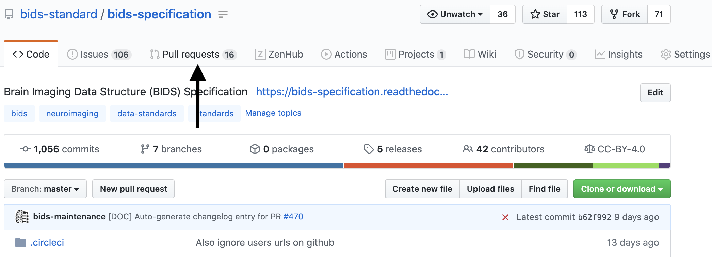

### Selecting an open pull request

In this example we will be navigating to our
[BIDS common derivatives pull request](https://github.com/bids-standard/bids-specification/pull/265).

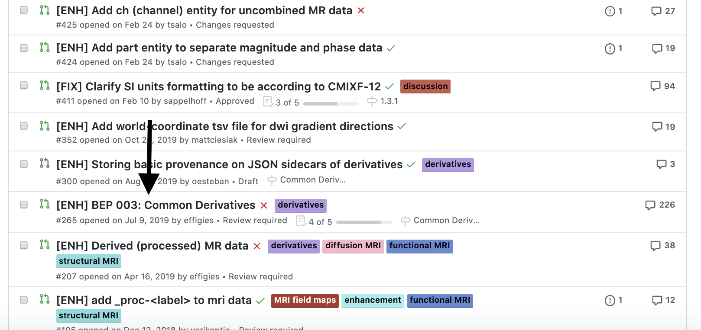

### Pull request description

Upon opening the pull request we see a detailed description of what this pull
request is seeking to address.
Descriptions are important for reviewers and the community to gain context into
what the pull request is achieving.

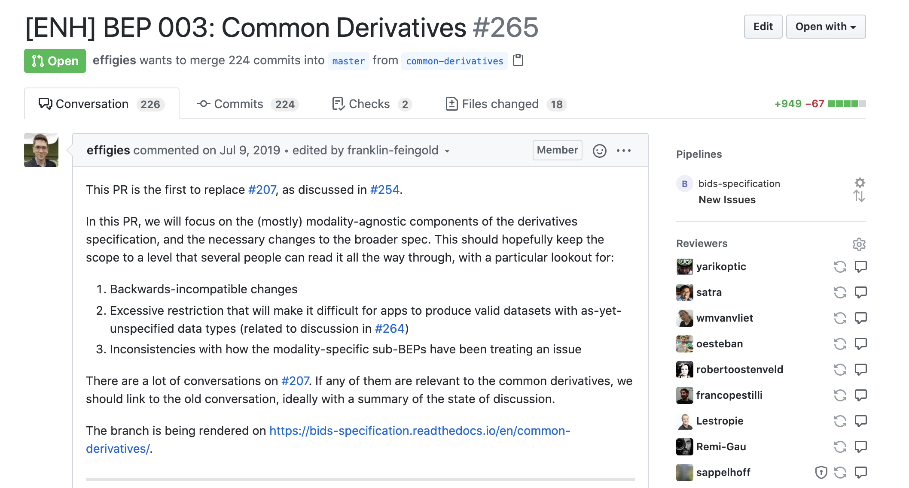

### Generally commenting on a pull request

At the bottom of the pull request page, a comment box is provided for general
comments and questions.

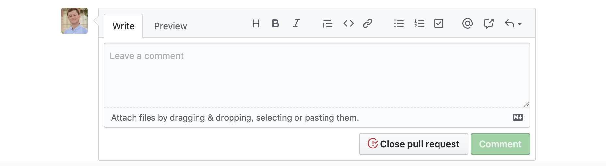

### Specific comments on a pull request

The proposed changes to the text of the specification can be seen in the "Files
changed" tab.
Proposed additions are displayed on a green background with a `+`
before each added line.
Proposed deletions are displayed on a red background with a `-` before each removed line.
To comment on a specific line, hover over it, and click the blue plus sign (pictured below).
Multiple lines can be selected by clicking and dragging the plus sign.

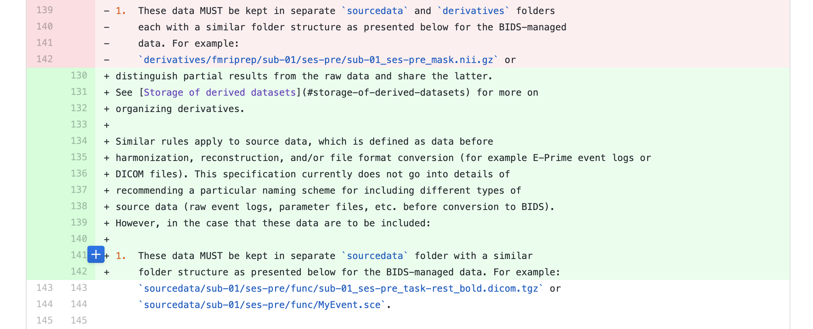

#### Suggesting text

Comments on lines can contain "suggestions", which allow you to propose specific
wording for consideration. To make a suggestion, click the plus/minus (±) icon
in the comment box (pictured below).

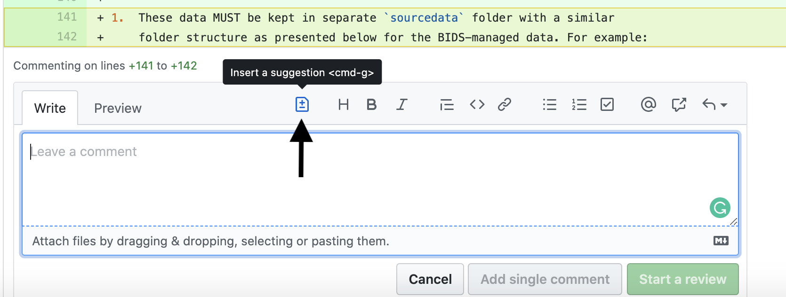

Once the button is clicked the highlighted text will be copied into the comment
box and formatted as a
[Markdown code block](https://help.github.com/en/github/writing-on-github/creating-and-highlighting-code-blocks).

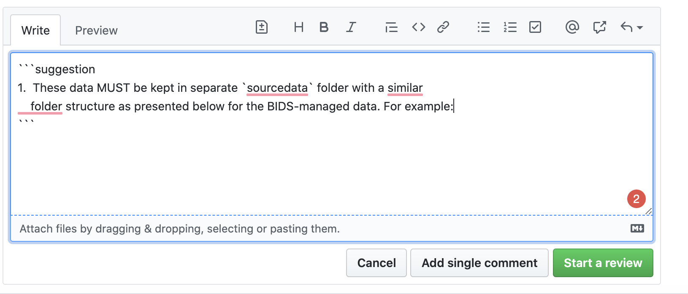

The "Preview" tab in the comment box will show your suggestion as it will be
rendered. The "Suggested change" box will highlight the differences between the
original text and your suggestion.

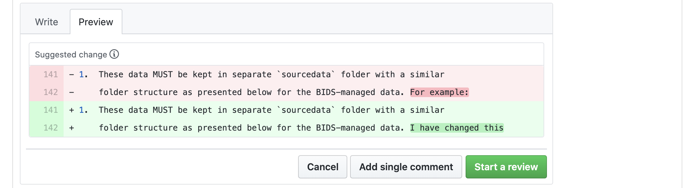

A comment may be submitted on its own by clicking "Add single comment". Several
comments may be grouped by clicking "Start a review". As more comments are
written, accept them with "Add review comment", and submit your review comments
as a batch by clicking the "Finish your review" button.

## Accepting suggestion from a review

When others are making [suggestions to your pull request](#suggesting-text), you
have the possibility to accept directly the changes suggested during the review
through the github interface. This can often be faster and more convenient than
make the changes locally and then pushing those changes to update your pull
request. Moreover it gives the opportunity to give credit to the reviewers for
their contribution.

To do this, you must click on the `Files changed` tab at the top of the page of
a pull request.

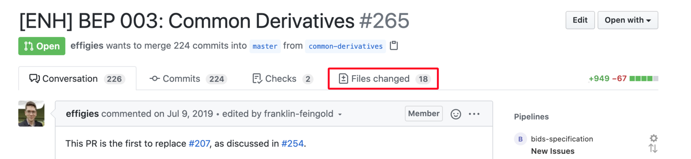

From there you can browse the different files changed and the 'diff' for each of
them (what line was changed and what the change consist of). You can also see
comments and directly change suggestions made by reviewers.

You can add each suggestion one by one or group them together in a batch.

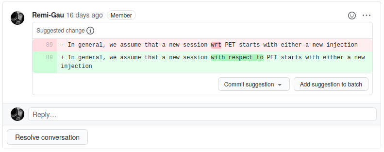

If you decide to batch the suggestions to add several of them at once, you must
scroll back to the top of the 'Files changed' page and the `commit suggestions`
button will let you add all those suggestions as a single commit.

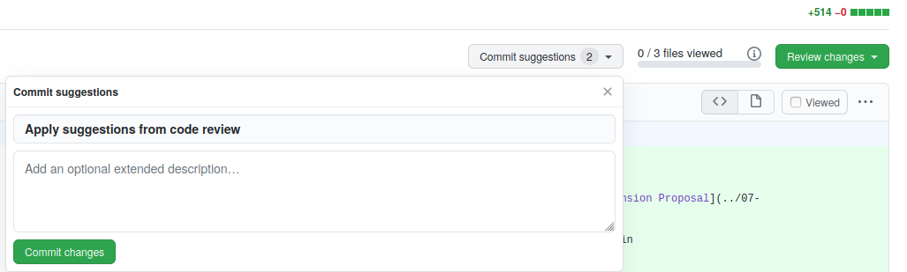

Once those suggestions are committed the commit information should mention the
reviewer as a co-author.

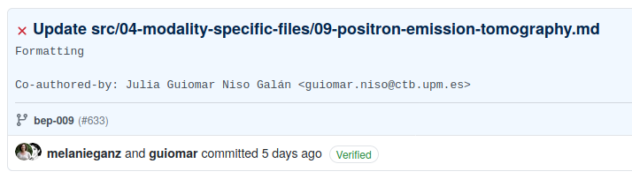

## Making a change to the BIDS-schema

Several aspects of the specification are defined in a set of YAML files in the
`src/schema` directory. The content of those files is described in a dedicated
[README file](./src/schema/README.md).

### 1. Ensure that changes to the specification are matched in the schema

The schema formalizes the rules described in the specification text, so you must
ensure that any changes which impact the rules of the specification (including,
but not limited to, adding new entities, suffixes, datatypes, modalities) are
reflected in the schema as well.

### 2. Ensure that changes to the schema are matched in auto-generated sections of the specification

The schema is used to generate a number of elements in the specification text, including:
- Filename format templates
- Entity tables
- Entity definitions

As such, you need to ensure that the functions used throughout the specification to render these elements are appropriately referencing the schema.
In essence, please make sure, if your changes do impact how functions should be called, that you also update how the function are called.

### 3. Render the specification with `mkdocs` to check your changes

Run `mkdocs serve` and open `localhost:8000` to browse the rendered specification.
Make sure that all filename format templates, entity tables, and entity definitions are correct
and that the code that generates these elements is not broken by your changes.

While the continuous integration run on pull requests by the repository will render the specification,
it is crucial to manually review the rendered changes to ensure that the code not only successfully runs,
but also that the rendered changes appear as expected.

### 4. Push your changes

For more information on making general changes with a pull request, please
review
[Making a change with a pull request](#making-a-change-with-a-pull-request).

## How the decision to merge a pull request is made?

The decision-making rules are outlined in
[DECISION-MAKING.md](DECISION-MAKING.md).

## Recognizing contributions

BIDS follows the
[all-contributors](https://github.com/kentcdodds/all-contributors)
specification, so we welcome and recognize all contributions from documentation
to testing to code development.
You can see a list of current contributors in the
[BIDS specification](https://github.com/bids-standard/bids-specification/blob/master/src/99-appendices/01-contributors.md).

If you have made any type of contributions to the BIDS specifications, you can
either make a change to the
[contributors document](./src/99-appendices/01-contributors.md) and commit as
part of a pull request or you can edit this
[page](https://github.com/bids-standard/bids-specification/wiki/Recent-Contributors)
of the specification WIKI.
The WIKI is then synced with the specification with evert new release of the specifications.

## Thank you!

You're awesome.
