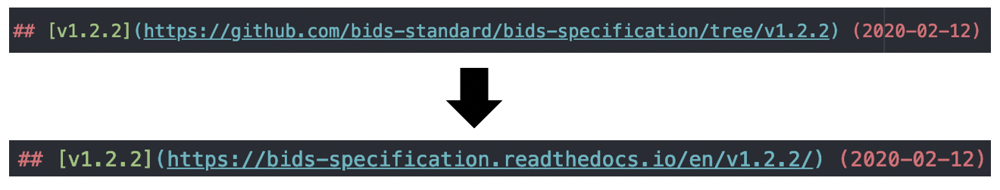

# Release Procedure

When it is time to release, use a pull request to put the repository into a releasable state,
allowing testing and edits prior to merging to master.
The following procedure ensures a predictable release.

The protocol assumes that you have a [fork](https://help.github.com/en/articles/fork-a-repo)
of the bids-standard/bids-specification repository and have [cloned](https://help.github.com/en/articles/cloning-a-repository)
your fork locally to a directory called `bids-specification`.

### 1. Fetch the latest version of the [master branch of the BIDS-specification](https://github.com/bids-standard/bids-specification/tree/master)

You should have a remote, which we will call `upstream`, for the
[bids-standard/bids-specification](https://github.com/bids-standard/bids-specification/)
repository:

```Shell
$ git remote get-url upstream
git@github.com:bids-standard/bids-specification.git
```

If you do not, add it with:

```Shell
$ cd bids-specification
$ git remote add upstream git@github.com:bids-standard/bids-specification.git
```

Fetch the current repository state and create a new `rel/<version>` branch based on
`upstream/master`.
For example, if releasing version `1.2.0`:

```Shell
$ git fetch upstream
$ git checkout -b rel/1.2.0 upstream/master
```

### 2. Update the version, contributors list, previous version URLs, and the Changelog

Change the "Unreleased" heading in
[src/CHANGES.md](https://github.com/bids-standard/bids-specification/blob/master/src/CHANGES.md)
to `v<version>`, and link to the target ReadTheDocs URL.
If the target release date is known, include the date in YYYY-MM-DD in parentheses after
the link.

```Diff
- ## Unreleased
+ ## [v1.2.0](https://bids-specification.readthedocs.io/en/v1.2.0/) (2019-03-04)
```

The date can be changed or added later, so accurate prediction is not necessary.

Remove the `-dev` from the version in
[mkdocs.yml](https://github.com/bids-standard/bids-specification/blob/master/mkdocs.yml)
configuration, so the title will be correct for the released specification.
If the version preceding the `-dev` is not the target version, update the version as well.
In the figure below, we update `v1.2.0-dev` to `v1.2.0`.


Note: this will make our continuous integration ([CircleCI](https://circleci.com/)) fail. This fails because the URL of the new ReadTheDocs rendering has not been generated at this time. It will be generated once the GitHub release has been completed.

Synchronize the [Contributors appendix](https://github.com/bids-standard/bids-specification/blob/master/src/99-appendices/01-contributors.md)
with the [Contributors wiki page](https://github.com/bids-standard/bids-specification/wiki/Contributors)
to ensure all contributors are duly credited.
Be sure not to remove credits if both have been edited.

Please change the previous version links from GitHub to ReadTheDocs.
In the figure below, we update v1.2.2.


Remove `REL:` entries in [src/CHANGES.md](https://github.com/bids-standard/bids-specification/blob/master/src/CHANGES.md).

```Diff
- REL: v1.2.2 #405 (franklin-feingold)
```

Review `src/CHANGES.md` to ensure that the document produces a changelog that is useful to a
reader of the specification.
For example, several small PRs fixing typos might be merged into a single line-item, or less
important changes might be moved down the list to ensure that large changes are more prominent.

### 3. Commit changes and push to upstream

By pushing `rel/` branches to the main repository, the chances of continuous integration
discrepancies is reduced.

```Shell
$ git add src/CHANGES.md mkdocs.yml src/99-appendices/01-contributors.md
$ git commit -m 'REL: v1.2.0'
$ git push -u upstream rel/1.2.0
```

### 4. Open a pull request against the master branch
Important note: The pull request title **must** be named "REL: vX.Y.Z" (*e.g.*, "REL: v1.2.0").

**This will open a period of discussion for 5 business days regarding if we are ready to release.**

Minor revisions may be made using GitHub's [suggestion
feature](https://help.github.com/en/articles/incorporating-feedback-in-your-pull-request).
For larger changes, pull requests should be made against `master`.

**Merging other pull requests during this period requires agreement among BIDS Maintainers.**

There are no hard-and-fast rules for what other pull requests might be merged, but the focus
should generally be on achieving a self-consistent, backwards-compatible document.
For example, if an inconsistency is noticed, a PR might be necessary to resolve it.
Merging an entire BEP would likely lead to greater uncertainty about self-consistency, and should
probably wait.

If `master` is updated, it should be merged into the `rel/<verison>` branch:

```Shell
$ git fetch upstream
$ git checkout rel/1.2.0
$ git merge upstream/master
$ git push rel/1.2.0
```

### 5. Set release date and merge

On the day of release, please ensure the release branch aligns with the master branch.
The current date should be added to/updated in the changelog in the form
YYYY-MM-DD.
The date should be placed after the link to the versioned URL.
For example:

```Diff
- ## [v1.2.0](https://bids-specification.readthedocs.io/en/v1.2.0/)
+ ## [v1.2.0](https://bids-specification.readthedocs.io/en/v1.2.0/) (2019-03-04)
```

Verify that the pull request title matches "REL: vX.Y.Z" and merge the pull request.

### 6. Get the built PDF

Upon each commit to the `master` branch, CircleCI builds a PDF version of the
specification (see `.circleci/config.yml` and the `pdf_build_src` directory).

So after merging the new "stable" version into `master`, wait for the CircleCI
jobs to finish and then check the built PDF using this link:

`https://circleci.com/api/v1.1/project/github/bids-standard/bids-specification/latest/artifacts/0/bids-spec.pdf?branch=master`

Download the PDF and hold it ready for upload to our Zenodo archive. See the
*Uploading the stable PDF to Zenodo* step below.

### 7. Tag the release

GitHub's release mechanism does not have all of the features we need, so manually tag the release
in your local repository.
To do this, `fetch` the current state of `upstream` (see step 1), tag `upstream/master`, and
`push` the tag to `upstream`.

```Shell
$ git fetch upstream
$ git tag -a -m "v1.2.0 (2019-03-04)" v1.2.0 upstream/master
$ git push upstream v1.2.0
```

There are four components to the tag command:

1. `-a-` indicates that we want to use an
   [annotated tag](https://git-scm.com/book/en/v2/Git-Basics-Tagging#_creating_tags), which will
   ensure that [`git describe`](https://git-scm.com/docs/git-describe) works nicely with the
   repository.
2. `-m <message>` is the message that will be saved with the tag.
3. `v<version>` is the name of the release and the tag.
4. `upstream/master` instructs `git` to tag the most recent commit on the `master` branch of the
   `upstream` remote.

### 8. Create a GitHub release

Some GitHub processes may only trigger on a GitHub release, rather than a tag push.
To make a GitHub release, go to the [Releases
](https://github.com/bids-standard/bids-specification/releases) page:


Click [Draft a new release](https://github.com/bids-standard/bids-specification/releases/new):


Set the tag version and release title to "vX.Y.Z", and paste the current changelog as the
description:


Click "Publish release".

Verify ReadTheDocs builds complete and publish. If needed, manually
trigger [builds](https://readthedocs.org/projects/bids-specification/builds/)
for `stable` and the most recent tag.

### 9. Edit the mkdocs.yml file site_name to set a new development version

Please commit to `master` with the title `REL: <version>-dev`.
This should be the first commit in the new version.
This process is illustrated below.


Note that the development version number should be larger than the last release, with the
version of the next *intended* release, followed by `-dev`.
For example, after the 1.3.0 release, either `1.3.1-dev` or `1.4.0-dev` would be reasonable, based
on the expected next version.

### 10. Uploading the stable PDF to Zenodo

1. Open a private browser window
1. Log into https://github.com with the `bids-maintenance` user (credentials
   are available from the BIDS maintainer group)
1. Open a new tab at https://zenodo.org and "log in via GitHub", you'll then
   be on the `bids-maintenance` Zenodo account
1. Navigate to the [archive of our BIDS specification PDFs](https://doi.org/10.5281/zenodo.3686061)
1. Click on "add new version"
1. For a new version, upload the new PDF, naming it consistently with the other
   PDFs: `BIDS-Specification-vX.X.X.pdf` (replace `X.X.X` with the new version)
1. Remove all other files from the upload
1. Edit the following fields:
    1. publication date
    1. version
1. Double check that everything is in order, then save and publish

### 11. Sharing news of the release

Please share news of the release on the [identified platforms](https://docs.google.com/spreadsheets/d/16SAGK3zG93WM2EWuoZDcRIC7ygPc5b7PDNGpFyC3obA/edit#gid=0).
Please use our previous release posts as a guide.
