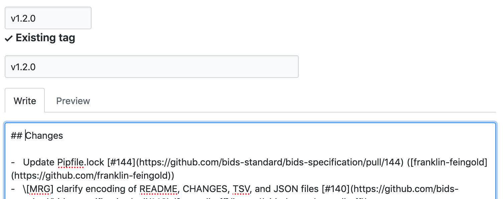

# Release Procedure

When a release pull request is ready to be opened, please follow this procedure.

### 1. Fork/Update the most current version of the [master branch of the BIDS-specification](https://github.com/bids-standard/bids-specification/tree/master)

Please make sure your fork is the most up to date version

### 2. Change 'Unreleased' to the version number and change the path to the versioned readthedocs rendering in the src/CHANGES.md file. One may commit this to their fork.

This process is figured below 

### 3. Please open a pull request on the [master branch of the BIDS-specification](https://github.com/bids-standard/bids-specification/tree/master).
Important note: The pull request title **needs** to follow this protocol. REL: vX.X.X (i.e. REL: v1.1.2) There should only be one commit in the pull request (the step 2 commit)

### This will open a period of discussion for 5 business days regarding if we are ready to release. This will also freeze all pull request merging.

If we determine we are ready to release, please have the PR submitter add an additional commit with the date in year-month-date format in parentheses after the version of the date of merging (not opening) (i.e. it should read v1.1.2 (2018-12-28)) and merge this PR. This will mark a new release. On the same day, please also do a github release. To do this please see below.

However, if it is determined we are not ready to release, please simply close the pull request.
