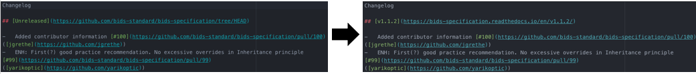

# Release Procedure

When it is time to release, use a pull request to put the repository into a releasable state,
allowing testing and edits prior to merging to master.
The following procedure ensures a predictable release.

### 1. Fetch the latest version of the [master branch of the BIDS-specification](https://github.com/bids-standard/bids-specification/tree/master)

You should have a remote, which we will call `upstream`, for the [
bids-standard/bids-specification](https://github.com/bids-standard/bids-specification/) repository:

```Shell
$ git remote get-url upstream
git@github.com:bids-standard/bids-specification.git
```

If you do not, add it with:

```Shell
$ git remote add upstream git@github.com:bids-standard/bids-specification.git
```

Fetch the current repository state and create a new `rel/<version>` branch based on
`upstream/master`.
For example, if releasing version `1.2.0`:

```Shell
$ git fetch upstream
$ git checkout -b rel/1.2.0 upstream/master
```

### 2. Update the version in the changelog and mkdocs.yml

Change the "Unreleased" heading in
[src/CHANGES.md](https://github.com/bids-standard/bids-specification/blob/master/src/CHANGES.md)
to `v<version>`, and link to the target ReadTheDocs URL.
In the figure below, we use the example of version 1.1.2, which would have the URL
https://bids-specification.readthedocs.io/en/v1.1.2/:


Remove the `-dev` from the version in
[mkdocs.yml](https://github.com/bids-standard/bids-specification/blob/master/mkdocs.yml)
configuration, so the title will be correct for the released specification.
If the version preceding the `-dev` is not the target version, update the version as well.
In the figure below, we update `v1.2.0-dev` to `v1.2.0`.


### 3. Commit changes and push to upstream

By pushing `rel/` branches to the main repository, the chances of continuous integration
discrepancies is reduced.

```Shell
$ git add src/CHANGES.md mkdocs.yml
$ git commit -m 'REL: v1.2.0`
$ git push -u upstream rel/1.2.0
```

### 4. Open a pull request against the master branch
Important note: The pull request title **must** be named "REL: vX.Y.Z" (*e.g.*, "REL: v1.2.0").

**This will open a period of discussion for 5 business days regarding if we are ready to release.**

Minor revisions may be made using GitHub's [suggestion
feature](https://help.github.com/en/articles/incorporating-feedback-in-your-pull-request).
For larger changes, pull requests should be made against `master`.

**Merging other pull requests during this period requires agreement in this discussion.**

If `master` is updated, it should be merged into the `rel/<verison>` branch.

### 5. Set release date and merge

On the day of release, the current date should be added to the changelog in the form YYYY-MM-DD.
The date should be placed after the link to the versioned URL.
For example:

```Diff
- ## [v1.1.2](https://bids-specification.readthedocs.io/en/v1.1.2/)
+ ## [v1.1.2](https://bids-specification.readthedocs.io/en/v1.1.2/) (2019-01-10)
```

Verify that the pull request title matches "REL: vX.Y.Z" and merge the pull request.

### 6. Tag the release

GitHub's release mechanism does not have all of the features we need, so manually tag the release
in your local repository.
To do this, `fetch` the current state of `upstream` (see step 1), tag `upstream/master`, and
`push` the tag to `upstream`.

```Shell
$ git fetch upstream
$ git tag -a -m "v1.1.2 (2019-01-10)" v1.1.2 upstream/master
$ git push upstream v1.1.2
```

There are four components to the tag command:

1. `-a-` indicates that we want to use an
   [annotated tag](https://git-scm.com/book/en/v2/Git-Basics-Tagging#_creating_tags), which will
   ensure that [`git describe`](https://git-scm.com/docs/git-describe) works nicely with the
   repository.
2. `-m <message>` is the message that will be saved with the tag.
3. `v<version>` is the name of the release and the tag.
4. `upstream/master` instructs `git` to tag the most recent commit on the `master` branch of the
   `upstream` remote.

### 7. Create a GitHub release


This will mark a new release. On the same day, please also do a GitHub release. To do this please see below.


However, if it is determined we are not ready to release, please simply close the pull request.

### 5. Edit the mkdocs.yml file site_name to set a new development version

Please submit a PR with the title `REL: <version>-dev`.
This should be the first merged PR in the new version.
This process is illustrated below.


Note that the development version number should be larger than the last release, with the
version of the next *intended* release, followed by `-dev`.
For example, after the 1.3.0 release, either `1.3.1-dev` or `1.4.0-dev` would be reasonable, based
on the expected next version.
