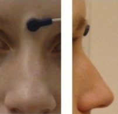

# Magnetoencephalography

Support for Magnetoencephalography (MEG) was developed as a
[BIDS Extension Proposal](../07-extensions.md#bids-extension-proposals).
Please see [Citing BIDS](../01-introduction.md#citing-bids)
on how to appropriately credit this extension when referring to it in the
context of the academic literature.

The following example MEG datasets have been formatted using this specification
and can be used for practical guidance when curating a new dataset.

-   [`multimodal MEG and MRI`](https://github.com/bids-standard/bids-examples/tree/master/ds000117)

Further datasets are available from
the [BIDS examples repository](https://github.com/bids-standard/bids-examples).

## MEG recording data

<!--
This block generates a filename templates.
The inputs for this macro can be found in the folder
  src/schema/rules/datatypes
and a guide for using macros can be found at
 https://github.com/bids-standard/bids-specification/blob/master/macros_doc.md
-->
{{ MACROS___make_filename_template(
   datatypes=["meg"],
   suffixes=["meg", "markers", "events", "physio", "stim"])
}}

Unprocessed MEG data MUST be stored in the native file format of the MEG
instrument with which the data was collected.
With the MEG specification of BIDS, we wish to promote the adoption of good
practices in the management of scientific data.
Hence, the emphasis is not to impose a new, generic data format for the
modality, but rather to standardize the way data is stored in repositories.
Further, there is currently no widely accepted standard file format for MEG, but
major software applications, including free and open-source solutions for MEG
data analysis, provide readers of such raw files.

Some software readers may skip important metadata that is specific to MEG system
manufacturers. It is therefore RECOMMENDED that users provide additional meta
information extracted from the manufacturer raw data files in a sidecar JSON
file. This allows for easy searching and indexing of key metadata elements
without the need to parse files in proprietary data format. Other relevant files
MAY be included alongside the MEG data; examples are provided below.

This template is for MEG data of any kind, including but not limited to
task-based, resting-state, and noise recordings.
If multiple *Tasks* were performed within a single *Run*,
the task description can be set to `task-multitask`.
The `*_meg.json` file SHOULD contain details on the *Tasks*.

Some manufacturers' data storage conventions use directories which contain data
files of various nature: for example, CTF's `.ds` format, or BTi/4D's data directory.
Yet other manufacturers split their files once they exceed a certain size
limit.
For example Neuromag/Elekta/Megin, which can produce several files
for a single recording.
Both `some_file.fif` and `some_file-1.fif` would belong to a single recording.
In BIDS, the [`split`](../99-appendices/09-entities.md#split) entity is RECOMMENDED to deal
with split files.
If there are multiple parts of a recording and the optional `scans.tsv` is provided,
remember to list all files separately in `scans.tsv` and that the entries for the
`acq_time` column in `scans.tsv` MUST all be identical, as described in
[Scans file](../03-modality-agnostic-files.md#scans-file).

Another manufacturer-specific detail pertains to the KIT/Yokogawa/Ricoh system,
which saves the MEG sensor coil positions in a separate file with two possible filename extensions  (`.sqd`, `.mrk`).
For these files, the `markers` suffix MUST be used.
For example: `sub-01_task-nback_markers.sqd`

Please refer to [Appendix VI](../99-appendices/06-meg-file-formats.md)
for general information on how to deal with such manufacturer specifics and to see more examples.

The [`proc-<label>`](../99-appendices/09-entities.md#proc) entity is analogous to the
[`rec-<label>`](../99-appendices/09-entities.md#rec) entity for MRI,
and denotes a variant of a file that was a result of particular processing performed on the device.
This is useful for files produced in particular by Elekta's MaxFilter
(for example, sss, tsss, trans, quat, mc),
which some installations impose to be run on raw data prior to analysis.
Such processing steps are needed for example because of active shielding software corrections
that have to be performed to before the MEG data can actually be exploited.

### Recording EEG simultaneously with MEG

Note that if EEG is recorded with a separate amplifier,
it SHOULD be stored separately under a new `/eeg` data type
(see [the EEG specification](03-electroencephalography.md)).

If however EEG is recorded simultaneously **with the same MEG system**,
it MAY be stored under the `/meg` data type.
In that case, it SHOULD have the same sampling frequency as MEG (see `SamplingFrequency` field below).
Furthermore, the EEG sensor coordinates SHOULD be specified using MEG-specific coordinate
systems (see [coordinates section](#coordinate-system-json-_coordsystemjson) below and [Appendix VIII](../99-appendices/08-coordinate-systems.md)).

### Sidecar JSON (`*_meg.json`)

Generic fields MUST be present:

<!-- This block generates a metadata table.
The definitions of these fields can be found in
  src/schema/objects/metadata.yaml
and a guide for using macros can be found at
 https://github.com/bids-standard/bids-specification/blob/master/macros_doc.md
-->
{{ MACROS___make_metadata_table(
   {
      "TaskName": ("REQUIRED", "A RECOMMENDED convention is to name resting state task using labels beginning with `rest`."),
   }
) }}

SHOULD be present: For consistency between studies and institutions, we
encourage users to extract the values of these fields from the actual raw data.
Whenever possible, please avoid using ad-hoc wording.

<!-- This block generates a metadata table.
The definitions of these fields can be found in
  src/schema/objects/metadata.yaml
and a guide for using macros can be found at
 https://github.com/bids-standard/bids-specification/blob/master/macros_doc.md
-->
{{ MACROS___make_metadata_table(
   {
      "InstitutionName": "RECOMMENDED",
      "InstitutionAddress": "RECOMMENDED",
      "InstitutionalDepartmentName": "RECOMMENDED",
      "Manufacturer": (
         "RECOMMENDED",
         "For MEG scanners, this must be one of: "
         '`"CTF"`, `"Elekta/Neuromag"`, `"BTi/4D"`, `"KIT/Yokogawa"`, '
         '`"ITAB"`, `"KRISS"`, `"Other"`. '
         "See [Appendix VII](/99-appendices/07-meg-systems.html) for "
         "preferred names.",
      ),
      "ManufacturersModelName": (
         "RECOMMENDED",
         "See [Appendix VII](/99-appendices/07-meg-systems.html) for "
         "preferred names.",
      ),
      "SoftwareVersions": "RECOMMENDED",
      "TaskDescription": "RECOMMENDED",
      "Instructions": ("RECOMMENDED", "This is especially important in context of resting state recordings and distinguishing between eyes open and eyes closed paradigms."),
      "CogAtlasID": "RECOMMENDED",
      "CogPOID": "RECOMMENDED",
      "DeviceSerialNumber": "RECOMMENDED",
   }
) }}

Specific MEG fields MUST be present:

<!-- This block generates a metadata table.
The definitions of these fields can be found in
  src/schema/objects/metadata.yaml
and a guide for using macros can be found at
 https://github.com/bids-standard/bids-specification/blob/master/macros_doc.md
-->
{{ MACROS___make_metadata_table(
   {
      "SamplingFrequency": ("REQUIRED", "The sampling frequency of data channels that deviate from the main sampling frequency SHOULD be specified in the `channels.tsv` file."),
      "PowerLineFrequency": "REQUIRED",
      "DewarPosition": "REQUIRED",
      "SoftwareFilters": "REQUIRED",
      "DigitizedLandmarks": "REQUIRED",
      "DigitizedHeadPoints": "REQUIRED",
   }
) }}

SHOULD be present:

<!-- This block generates a metadata table.
The definitions of these fields can be found in
  src/schema/objects/metadata.yaml
and a guide for using macros can be found at
 https://github.com/bids-standard/bids-specification/blob/master/macros_doc.md
-->
{{ MACROS___make_metadata_table(
   {
      "MEGChannelCount": "RECOMMENDED",
      "MEGREFChannelCount": "RECOMMENDED",
      "EEGChannelCount": "RECOMMENDED",
      "ECOGChannelCount": "RECOMMENDED",
      "SEEGChannelCount": "RECOMMENDED",
      "EOGChannelCount": "RECOMMENDED",
      "ECGChannelCount": "RECOMMENDED",
      "EMGChannelCount": "RECOMMENDED",
      "MiscChannelCount": "RECOMMENDED",
      "TriggerChannelCount": "RECOMMENDED",
      "RecordingDuration": "RECOMMENDED",
      "RecordingType": "RECOMMENDED",
      "EpochLength": "RECOMMENDED",
      "ContinuousHeadLocalization": "RECOMMENDED",
      "HeadCoilFrequency": "RECOMMENDED",
      "MaxMovement": "RECOMMENDED",
      "SubjectArtefactDescription": "RECOMMENDED",
      "AssociatedEmptyRoom": "RECOMMENDED",
      "HardwareFilters": "RECOMMENDED",
   }
) }}

Specific EEG fields
(if recorded with MEG, see [Recording EEG simultaneously with MEG](#recording-eeg-simultaneously-with-meg)
SHOULD be present:

<!-- This block generates a metadata table.
The definitions of these fields can be found in
  src/schema/objects/metadata.yaml
and a guide for using macros can be found at
 https://github.com/bids-standard/bids-specification/blob/master/macros_doc.md
-->
{{ MACROS___make_metadata_table(
   {
      "EEGPlacementScheme": "OPTIONAL",
      "CapManufacturer": "OPTIONAL",
      "CapManufacturersModelName": "OPTIONAL",
      "EEGReference": "OPTIONAL",
   }
) }}

Example:

```JSON
{
   "InstitutionName": "Stanford University",
   "InstitutionAddress": "450 Serra Mall, Stanford, CA 94305-2004, USA",
   "Manufacturer": "CTF",
   "ManufacturersModelName": "CTF-275",
   "DeviceSerialNumber": "11035",
   "SoftwareVersions": "Acq 5.4.2-linux-20070507",
   "PowerLineFrequency": 60,
   "SamplingFrequency": 2400,
   "MEGChannelCount": 270,
   "MEGREFChannelCount": 26,
   "EEGChannelCount": 0,
   "EOGChannelCount": 2,
   "ECGChannelCount": 1,
   "EMGChannelCount": 0,
     "DewarPosition": "upright",
   "SoftwareFilters": {
     "SpatialCompensation": {"GradientOrder": "3rd"}
   },
   "RecordingDuration": 600,
   "RecordingType": "continuous",
   "EpochLength": 0,
   "TaskName": "rest",
   "ContinuousHeadLocalization": true,
   "HeadCoilFrequency": [1470,1530,1590],
   "DigitizedLandmarks": true,
   "DigitizedHeadPoints": true
}
```

Note that the date and time information SHOULD be stored in the Study key file
(`scans.tsv`), see [Scans file](../03-modality-agnostic-files.md#scans-file).
Date time information MUST be expressed as indicated in [Units](../02-common-principles.md#units)

## Channels description (`*_channels.tsv`)

<!--
This block generates a filename templates.
The inputs for this macro can be found in the folder
  src/schema/rules/datatypes
and a guide for using macros can be found at
 https://github.com/bids-standard/bids-specification/blob/master/macros_doc.md
-->
{{ MACROS___make_filename_template(datatypes=["meg"], suffixes=["channels"]) }}

This file is RECOMMENDED as it provides easily searchable information across BIDS datasets.
For example for general curation, response to queries, or for batch analysis.
To avoid confusion, the channels SHOULD be listed in the order they appear in the MEG data file.
Any number of additional columns MAY be added to provide additional information about the channels.
Missing values MUST be indicated with `"n/a"`.

The columns of the channels description table stored in `*_channels.tsv` are:

MUST be present **in this specific order**:

<!-- This block generates a columns table.
The definitions of these fields can be found in
  src/schema/objects/columns.yaml
and a guide for using macros can be found at
 https://github.com/bids-standard/bids-specification/blob/master/macros_doc.md
-->
{{ MACROS___make_columns_table(
   {
      "name__channels": "REQUIRED",
      "type__channels": "REQUIRED",
      "units": "REQUIRED",
   }
) }}

SHOULD be present:

<!-- This block generates a columns table.
The definitions of these fields can be found in
  src/schema/objects/columns.yaml
and a guide for using macros can be found at
 https://github.com/bids-standard/bids-specification/blob/master/macros_doc.md
-->
{{ MACROS___make_columns_table(
   {
      "description": "OPTIONAL",
      "sampling_frequency": "OPTIONAL",
      "low_cutoff": "OPTIONAL",
      "high_cutoff": "OPTIONAL",
      "notch": "OPTIONAL",
      "software_filters": "OPTIONAL",
      "status": "OPTIONAL",
      "status_description": "OPTIONAL",
   }
) }}

Example:

```Text
name type units description sampling_frequency low_cutoff high_cutoff notch software_filters status
UDIO001 TRIG V analogue trigger 1200 0.1 300 0 n/a good
MLC11 MEGGRADAXIAL T sensor 1st-order grad 1200 0 n/a 50 SSS bad
```

Restricted keyword list for field `type`.
Note that upper-case is REQUIRED:

| **Keyword**      | **Description**                                      |
| ---------------- | ---------------------------------------------------- |
| MEGMAG           | MEG magnetometer                                     |
| MEGGRADAXIAL     | MEG axial gradiometer                                |
| MEGGRADPLANAR    | MEG planargradiometer                                |
| MEGREFMAG        | MEG reference magnetometer                           |
| MEGREFGRADAXIAL  | MEG reference axial gradiometer                      |
| MEGREFGRADPLANAR | MEG reference planar gradiometer                     |
| MEGOTHER         | Any other type of MEG sensor                         |
| EEG              | Electrode channel                                    |
| ECOG             | Electrode channel                                    |
| SEEG             | Electrode channel                                    |
| DBS              | Electrode channel                                    |
| VEOG             | Vertical EOG (electrooculogram)                      |
| HEOG             | Horizontal EOG                                       |
| EOG              | Generic EOG channel                                  |
| ECG              | ElectroCardioGram (heart)                            |
| EMG              | ElectroMyoGram (muscle)                              |
| TRIG             | System Triggers                                      |
| AUDIO            | Audio signal                                         |
| PD               | Photodiode                                           |
| EYEGAZE          | Eye Tracker gaze                                     |
| PUPIL            | Eye Tracker pupil diameter                           |
| MISC             | Miscellaneous                                        |
| SYSCLOCK         | System time showing elapsed time since trial started |
| ADC              | Analog to Digital input                              |
| DAC              | Digital to Analog output                             |
| HLU              | Measured position of head and head coils             |
| FITERR           | Fit error signal from each head localization coil    |
| OTHER            | Any other type of channel                            |

Example of free text for field `description`:

-   stimulus, response, vertical EOG, horizontal EOG, skin conductance, sats,
    intracranial, eyetracker

Example:

```Text
name type units description
VEOG VEOG V vertical EOG
FDI EMG V left first dorsal interosseous
UDIO001 TRIG V analog trigger signal
UADC001 AUDIO V envelope of audio signal presented to participant
```

## Coordinate System JSON (`*_coordsystem.json`)

<!--
This block generates a filename templates.
The inputs for this macro can be found in the folder
  src/schema/rules/datatypes
and a guide for using macros can be found at
 https://github.com/bids-standard/bids-specification/blob/master/macros_doc.md
-->
{{ MACROS___make_filename_template(datatypes=["meg"], suffixes=["coordsystem"]) }}

OPTIONAL. A JSON document specifying the coordinate system(s) used for the MEG,
EEG, head localization coils, and anatomical landmarks.

MEG and EEG sensors:

<!-- This block generates a metadata table.
The definitions of these fields can be found in
  src/schema/objects/metadata.yaml
and a guide for using macros can be found at
 https://github.com/bids-standard/bids-specification/blob/master/macros_doc.md
-->
{{ MACROS___make_metadata_table(
   {
      "MEGCoordinateSystem": "REQUIRED",
      "MEGCoordinateUnits": "REQUIRED",
      "MEGCoordinateSystemDescription": "OPTIONAL, but REQUIRED if `MEGCoordinateSystem` is `Other`",
      "EEGCoordinateSystem": (
         "OPTIONAL",
         "See [Recording EEG simultaneously with MEG](/04-modality-specific-files/02-magnetoencephalography.html#recording-eeg-simultaneously-with-meg). "
         "Preferably the same as the `MEGCoordinateSystem`.",
      ),
      "EEGCoordinateUnits": "OPTIONAL",
      "EEGCoordinateSystemDescription": (
         "OPTIONAL, but REQUIRED if `EEGCoordinateSystem` is `Other`",
         "See [Recording EEG simultaneously with MEG](/04-modality-specific-files/02-magnetoencephalography.html#recording-eeg-simultaneously-with-meg).",
      ),
   }
) }}

Head localization coils:

<!-- This block generates a metadata table.
The definitions of these fields can be found in
  src/schema/objects/metadata.yaml
and a guide for using macros can be found at
 https://github.com/bids-standard/bids-specification/blob/master/macros_doc.md
-->
{{ MACROS___make_metadata_table(
   {
      "HeadCoilCoordinates": "OPTIONAL",
      "HeadCoilCoordinateSystem": "OPTIONAL",
      "HeadCoilCoordinateUnits": "OPTIONAL",
      "HeadCoilCoordinateSystemDescription": "OPTIONAL, but REQUIRED if `HeadCoilCoordinateSystem` is `Other`",
   }
) }}

Digitized head points:

<!-- This block generates a metadata table.
The definitions of these fields can be found in
  src/schema/objects/metadata.yaml
and a guide for using macros can be found at
 https://github.com/bids-standard/bids-specification/blob/master/macros_doc.md
-->
{{ MACROS___make_metadata_table(
   {
      "DigitizedHeadPoints__coordsystem": "OPTIONAL",
      "DigitizedHeadPointsCoordinateSystem": "OPTIONAL",
      "DigitizedHeadPointsCoordinateUnits": "OPTIONAL",
      "DigitizedHeadPointsCoordinateSystemDescription": "OPTIONAL, but REQUIRED if `DigitizedHeadPointsCoordinateSystem` is `Other`",
   }
) }}

Anatomical MRI:

<!-- This block generates a metadata table.
The definitions of these fields can be found in
  src/schema/objects/metadata.yaml
and a guide for using macros can be found at
 https://github.com/bids-standard/bids-specification/blob/master/macros_doc.md
-->
{{ MACROS___make_metadata_table(
   {
      "IntendedFor": (
         "OPTIONAL",
         "This is used to identify the structural MRI(s), "
         "possibly of different types if a list is specified, "
         "to be used with the MEG recording.",
      )
   }
) }}

Anatomical landmarks:

<!-- This block generates a metadata table.
The definitions of these fields can be found in
  src/schema/objects/metadata.yaml
and a guide for using macros can be found at
 https://github.com/bids-standard/bids-specification/blob/master/macros_doc.md
-->
{{ MACROS___make_metadata_table(
   {
      "AnatomicalLandmarkCoordinates": "OPTIONAL",
      "AnatomicalLandmarkCoordinateSystem": ("OPTIONAL", "Preferably the same as the `MEGCoordinateSystem`."),
      "AnatomicalLandmarkCoordinateUnits": "OPTIONAL",
      "AnatomicalLandmarkCoordinateSystemDescription": "OPTIONAL, but REQUIRED if `AnatomicalLandmarkCoordinateSystem` is `Other`",
   }
) }}

It is also RECOMMENDED that the MRI voxel coordinates of the actual anatomical
landmarks for co-registration of MEG with structural MRI are stored in the
`AnatomicalLandmarkCoordinates` field in the JSON sidecar of the corresponding
T1w MRI anatomical data of the subject seen in the MEG session
(see [Anatomy Imaging Data](01-magnetic-resonance-imaging-data.md#anatomy-imaging-data)).

For example: `"sub-01/ses-mri/anat/sub-01_ses-mri_acq-mprage_T1w.json"`

In principle, these locations are those of absolute anatomical markers. However,
the marking of NAS, LPA and RPA is more ambiguous than that of for example, AC and PC.
This may result in some variability in their 3-D digitization from session to
session, even for the same participant. The solution would be to use only one
T1w file and populate the `AnatomicalLandmarkCoordinates` field with
session-specific labels for example, "NAS-session1": `[127,213,139]`,"NAS-session2":
`[123,220,142]`.

Fiducials information:

<!-- This block generates a metadata table.
The definitions of these fields can be found in
  src/schema/objects/metadata.yaml
and a guide for using macros can be found at
 https://github.com/bids-standard/bids-specification/blob/master/macros_doc.md
-->
{{ MACROS___make_metadata_table(
   {
      "FiducialsDescription": "OPTIONAL",
   }
) }}

For more information on the definition of anatomical landmarks, please visit:
[http://www.fieldtriptoolbox.org/faq/how_are_the_lpa_and_rpa_points_defined](http://www.fieldtriptoolbox.org/faq/how_are_the_lpa_and_rpa_points_defined)

For more information on typical coordinate systems for MEG-MRI coregistration:
[http://www.fieldtriptoolbox.org/faq/how_are_the_different_head_and_mri_coordinate_systems_defined](http://www.fieldtriptoolbox.org/faq/how_are_the_different_head_and_mri_coordinate_systems_defined),
or:
[http://neuroimage.usc.edu/brainstorm/CoordinateSystems](http://neuroimage.usc.edu/brainstorm/CoordinateSystems)

## Landmark photos (`*_photo.jpg`)

Photos of the anatomical landmarks and/or head localization coils
(`*_photo.jpg`)

<!--
This block generates a filename templates.
The inputs for this macro can be found in the folder
  src/schema/rules/datatypes
and a guide for using macros can be found at
 https://github.com/bids-standard/bids-specification/blob/master/macros_doc.md
-->
{{ MACROS___make_filename_template(datatypes=["meg"], suffixes=["photo"]) }}

Photos of the anatomical landmarks and/or head localization coils on the
subject’s head are RECOMMENDED. If the coils are not placed at the location of
actual anatomical landmarks, these latter may be marked with a piece of felt-tip
taped to the skin. Please note that the photos may need to be cropped or blurred
to conceal identifying features prior to sharing, depending on the terms of the
consent given by the participant.

The [`acq-<label>`](../99-appendices/09-entities.md#acq) entity can be used to indicate acquisition of different photos of
the same face (or other body part in different angles to show, for example, the
location of the nasion (NAS) as opposed to the right periauricular point (RPA)).

Example of the NAS fiducial placed between the eyebrows, rather than at the
actual anatomical nasion: `sub-0001_ses-001_acq-NAS_photo.jpg`



## Head shape and electrode description (`*_headshape.<ext>`)

<!--
This block generates a filename templates.
The inputs for this macro can be found in the folder
  src/schema/rules/datatypes
and a guide for using macros can be found at
 https://github.com/bids-standard/bids-specification/blob/master/macros_doc.md
-->
{{ MACROS___make_filename_template(datatypes=["meg"], suffixes=["headshape"]) }}

This file is RECOMMENDED.

The 3-D locations of points that describe the head shape and/or EEG
electrode locations can be digitized and stored in separate files. The
[`acq-<label>`](../99-appendices/09-entities.md#acq) entity can be used when more than one type of digitization in done for
a session, for example when the head points are in a separate file from the EEG
locations. These files are stored in the specific format of the 3-D digitizer’s
manufacturer (see [Appendix VI](../99-appendices/06-meg-file-formats.md)).

Example:

<!-- This block generates a file tree.
A guide for using macros can be found at
 https://github.com/bids-standard/bids-specification/blob/master/macros_doc.md
-->
{{ MACROS___make_filetree_example(
   {
   "sub-control01": {
      "ses-01":{
         "sub-control01_ses-01_acq-HEAD_headshape.pos": "",
         "sub-control01_ses-01_acq-EEG_headshape.pos": "",
         },
      }
   }
) }}

Note that the `*_headshape` file(s) is shared by all the runs and tasks in a
session. If the subject needs to be taken out of the scanner and the head-shape
has to be updated, then for MEG it could be considered to be a new session.

## Empty-room MEG recordings

Empty-room MEG recordings capture the environmental and recording system's
noise.
In the context of BIDS it is RECOMMENDED to perform an empty-room recording for
each experimental session.
It is RECOMMENDED to store the empty-room recording inside a subject directory
named `sub-emptyroom`.
The label for the [`task-<label>`](../99-appendices/09-entities.md#task) entity in the empty-room recording SHOULD be
set to `noise`.
If a [`session-<label>`](../99-appendices/09-entities.md#ses) entity is present, its label SHOULD be the date of the
empty-room recording in the format `YYYYMMDD`, that is `ses-YYYYMMDD`.
The `scans.tsv` file containing the date and time of the acquisition SHOULD
also be included.
The rationale is that this naming scheme will allow users to easily retrieve the
empty-room recording that best matches a particular experimental session, based
on date and time of the recording.
It should be possible to query empty-room recordings just like usual subject
recordings, hence all metadata sidecar files (such as the `channels.tsv`) file
SHOULD be present as well.

Example:

<!-- This block generates a file tree.
A guide for using macros can be found at
 https://github.com/bids-standard/bids-specification/blob/master/macros_doc.md
-->
{{ MACROS___make_filetree_example(
   {
   "sub-control01": {},
   "sub-control02": {},
   "sub-emptyroom": {
      "ses-20170801": {
         "sub-emptyroom_ses-20170801_scans.tsv": "",
         "meg": {
            "sub-emptyroom_ses-20170801_task-noise_meg.ds": "",
            "sub-emptyroom_ses-20170801_task-noise_meg.json": "",
            "sub-emptyroom_ses-20170801_task-noise_channels.tsv": "",
            }
         }
      },
   }
) }}

<!-- Link Definitions -->
