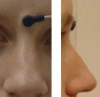

# Electroencephalography

Support for Electroencephalography (EEG) was developed as a [BIDS Extension Proposal](../07-extensions.md#bids-extension-proposals).
Please cite the following paper when referring to this part of the standard in
context of the academic literature:

> Pernet, C. R., Appelhoff, S., Gorgolewski, K.J., Flandin, G., Phillips, C.,
> Delorme, A., Oostenveld, R. (2019). **EEG-BIDS, an extension to the brain
> imaging data structure for electroencephalography**. Scientific data, 6.
> doi: [10.1038/s41597-019-0104-8](https://doi.org/10.1038/s41597-019-0104-8)

The following example EEG datasets have been formatted using this specification
and can be used for practical guidance when curating a new dataset.

-   Single session per subject: [`eeg_matchingpennies`](https://doi.org/10.17605/OSF.IO/CJ2DR)
-   Multiple sessions per subject: [`eeg_rishikesh`](https://doi.org/10.5281/zenodo.1490922)
-   Combined with fMRI: [`eeg_rest_fmri`](https://osf.io/94c5t/files/)

Further datasets are available from the [BIDS examples repository](https://github.com/bids-standard/bids-examples).

## EEG recording data

Template:

```Text
sub-<label>/
    [ses-<label>]/
      eeg/
        sub-<label>[_ses-<label>]_task-<label>[_run-<index>]_eeg.<manufacturer_specific_extension>
        sub-<label>[_ses-<label>]_task-<label>[_run-<index>]_eeg.json
```

The EEG community uses a variety of formats for storing raw data, and there is
no single standard that all researchers agree on. For BIDS, EEG data MUST be
stored in one of the following formats:

-   [European data format](https://www.edfplus.info/)
    (Each recording consisting of a `.edf` file)

-   [BrainVision Core Data Format](https://www.brainproducts.com/productdetails.php?id=21&tab=5)
    (Each recording consisting of a  `.vhdr`, `.vmrk`, `.eeg` file triplet)

-   The format used by the MATLAB toolbox [EEGLAB](https://sccn.ucsd.edu/eeglab)
    (Each recording consisting of a `.set` file with an optional `.fdt` file)

-   [Biosemi](https://www.biosemi.com/) data format
    (Each recording consisting of a `.bdf` file)

It is RECOMMENDED to use the European data format, or the BrainVision data
format. It is furthermore discouraged to use the other accepted formats over
these RECOMMENDED formats, particularly because there are conversion scripts
available in most commonly used programming languages to convert data into the
RECOMMENDED formats. The data in their original format, if different from the
supported formats, can be stored in the [`/sourcedata` directory](../02-common-principles.md#source-vs-raw-vs-derived-data).

The original data format is especially valuable in case conversion elicits the
loss of crucial metadata specific to manufacturers and specific EEG systems. We
also encourage users to provide additional meta information extracted from the
manufacturer specific data files in the sidecar JSON file. Other relevant files
MAY be included alongside the original EEG data in `/sourcedata`.

Note the RecordingType, which depends on whether the data stream on disk is interrupted or not. Continuous data is by definition 1 segment without interruption. Epoched data consists of multiple segments that all have the same length (e.g., corresponding to trials) and that have gaps in between. Discontinuous data consists of multiple segments of different length, for example due to a pause in the acquisition.

Note that for proper documentation of EEG recording metadata it is important to
understand the difference between electrode and channel: An EEG electrode is
attached to the skin, whereas a channel is the combination of the analog
differential amplifier and analog-to-digital converter that result in a
potential (voltage) difference that is stored in the EEG dataset. We employ
the following short definitions:

-   Electrode = A single point of contact between the acquisition system and
    the recording site (e.g., scalp, neural tissue, ...). Multiple electrodes
    can be organized as caps (for EEG), arrays, grids, leads, strips, probes,
    shafts, etc.

-   Channel = A single analog-to-digital converter in the recording system that
    regularly samples the value of a transducer, which results in the signal
    being represented as a time series in the digitized data. This can be
    connected to two electrodes (to measure the potential difference between
    them), a magnetic field or magnetic gradient sensor, temperature sensor,
    accelerometer, etc.

Although the *reference* and *ground* electrodes are often referred to as
channels, they are in most common EEG systems not recorded by
themselves. Therefore they are not represented as channels in the data.
The type of referencing for all channels and optionally the location of
the reference electrode and the location of the ground electrode MAY
be specified.

### Sidecar JSON (`*_eeg.json`)

Generic fields MUST be present:

| Field name | Definition                                                                                                                                                                                                                                                                                                                              |
|------------|-----------------------------------------------------------------------------------------------------------------------------------------------------------------------------------------------------------------------------------------------------------------------------------------------------------------------------------------|
| TaskName   | REQUIRED. Name of the task (for resting state use the `rest` prefix). No two tasks should have the same name. The task label included in the file name is derived from this TaskName field by removing all non-alphanumeric (`[a-zA-Z0-9]`) characters. For example TaskName `faces n-back` will correspond to task label `facesnback`. |

SHOULD be present: For consistency between studies and institutions, we
encourage users to extract the values of these fields from the actual raw data.
Whenever possible, please avoid using ad hoc wording.

| Field name             | Definition                                                                                                                                                                                                                                                                        |
| --------------------------------------------------------------------------------------------------------------------------------------------------------------------------------------------------------- | -------------------------------------------------------------------------------------------------------------------------------------------------------------------------------------------------------------------------------------------------------------------------------- |
| InstitutionName        | RECOMMENDED. The name of the institution in charge of the equipment that produced the composite instances.                                                                                                                                                                        |
| InstitutionAddress     | RECOMMENDED. The address of the institution in charge of the equipment that produced the composite instances.                                                                                                                                                                     |
| Manufacturer           | RECOMMENDED. Manufacturer of the EEG system (e.g., `Biosemi`, `Brain Products`, `Neuroscan`).                                                                                                                                                                                     |
| ManufacturersModelName | RECOMMENDED. Manufacturer's designation of the EEG system model (e.g., `BrainAmp DC`).                                                                                                                                                                                            |
| SoftwareVersions       | RECOMMENDED. Manufacturer's designation of the acquisition software.                                                                                                                                                                                                              |
| TaskDescription        | RECOMMENDED. Description of the task.                                                                                                                                                                                                                                             |
| Instructions           | RECOMMENDED. Text of the instructions given to participants before the scan. This is not only important for behavioral or cognitive tasks but also in resting state paradigms (e.g., to distinguish between eyes open and eyes closed).                                           |
| CogAtlasID             | RECOMMENDED. URL of the corresponding [Cognitive Atlas](http://www.cognitiveatlas.org/) term that describes the task (e.g., Resting State with eyes closed "[http://www.cognitiveatlas.org/task/id/trm_54e69c642d89b](http://www.cognitiveatlas.org/task/id/trm_54e69c642d89b)"). |
| CogPOID                | RECOMMENDED. URL of the corresponding [CogPO](http://www.cogpo.org/) term that describes the task (e.g., Rest "[http://wiki.cogpo.org/index.php?title=Rest](http://wiki.cogpo.org/index.php?title=Rest)") .                                                                       |
| DeviceSerialNumber     | RECOMMENDED. The serial number of the equipment that produced the composite instances. A pseudonym can also be used to prevent the equipment from being identifiable, as long as each pseudonym is unique within the dataset.                                                     |

Specific EEG fields MUST be present:

| Field name         | Definition                                                                                                                                                                                                                                                                                                                                                                                       |
| ---------------------------------------------------------------------------------------------------------------------------------------- | ----------------------------------------------------------------------------------------------------------------------------------------------------------------------------------------------------------------------------------------------------------------------------------------------------------------------------------------------------------------------------------------------- |
| EEGReference       | REQUIRED. General description of the reference scheme used and (when applicable) of location of the reference electrode in the raw recordings (e.g., "left mastoid", "Cz", "CMS"). If different channels have a different reference, this field should have a general description and the channel specific reference should be defined in the \_channels.tsv file.                               |
| SamplingFrequency  | REQUIRED. Sampling frequency (in Hz) of all the data in the recording, regardless of their type (e.g., 2400).                                                                                                                                                                                                                                                                                    |
| PowerLineFrequency | REQUIRED. Frequency (in Hz) of the power grid at the geographical location of the EEG instrument (i.e., 50 or 60).                                                                                                                                                                                                                                                                               |
| SoftwareFilters    | REQUIRED. A [JSON object](https://www.w3schools.com/js/js_json_objects.asp) of temporal software filters applied, or `"n/a"` if the data is not available. Each key:value pair in the JSON object is a name of the filter and an object in which its parameters are defined as key:value pairs. E.g., `{"Anti-aliasing filter": {"half-amplitude cutoff (Hz)": 500, "Roll-off": "6dB/Octave"}}`. |

SHOULD be present:

| Field name                 | Definition                                                                                                                                                                                                                                                                                                                                                                                          |
|-------------------------------------------------------------------------------------------------------------------------------------------------------------------------------------------------------------------------------------------------------------------------| ------------------------------------------------------------------------------------------------------------------------------------------------------------------------------------------------------------------------------------------------------------------------------------------------------------------------------------------------------------------------------------------------- |
| CapManufacturer            | RECOMMENDED. Name of the cap manufacturer (e.g., "EasyCap").                                                                                                                                                                                                                                                                                                                                        |
| CapManufacturersModelName  | RECOMMENDED. Manufacturer's designation of the EEG cap model (e.g., "actiCAP 64 Ch Standard-2").                                                                                                                                                                                                                                                                                                    |
| EEGChannelCount            | RECOMMENDED. Number of EEG channels included in the recording (e.g., 128).                                                                                                                                                                                                                                                                                                                          |
| ECGChannelCount            | RECOMMENDED. Number of ECG channels.                                                                                                                                                                                                                                                                                                                                                                |
| EMGChannelCount            | RECOMMENDED. Number of EMG channels.                                                                                                                                                                                                                                                                                                                                                                |
| EOGChannelCount            | RECOMMENDED. Number of EOG channels.                                                                                                                                                                                                                                                                                                                                                                |
| MiscChannelCount           | RECOMMENDED. Number of miscellaneous analog channels for auxiliary signals.                                                                                                                                                                                                                                                                                                                         |
| TriggerChannelCount        | RECOMMENDED. Number of channels for digital (TTL bit level) trigger.                                                                                                                                                                                                                                                                                                                                |
| RecordingDuration          | RECOMMENDED. Length of the recording in seconds (e.g., 3600).                                                                                                                                                                                                                                                                                                                                       |
| RecordingType              | RECOMMENDED. Defines whether the recording is `continuous`, `discontinuous`  or `epoched`.                                                                                                                                                                                                                                                                                                          |
| EpochLength                | RECOMMENDED. Duration of individual epochs in seconds (e.g., 1) in case of epoched data.                                                                                                                                                                                                                                                                                                            |
| EEGGround                  | RECOMMENDED. Description of the location of the ground electrode (e.g., "placed on right mastoid (M2)").                                                                                                                                                                                                                                                                                            |
| HeadCircumference          | RECOMMENDED. Circumference of the participants head, expressed in cm (e.g., 58).                                                                                                                                                                                                                                                                                                                    |
| EEGPlacementScheme         | RECOMMENDED. Placement scheme of EEG electrodes. Either the name of a standardized placement system (e.g., "10-20") or a list of standardized electrode names (e.g., `["Cz", "Pz"]`).                                                                                                                                                                                                               |
| HardwareFilters            | RECOMMENDED. A [JSON object](https://www.w3schools.com/js/js_json_objects.asp) of temporal hardware filters applied, or `"n/a"` if the data is not available. Each key:value pair in the JSON object is a name of the filter and an object in which its parameters are defined as key:value pairs. E.g., `{"Highpass RC filter": {"Half amplitude cutoff (Hz)": 0.0159, "Roll-off": "6dB/Octave"}}` |
| SubjectArtefactDescription | RECOMMENDED. Free-form description of the observed subject artifact and its possible cause (e.g., "Vagus Nerve Stimulator", "non-removable implant"). If this field is set to `n/a`, it will be interpreted as absence of major source of artifacts except cardiac and blinks.                                                                                                                      |

Example:

```JSON
{
  "TaskName":"Seeing stuff",
  "TaskDescription":"Subjects see various images for which phase, amplitude spectrum, and color vary continuously",
  "Instructions":"Your task is to detect images when they appear for the 2nd time, only then press the response button with your right/left hand (counterbalanced across subjects)",
  "InstitutionName":"The world best university, 10 Beachfront Avenue, Papeete",
  "SamplingFrequency":2400,
  "Manufacturer":"Brain Products",
  "ManufacturersModelName":"BrainAmp DC",
  "CapManufacturer":"EasyCap",
  "CapManufacturersModelName":"M1-ext",
  "EEGChannelCount":87,
  "EOGChannelCount":2,
  "ECGChannelCount":1,
  "EMGChannelCount":0,
  "MiscChannelCount":0,
  "TriggerChannelCount":1,
  "PowerLineFrequency":50,
  "EEGPlacementScheme":"10 percent system",
  "EEGReference":"single electrode placed on FCz",
  "EEGGround":"placed on AFz",
  "SoftwareFilters":{
    "Anti-aliasing filter":{
      "half-amplitude cutoff (Hz)": 500,
      "Roll-off": "6dB/Octave"
    }
  },
  "HardwareFilters":{
    "ADC's decimation filter (hardware bandwidth limit)":{
      "-3dB cutoff point (Hz)":480,
      "Filter order sinc response":5
    }
  },
  "RecordingDuration":600,
  "RecordingType":"continuous"
}
```

Note that the date and time information SHOULD be stored in the Study key file
([`scans.tsv`](../03-modality-agnostic-files.md#scans-file)). As it is
indicated there, date time information MUST be expressed in the following
format `YYYY-MM-DDThh:mm:ss`
([ISO8601](https://en.wikipedia.org/wiki/ISO_8601) date-time format). For
example: 2009-06-15T13:45:30. It does not need to be fully detailed, depending
on local REB/IRB ethics board policy.

## Channels description (`*_channels.tsv`)

Template:

```Text
sub-<label>/
    [ses-<label>]/
      eeg/
        [sub-<label>[_ses-<label>]_task-<label>[_run-<index>]_channels.tsv]
```

This file is RECOMMENDED as it provides easily searchable information across
BIDS datasets for e.g., general curation, response to queries or batch
analysis.
The required columns are channel `name`, `type` and `units` in this specific
order.
To avoid confusion, the channels SHOULD be listed in the order they
appear in the EEG data file.
Any number of additional columns may be added to provide additional information
about the channels.
Note that electrode positions SHOULD NOT be added to this file, but to [`*_electrodes.tsv`](./03-electroencephalography.md#electrodes-description-_electrodestsv).

The columns of the Channels description table stored in `*_channels.tsv` are:

MUST be present:

| Column name | Definition                                                                                                                                                                       |
| ----------- | -------------------------------------------------------------------------------------------------------------------------------------------------------------------------------- |
| name        | REQUIRED. Channel name (e.g., FC1, Cz)                                                                                                                                           |
| type        | REQUIRED. Type of channel; MUST use the channel types listed below.                                                                                                              |
| units       | REQUIRED. Physical unit of the value represented in this channel, e.g., `V` for Volt, or `fT/cm` for femto Tesla per centimeter (see [Units](../02-common-principles.md#units)). |

SHOULD be present:

| Column name        | Definition                                                                                                                                                                                                                                                                    |
| -------------------------------------------------------------------------------------------------------------------------------------------------------------------------------------------------- | --------------------------------------------------------------------------------------------------------------------------------------------------------------------------------------------------------------------------------------------------------------------------- |
| description        | OPTIONAL. Free-form text description of the channel, or other information of interest. See examples below.                                                                                                                                                                    |
| sampling_frequency | OPTIONAL. Sampling rate of the channel in Hz.                                                                                                                                                                                                                                 |
| reference          | OPTIONAL. Name of the reference electrode(s) (not needed when it is common to all channels, in that case it can be specified in `*_eeg.json` as `EEGReference`).                                                                                                              |
| low_cutoff         | OPTIONAL. Frequencies used for the high-pass filter applied to the channel in Hz. If no high-pass filter applied, use `n/a`.                                                                                                                                                  |
| high_cutoff        | OPTIONAL. Frequencies used for the low-pass filter applied to the channel in Hz. If no low-pass filter applied, use `n/a`. Note that hardware anti-aliasing in A/D conversion of all EEG electronics applies a low-pass filter; specify its frequency here if applicable.     |
| notch              | OPTIONAL. Frequencies used for the notch filter applied to the channel, in Hz. If no notch filter applied, use `n/a`.                                                                                                                                                         |
| status             | OPTIONAL. Data quality observed on the channel `(good/bad)`. A channel is considered `bad` if its data quality is compromised by excessive noise. Description of noise type SHOULD be provided in `[status_description]`.                                                     |
| status_description | OPTIONAL. Free-form text description of noise or artifact affecting data quality on the channel. It is meant to explain why the channel was declared bad in `[status]`.                                                                                                       |

Restricted keyword list for field `type` in alphabetic order (shared with the
MEG and iEEG modality; however, only the types that are common in EEG data are listed here):

| Keyword  | Description                                                  |
| -----------------| -------------------------------------------------------------- |
| AUDIO    | Audio signal                                                 |
| EEG      | Electroencephalogram channel                                 |
| EOG      | Generic electrooculogram (eye), different from HEOG and VEOG |
| ECG      | Electrocardiogram (heart)                                    |
| EMG      | Electromyogram (muscle)                                      |
| EYEGAZE  | Eye tracker gaze                                             |
| GSR      | Galvanic skin response                                       |
| HEOG     | Horizontal EOG (eye)                                         |
| MISC     | Miscellaneous                                                |
| PUPIL    | Eye tracker pupil diameter                                   |
| REF      | Reference channel                                            |
| RESP     | Respiration                                                  |
| SYSCLOCK | System time showing elapsed time since trial started         |
| TEMP     | Temperature                                                  |
| TRIG     | System triggers                                              |
| VEOG     | Vertical EOG (eye)                                           |

Example of free-form text for field `description`

-   n/a, stimulus, response, skin conductance, battery status

Example:

```Text
name     type   units   description                     status  status_description
VEOG     VEOG   uV      n/a                             good    n/a
FDI      EMG    uV      left first dorsal interosseous  good    n/a
Cz       EEG    uV      n/a                             bad     high frequency noise
UADC001  MISC   n/a     envelope of audio signal        good    n/a
```

## Electrodes description (`*_electrodes.tsv`)

Template:

```Text
sub-<label>/
    [ses-<label>]/
      eeg/
        [sub-<label>[_ses-<label>][_acq-<label>][_run-<index>]_electrodes.tsv]
```

File that gives the location of EEG electrodes. Note that coordinates are
expected in cartesian coordinates according to the `EEGCoordinateSystem` and
`EEGCoordinateSystemUnits` fields in `*_coordsystem.json`. **If an
`*_electrodes.tsv` file is specified, a [`*_coordsystem.json`](#coordinate-system-json-_coordsystemjson)
file MUST be specified as well**. The order of the required columns in the
`*_electrodes.tsv` file MUST be as listed below.

MUST be present:

| Column name | Definition                                   |
| --------------| ------------------------------------------------- |
| name        | REQUIRED. Name of the electrode              |
| x           | REQUIRED. Recorded position along the x-axis |
| y           | REQUIRED. Recorded position along the y-axis |
| z           | REQUIRED. Recorded position along the z-axis |

SHOULD be present:

| Column name | Definition                                                                  |
| ------------------------------| ------------------------------------------------------------------------------- |
| type        | RECOMMENDED. Type of the electrode (e.g., cup, ring, clip-on, wire, needle) |
| material    | RECOMMENDED. Material of the electrode  (e.g., Tin, Ag/AgCl, Gold)          |
| impedance   | RECOMMENDED. Impedance of the electrode, units MUST be in `kOhm`.           |

Example:

```Text
name  x         y        z         type      material
A1    -0.0707   0.0000   -0.0707   clip-on   Ag/AgCl
F3    -0.0567   0.0677   0.0469    cup       Ag/AgCl
Fz    0.0000    0.0714   0.0699    cup       Ag/AgCl
REF   -0.0742   -0.0200  -0.0100   cup       Ag/AgCl
GND   0.0742    -0.0200  -0.0100   cup       Ag/AgCl
```

The `acq` parameter can be used to indicate acquisition of the same data. For
example, this could be the recording of electrode positions with a different
electrode position recording device, or repeated digitization before and after
the recording.

## Coordinate System JSON (`*_coordsystem.json`)

Template:

```Text
sub-<label>/
    [ses-<label>]/
      eeg/
        [sub-<label>[_ses-<label>][_acq-<label>]_coordsystem.json]
```

A `*_coordsystem.json` file is used to specify the fiducials, the location of
anatomical landmarks, and the coordinate system and units in which the position
of electrodes and landmarks is expressed. **The `*_coordsystem.json` is
REQUIRED if the optional `*_electrodes.tsv` is specified**. If a corresponding
anatomical MRI is available, the locations of landmarks and fiducials according
to that scan should also be stored in the [`*_T1w.json`](./01-magnetic-resonance-imaging-data.md)
file which goes alongside the MRI data.

For disambiguation, we employ the following definitions for fiducials and
anatomical landmarks respectively:

-   Fiducials = objects with a well defined location used to facilitate the
    localization of electrodes and co-registration with other geometric data
    such as the participant's own T1 weighted magnetic resonance head image, a
    T1 weighted template head image, or a spherical head model. Commonly used
    fiducials are vitamin-E pills, which show clearly in an MRI, or reflective
    spheres that are localized with an infrared optical tracking system.

-   Anatomical landmarks = locations on a research subject such as the nasion,
    which is the intersection of the frontal bone and two nasal bones of the
    human skull.

Fiducials are typically used in conjunction with anatomical landmarks. An
example would be the placement of vitamin-E pills on top of anatomical
landmarks, or the placement of LEDs on the nasion and preauricular points to
triangulate the position of other LED-lit electrodes on a research subject's
head.

-   For more information on the definition of anatomical landmarks, please visit:
    [http://www.fieldtriptoolbox.org/faq/how_are_the_lpa_and_rpa_points_defined](http://www.fieldtriptoolbox.org/faq/how_are_the_lpa_and_rpa_points_defined)

-   For more information on coordinate systems for coregistration, please visit:
    [http://www.fieldtriptoolbox.org/faq/how_are_the_different_head_and_mri_coordinate_systems_defined](http://www.fieldtriptoolbox.org/faq/how_are_the_different_head_and_mri_coordinate_systems_defined)

General fields:

| Keyword              | Description                                                                                |
| -----------------------------------| ------------------------------------------------------------------------------------------------- |
| IntendedFor          | OPTIONAL. Relative path to associate the electrodes, landmarks and fiducials to an MRI/CT. |

Fields relating to the EEG electrode positions:

| Keyword                        | Description                                                                                                                                                            |
| --------------------------------------------------------------------------------------------------------------------------------------------------| --------------------------------------------------------------------------------------------------------------------------------------------------------------------- |
| EEGCoordinateSystem            | REQUIRED. Refers to the coordinate system in which the EEG electrode positions are to be interpreted (see [Appendix VIII](../99-appendices/08-coordinate-systems.md)). |
| EEGCoordinateUnits             | REQUIRED. Units in which the coordinates that are listed in the field `EEGCoordinateSystem` are represented. MUST be `m`, `cm`, or `mm`.                               |
| EEGCoordinateSystemDescription | RECOMMENDED. Free-form text description of the coordinate system. May also include a link to a documentation page or paper describing the system in greater detail.    |

Fields relating to the position of fiducials measured during an EEG session/run:

| Keyword                                       | Description                                                                                                                                                                                                                              |
| ---------------------------------------------------------------------------------------------------------------------------------------|--------------------------------------------------------------------------------------------------------------------------------------------------------------------------------------------------------------------------------------- |
| FiducialsDescription                          | OPTIONAL. Free-form text description of how the fiducials such as vitamin-E capsules were placed relative to anatomical landmarks, and how the position of the fiducials were measured (e.g., both with Polhemus and with T1w MRI).      |
| FiducialsCoordinates                          | RECOMMENDED. Key:value pairs of the labels and 3-D digitized position of anatomical landmarks, interpreted following the `FiducialsCoordinateSystem` (e.g., `{"NAS": [12.7,21.3,13.9], "LPA": [5.2,11.3,9.6], "RPA": [20.2,11.3,9.1]}`). |
| FiducialsCoordinateSystem                     | RECOMMENDED. Refers to the coordinate space to which the landmarks positions are to be interpreted - preferably the same as the `EEGCoordinateSystem`.                                                                                   |
| FiducialsCoordinateUnits                      | RECOMMENDED. Units in which the coordinates that are  listed in the field `AnatomicalLandmarkCoordinateSystem` are represented. MUST be `m`, `cm`, or `mm`.                                                                              |
| FiducialsCoordinateSystemDescription          | RECOMMENDED. Free-form text description of the coordinate system. May also include a link to a documentation page or paper describing the system in greater detail.                                                                      |

Fields relating to the position of anatomical landmark measured during an EEG session/run:

| Keyword                                       | Description                                                                                                                                                                                                                                       |
| ------------------------------------------------------------------------------------------------------------------------------------------------------------------------------------------------------------------------------------------------------------------------------| ----------------------------------------------------------------------------------------------------------------------------------------------------------------------------------------------------------------------------------------------------------------------------------------------- |
| AnatomicalLandmarkCoordinates                 | RECOMMENDED. Key:value pairs of the labels and 3-D digitized position of anatomical landmarks, interpreted following the `AnatomicalLandmarkCoordinateSystem` (e.g., `{"NAS": [12.7,21.3,13.9], "LPA": [5.2,11.3,9.6], "RPA": [20.2,11.3,9.1]}`). |
| AnatomicalLandmarkCoordinateSystem            | RECOMMENDED. Refers to the coordinate space to which the landmarks positions are to be interpreted - preferably the same as the `EEGCoordinateSystem`.                                                                                            |
| AnatomicalLandmarkCoordinateUnits             | RECOMMENDED. Units in which the coordinates that are  listed in the field `AnatomicalLandmarkCoordinateSystem` are represented. MUST be `m`, `cm`, or `mm`.                                                                                       |
| AnatomicalLandmarkCoordinateSystemDescription | RECOMMENDED. Free-form text description of the coordinate system. May also include a link to a documentation page or paper describing the system in greater detail.                                                                               |

If the position of anatomical landmarks is measured using the same system or
device used to measure electrode positions, and if thereby the anatomical
landmarks are expressed in the same coordinates, the coordinates of the
anatomical landmarks can be specified in `electrodes.tsv`. The same applies to
the coordinates of the fiducials.

Anatomical landmarks or fiducials measured on an anatomical MRI  that match the
landmarks or fiducials during an EEG session/run, must be stored separately in
the corresponding `*_T1w.json` or `*_T2w.json` file and should be expressed in
voxels (starting from `[0, 0, 0]`).

Example:

```JSON
{
  "IntendedFor":"/sub-01/ses-01/anat/sub-01_T1w.nii",
  "EEGCoordinateSystem":"Other",
  "EEGCoordinateUnits":"mm",
  "EEGCoordinateSystemDescription":"RAS orientation: Origin halfway between LPA and RPA, positive x-axis towards RPA, positive y-axis orthogonal to x-axis through Nasion,  z-axis orthogonal to xy-plane, pointing in superior direction.",
  "FiducialsDescription":"Electrodes and fiducials were digitized with Polhemus, fiducials were recorded as the centre of vitamin E capsules sticked on the left/right pre-auricular and on the nasion, these are also visible on the T1w MRI"
}
```

## Landmark photos (`*_photo.jpg`)

Photos of the anatomical landmarks and/or fiducials.

Template:

```Text
sub-<label>/
    [ses-<label>]/
      eeg/
        [sub-<label>[_ses-<label>][_acq-<label>]_photo.jpg]
```

Photos of the anatomical landmarks and/or fiducials are OPTIONAL.
Please note that the photos may need to be cropped or blurred to conceal
identifying features prior to sharing, depending on the terms of the consent
given by the participant.

The `acq` parameter can be used to indicate acquisition of different photos of
the same face (or other body part in different angles to show, for example, the
location of the nasion (NAS) as opposed to the right periauricular point (RPA).

Example:

Picture of a NAS fiducial placed between the eyebrows, rather than at the
actual anatomical nasion: `sub-0001_ses-001_acq-NAS_photo.jpg`


