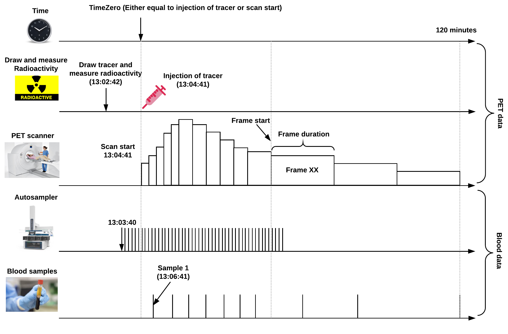
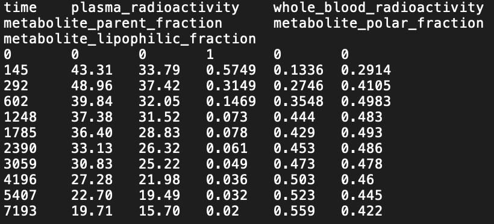

# Positron Emission Tomography

Support for Positron Emission Tomography (PET) was developed as a
[BIDS Extension Proposal](../07-extensions.md#bids-extension-proposals).
Please see [Citing BIDS](../01-introduction.md#citing-bids)
on how to appropriately credit this extension when referring to it in the
context of the academic literature.

The following example PET datasets have been formatted using this specification
and can be used for practical guidance when curating a new dataset.

-   One subject single dynamic scan (pet, mri, blood):
	[`pet_example1`](https://www.dropbox.com/sh/dmjmaxfswatptpm/AACw31cTyChLA1kwM4Vhqueja?dl=0)
-   One subject single dynamic scan (pet, mri):
	[`pet_example2`](https://www.dropbox.com/sh/i95a71rpq2unks7/AACby5XcYQp9vcwgx3cNXBhza?dl=0)
-   One subject single dynamic scan (pet, blood):
	[`pet_example3`](https://www.dropbox.com/sh/i0c3iq50id4s0d3/AABSjaczHM1SQnMRvh3fc7fna?dl=0)

Further PET datasets are available from [OpenNeuro](https://openneuro.org).

## PET recording data

As specified above, this extension is relevant for brain PET imaging
and its associated data, such as blood data.
In addition, the extension is in accordance with the guidelines for reporting
and sharing brain PET data (Knudsen et al. 2020, [1]).

Template:

```Text
sub-<participant_label>/
      [ses-<session_label>/]
        pet/
        sub-<participant_label>[_ses-<session_label>][_task-<task_label>][_acq-<label>][_rec-<label>][_run-<index>]_pet.nii[.gz]
        sub-<participant_label>[_ses-<session_label>][_task-<task_label>][_acq-<label>][_rec-<label>][_run-<index>]_pet.json
```

**Shared MRI data along with PET:**
To share structural magnetic resonance (MR) images with your PET data,
please follow the original BIDS specification
(https://bids-specification.readthedocs.io/en/stable).
Please pay specific attention to the format the MR images are in,
such as if they have been unwarped in order to correct for gradient non-linearities.
There is a specific field in the MRI BIDS (https://bids-specification.readthedocs.io/en/stable/04-modality-specific-files/01-magnetic-resonance-imaging-data.html) called “NonlinearGradientCorrection”
which indicates this.
The reason for this is that the MRI needs to be corrected for nonlinear gradients
in order to fit the accompanying PET scans for co-registration [1, 2].
**Units**: In general, SI units must be used (we refer to https://bids-specification.readthedocs.io/en/stable/99-appendices/05-units.html) and we recommend to use the CMIXF style formatting for SI units, for example, "kBq/mL"
rather than "kilobecquerel per ml".
An overview of a common PET experiment (with blood data) can be seen in Figure 1,
defined on a single time scale relative to a predefined “time zero”
(which should be defined either to be scan start or injection time;
please note an exception to this definition is possible if a pharmacological
within-scan challenge is performed).



Figure 1: Overview of a common PET experiment, including blood measurements,
and defined on a common time scale.
Note, “time zero” can either be defined as time of injection or scan start,
and all the PET and blood data should be decay-corrected to this time point.
Furthermore, although in this example tracer injection coincides with scan start,
this is not always the case and hence we allow for the flexibility of specifying
either time of injection or scan start as “time zero”.

PET data belong to the `pet` directory. PET imaging data SHOULD be stored in 4D
(or 3D if only one volume was acquired) NIfTI files with `_pet` suffix.
Volumes should be stored in chronological order (the order they were acquired in).

Following the BIDS Common Principles (https://bids-specification.readthedocs.io/en/stable/02-common-principles.html), here we summarize how different labels are organized for PET data. Please, check the Common Principles section for further details.
**Sessions**: Multiple sessions (visits) are encoded by adding an extra layer of directories
and file names in the form of `ses-<label>`.
Session labels can consist only of alphanumeric characters [a-zA-Z0-9]
and should be consistent across subjects.
If numbers are used in session labels we recommend using zero padding
(for example, `ses-01`, `ses-11` instead of `ses-1`, `ses-11`).
This makes results of alphabetical sorting more intuitive.
The extra session layer (at least one `ses-<label>` subfolder) should be added
for all subjects if at least one subject in the dataset has more than one session.
Skipping the session layer for only some subjects in the dataset is not allowed.
If a `ses-<label>` subfolder is included as part of the directory hierarchy,
then the same `ses-<label>` tag must also be included as part of the file names themselves.
In general, we assume that a new session with respect to PET starts with either a new injection
(probably most common case) or with the subject being taken out of the scanner
(same injection, but subject leaves the scanner and returns).
However, for example, if a subject has to leave the scanner room and
then be re-positioned on the scanner bed, for example, to use the bathroom,
the set of PET acquisitions will still be considered as a session and match
sessions acquired in other subjects.
Similarly, in situations where different data types are obtained over several
visits (for example, FDG PET on one day followed by amyloid PET a couple days after)
those can be grouped in one session.
Please see the difference with the `run-<label>` below.

**Task:** With respect to the `task-<label>`, data is arranged in a similar way as task-based
and resting state BOLD fMRI data.
In case of studies using combined PET/fMRI, subject-specific tasks may be carried out
during the acquisition within the same session.
Therefore, it is possible to specify `task-<label>` in accordance with the fMRI data.
For more information please see https://bids-specification.readthedocs.io/en/stable/04-modality-specific-files/01-magnetic-resonance-imaging-data.html#task-including-resting-state-imaging-data.

**Acquisition:** In case of studies with multiple acquisitions per subject using different tracers,
the `acq-<label>` must be used to distinguish between different tracers.
Please keep in mind that the label used is arbitrary and each file requires
a separate JSON sidecar with details of the tracer used (see below).
Examples are `acq-18FFDG` for fludeoxyglucose, `acq-11CPIB` for Pittsburgh compound B, etc.

**Reconstruction:** The reconstruction key (`rec-<label>`) has four reserved values:
- `acdyn`, for reconstructions with attenuation correction of dynamic data;
- `acstat`, for reconstructions with attenuation correction of static data;
- `nacdyn`, for reconstructions without attenuation correction of dynamic data;
- `nacstat`, for reconstructions without attenuation correction of static data.
Further details regarding reconstruction are in the `_pet.json` file.
In case of multiple reconstructions of the data with the same type,
we allow for using a number after the `<label>` in order to distinguish,
for example `rec-acdyn1` and `rec-acdyn2`.

The run entity is used if one scan type/contrast is repeated multiple times
within the same scan session/visit.
If several scans of the same modality are acquired they MUST be indexed
with a key-value pair: `_run-1`, `_run-2`, `_run-3` etc. (only integers are allowed as run labels).
When there is only one scan of a given type the run key MAY be omitted.
An example of this would be two consecutive scans performed within the same session,
for example two short FDG scans right after each other.
It is our assumption that the `run-<label>` is used in PET for the cases
where the subject does not leave the scanner.
Otherwise, we refer to the `ses-<label>` definition.

In addition to the imaging data a `_pet.json` sidecar file needs to be provided.
The included metadata are divided into sections described below.

### PET sidecar JSON (`*_pet.json`)

#### Information

This section is mandatory and contains general information about the imaging experiment.
Some of the fields are marked OPTIONAL, for example anaesthesia; for those fields
the BIDS validator will not throw an error even if they are not present.
Note, although bodyweight is a recommended information in (Knudsen et al. 2020, JCBFM [1]),
this consists of meta information at the participant level and should hence
be part of the `participants.tsv` or `session.tsv` file in case of multiple measurements.

| Field name                | Definition                                                                                                                                                                                                                                                                                                                                                                                                                                    |
|---------------------------|-----------------------------------------------------------------------------------------------------------------------------------------------------------------------------------------------------------------------------------------------------------------------------------------------------------------------------------------------------------------------------------------------------------------------------------------------|
| Manufacturer              | REQUIRED. Scanner manufacturer (for example, "Siemens").                                                                                                                                                                                                                                                                                                                                                                                      |
| ManufacturersModelName    | REQUIRED. PET scanner model name (for example, "mMR Biograph").                                                                                                                                                                                                                                                                                                                                                                               |
| Unit                      | REQUIRED. Unit of the image file; please see BIDS main spec section 6. SI unit for radioactivity (Becquerel) should be used (for example, "Bq/mL"). Corresponds to DICOM Tag 0054, 1001 Units.                                                                                                                                                                                                                                                |
| TracerName                | REQUIRED. Name of the tracer compound used (for example, "CIMBI-36")                                                                                                                                                                                                                                                                                                                                                                          |
| TracerRadionuclide        | REQUIRED. Radioisotope labelling tracer (for example, "C11").                                                                                                                                                                                                                                                                                                                                                                                 |
| InstitutionName           | RECOMMENDED. The name of the institution in charge of the equipment that produced the composite instances. Corresponds to DICOM Tag 0008, 0080 InstitutionName.                                                                                                                                                                                                                                                                               |
| InstitutionAddress        | RECOMMENDED. The address of the institution in charge of the equipment that produced the composite instances. Corresponds to DICOM Tag 0008, 0081 InstitutionAddress.                                                                                                                                                                                                                                                                         |
| InstitutionDepartmentName | RECOMMENDED. The department in the institution in charge of the equipment that produced the composite instances. Corresponds to DICOM Tag 0008, 1040 Institutional Department Name.                                                                                                                                                                                                                                                           |
| BodyPart                  | RECOMMENDED. Name of the organ / body region scanned.                                                                                                                                                                                                                                                                                                                                                                                         |
| TracerRadLex              | RECOMMENDED. ID of the tracer compound from the RadLex Ontology.                                                                                                                                                                                                                                                                                                                                                                              |
| TracerSNOMED              | RECOMMENDED. ID of the tracer compound from the SNOMED Ontology (subclass of Radioactive isotope).                                                                                                                                                                                                                                                                                                                                            |
| TracerMolecularWeight     | RECOMMENDED. Accurate molecular weight of the tracer used in unit specified in TracerMolecularWeightUnit below.                                                                                                                                                                                                                                                                                                                                                                                    |
| TracerMolecularWeightUnit | RECOMMENDED. Unit of the molecular weights measurement (for example, "g/mol").                                                                                                                                                                                                                                                                                                                                                                |
| PharmaceuticalName        | RECOMMENDED. Name of pharmaceutical coadministered with tracer.                                                                                                                                                                                                                                                                                                                                                                               |
| PharmaceuticalDoseAmount  | RECOMMENDED. Dose amount of pharmaceutical coadministered with tracer in unit specified in PharmaceuticalDoseUnit below.                                                                                                                                                                                                                                                                                                                                                                        |
| PharmaceuticalDoseUnit    | RECOMMENDED. Unit format relating to pharmaceutical dose (for example, "mg" or "mg/kg").                                                                                                                                                                                                                                                                                                                                                      |
| PharmaceuticalDoseRegimen | RECOMMENDED. Details of the pharmaceutical dose regimen. Either adequate description or short-code relating to regimen documented elsewhere (for example, "single oral bolus").                                                                                                                                                                                                                                                               |
| PharmaceuticalDoseTime    | RECOMMENDED. Time of administration of pharmaceutical dose, relative to time zero (please see below). For an infusion, this should be a vector with two elements specifying the start and end of the infusion period. For more complex dose regimens, the regimen description should be complete enough to enable unambiguous interpretation of the DoseTime vector. Unit format of the specified pharmaceutical dose time should be seconds. |
| Anaesthesia               | OPTIONAL. Details of anaesthesia used, if any.                                                                                                                                                                                                                                                                                                                                                                                                     |

#### Radiochemistry

This section is mandatory and contains information regarding the radioactive
material used in the experiment.

| Field name                    | Definition                                                                                                                                                                                                                                                                           |
|-------------------------------|--------------------------------------------------------------------------------------------------------------------------------------------------------------------------------------------------------------------------------------------------------------------------------------|
| InjectedRadioactivity         | REQUIRED. Total amount of radioactivity injected into the patient (for example, 400) in the unit specified in InjectedRadioactivityUnit below. Corresponds to DICOM Tag (0018,1074) Radionuclide Total Dose.                                                                                                                                  |
| InjectedRadioactivityUnit     | REQUIRED. Unit format of the specified injected radioactivity (for example, "MBq").                                                                                                                                                                                                  |
| InjectedMass                  | REQUIRED. Total mass of radiolabeled compound injected into subject (for example, 10) in the unit specified in InjectedMassUnit below. This can be derived as the ratio of the `InjectedRadioactivity` and `MolarRadioactivity`. **Note for an FDG acquisition this is not available and should be set to -1.** |

| InjectedMassUnit              | REQUIRED. Unit format of the mass of compound injected (for example, "ug" or "umol"). **Note this is not required for an FDG acquisition, since it is not available, and can be set to "-1"**.                                                                                       |
| SpecificRadioactivity         | REQUIRED. Specific activity of compound injected in the unit specified in SpecificRadioactivityUnit below. **Note this is not required for an FDG acquisition, since it is not available, and can be set to -1**.                                                                                                                             |
| SpecificRadioactivityUnit     | REQUIRED. Unit format of specified specific radioactivity (for example, "Bq/g"). **Note this is not required for an FDG acquisition, since it is not available, and can be set to "-1"**.                                                                                            |
| ModeOfAdministration          | REQUIRED. Mode of administration of the injection (for example, "bolus" or "infusion").                                                                                                                                                                                              |
| InjectedMassPerWeight         | RECOMMENDED. Injected mass per kilogram bodyweight in the unit specified in InjectedMassPerWeightUnit  below.                                                                                                                                                                                                                                  |
| InjectedMassPerWeightUnit     | RECOMMENDED. Unit format of the injected mass per kilogram bodyweight (for example, "ug/kg").                                                                                                                                                                                        |
| SpecificRadioactivityMeasTime | RECOMMENDED. Time to which specific radioactivity measurement above applies in the default unit "hh:mm:ss".                                                                                                                                                                          |
| MolarActivity                 | RECOMMENDED. Molar activity of compound injected in the unit specified in MolarActivityUnit below. Corresponds to DICOM Tag (0018,1077) Radiopharmaceutical Specific Activity.                                                                                                                                                        |
| MolarActivityUnit             | RECOMMENDED. Unit of the specified molar radioactivity (for example, "Bq/g").                                                                                                                                                                                                        |
| MolarActivityMeasTime         | RECOMMENDED. Time to which molar radioactivity measurement above applies in the default unit "hh:mm:ss".                                                                                                                                                                             |
| InfusionSpeed                 | RECOMMENDED. If given, infusion speed in the unit specified in InfusionSpeedUnit  below.                                                                                                                                                                                                                                               |
| InfusionSpeedUnit             | RECOMMENDED. Unit of infusion speed (for example, "mL/s").                                                                                                                                                                                                                           |
| InjectedVolume                | RECOMMENDED. Injected volume of the radiotracer in the unit specified in InjectedVolumeUnit below.                                                                                                                                                                                                                                     |
| InjectedVolumeUnit            | RECOMMENDED. Unit of the injected volume of the radiotracer (for example, "mL").                                                                                                                                                                                                     |
| Purity                        | RECOMMENDED. Purity of the radiolabeled compound (for example, 90) int eh unit specified in PurityUnit below.                                                                                                                                                                                                                  |
| PurityUnit                    | RECOMMENDED. Unit of the radiochemical purity (for example, "percent").                                                                                                                                                                                                              |


#### Time

This section is mandatory and contains timing information about the imaging experiment.

| Field name      | Definition                                                                                                                                                                          |
|-----------------|-------------------------------------------------------------------------------------------------------------------------------------------------------------------------------------|
| TimeZero        | REQUIRED. Time zero to which all scan and/or blood measurements have been adjusted to, in the unit “hh:mm:ss”. This should be equal to `InjectionStart` or `ScanStart`.             |
| ScanStart       | REQUIRED. Time of start of scan with respect to `TimeZero` in the default unit seconds.                                                                                             |
| InjectionStart  | REQUIRED. Time of start of injection with respect to `TimeZero` in the default unit seconds. This corresponds to DICOM Tag (0018,1042) converted to seconds relative to `timeZero`. |
| FrameTimesStart | REQUIRED. Start times for all frames relative to `TimeZero` in default unit seconds.                                                                                                |
| FrameDuration   | REQUIRED. Time duration of each frame in default unit seconds. This corresponds to DICOM Tag (0018,1242) converted to seconds.                                                      |
| ScanDate        | RECOMMENDED. Date of scan in the default unit “yyyy:mm:dd”.                                                                                                                         |
| InjectionEnd    | RECOMMENDED. Time of end of injection with respect to `TimeZero` in the default unit seconds.                                                                                       |

#### Reconstruction

This optional section includes information about the image reconstruction.
If there are further parameters, that are not specified here, they should go into the `ReconMethodParameterVal` field.

| Field name                           | Definition                                                                                                                |
|--------------------------------------|---------------------------------------------------------------------------------------------------------------------------|
| AcquisitionMode                      | REQUIRED. Type of acquisition of the PET data (for example, "list mode")                                                  |
| ImageDecayCorrected                  | REQUIRED. Boolean flag specifying whether the image data have been decay-corrected.                                       |
| ImageDecayCorrectionTime             | REQUIRED. Point in time from which the decay correction was applied with respect to TimeZero in the default unit seconds. |
| ReconMethodName                      | REQUIRED. Reconstruction method or algorithm (for example, "3d-op-osem").                                                 |
| ReconMethodParameterLabels           | REQUIRED. Names of reconstruction parameters (for example, ["subsets", "iterations"])                                     |
| ReconMethodParameterUnit             | REQUIRED. Unit of reconstruction parameters (for example, ["none", "none"]).                                              |
| ReconMethodParameterValues           | REQUIRED. Values of reconstruction parameters (for example, [21, 3])                                                      |
| ReconFilterType                      | REQUIRED. Type of post-recon smoothing (for example, ["Shepp"])                                                           |
| ReconFilterSize                      | REQUIRED. Kernel size of post-recon filter (FWHM).                                                                        |
| AttenuationCorrection                | REQUIRED. Short description of the attenuation correction method used.                                                    |
| ReconMethodImplementationVersion     | RECOMMENDED. Identification for the software used, such as name and version.                                              |
| AttenuationCorrectionMethodReference | RECOMMENDED. Reference paper for the attenuation correction method used.                                                  |
| ScaleFactor                          | RECOMMENDED. Scale factor for each frame (for example, []).                                                               |
| ScatterFraction                      | RECOMMENDED. Scatter fraction for each frame (for example, []).                                                           |
| DecayCorrectionFactor                | RECOMMENDED. Decay correction factor for each frame.                                                                      |
| PromptRate                           | RECOMMENDED. Prompt rate for each frame.                                                                                  |
| RandomRate                           | RECOMMENDED. Random rate for each frame.                                                                                  |
| SinglesRate                          | RECOMMENDED. Singles rate for each frame.                                                                                 |

#### Example (`*_pet.json`)

```JSON
{
	"Manufacturer": "Siemens",
	"ManufacturersModelName": "High-Resolution Research Tomograph (HRRT, CTI/Siemens)",
	"BodyPart": "Brain",
	"BodyWeight": 21,
	"BodyWeightUnit": "kg",
	"Unit": "Bq/mL",
	"TracerName": "CIMBI-36",
	"TracerRadionuclide": "C11",
	"TracerMolecularWeight": 380.28,
	"TracerMolecularWeightUnit": "g/mol",
	"TracerInjectionType": "bolus",
	"InjectedRadioactivity": 573,
	"InjectedRadioActivityUnit": "MBq",
	"InjectedMass": 0.62,
	"InjectedMassUnit": "ug",
	"SpecificRadioactivity": 929.6,
	"SpecificRadioactivityUnit": "MBq/ug",
	"ModeOfAdministration": "bolus",
	"MolarActivity": 353.51,
	"MolarActivityUnit": "GBq/umol",
	"MolarActivityMeasTime": "13:04:42",
	"TimeZero": "13:04:42",
	"ScanStart": 0,
	"InjectionStart": 0,
	"FrameTimesStart": [0, 10, 20, 30, 40, 50, 60, 80, 100, 120, 140, 160, 180, 240, 300, 360, 420, 480, 540, 660, 780, 900, 1020, 1140, 1260, 1380, 1500, 1800, 2100, 2400, 2700, 3000, 3300, 3600, 3900, 4200, 4500, 4800, 5100, 5400, 5700, 6000, 6300, 6600, 6900],
	"FrameDuration": [10, 10, 10, 10, 10, 10, 20, 20, 20, 20, 20, 20, 60, 60, 60, 60, 60, 60, 120, 120, 120, 120, 120, 120, 120, 120, 300, 300, 300, 300, 300, 300, 300, 300, 300, 300, 300, 300, 300, 300, 300, 300, 300, 300, 300],
	"AcquisitionMode": "list mode",
	"ImageDecayCorrected": true,
	"ImageDecayCorrectionTime": 0,
	"ReconMethodName": "3D-OSEM-PSF",
	"ReconMethodParameterLabels": ["subsets","iterations"],
	"ReconMethodParameterUnit": ["none","none"],
	"ReconMethodParameterValues": [16,10],
	"ReconFilterType": "none",
	"AttenuationCorrection": "[137Cs]transmission scan-based"
}
```

## Blood recording data

This section includes all data needed to perform blood analysis for PET data.
The section may be omitted completely if blood measurements of radioactivity were not made.
**`*_blood.json`:** If blood measurements were made a `*_blood.json` file is expected that contains
information about which blood data is available as well as some blood measurement details.
Furthermore, depending on the information given in the `*_blood.json` file
we expect `.tsv` files with corresponding .json files that contain the values
and information regarding plasma samples, metabolite fractions,
discrete blood samples and/or continuous blood samples from an autosampler.
All these measurements should be defined according to a single time-scale
in relation to time zero defined by the PET data (Figure 1).
Additionally, if blood and metabolite measurements were made
one should always report radioactivity in plasma and corresponding
parent fraction measurements, including fractions of radiometabolites.
All definitions used below are in accordance with Innis et al. 2007 [3].
All method specific information related to the measurements can be stated
in the field `Description`.

Template:

```Text
sub-<participant_label>/
 	[ses-<session_label>/]
	pet/
	sub-<participant_label>[_ses-<session_label>][_task-<task_label>][_acq-<label>][_rec-<label>][_run-<index>]_blood.json
	sub-<participant_label>[_ses-<session_label>][_task-<task_label>][_acq-<label>][_rec-<label>][_run-<index>]_recording-<label>.tsv
	sub-<participant_label>[_ses-<session_label>][_task-<task_label>][_acq-<label>][_rec-<label>][_run-<index>]_recording-<label>.json

```

Blood data belongs in the /pet folder along with the corresponding PET data.
However, the blood data also follows the [inheritance principle](../02-common-principles.md#the-inheritance-principle) and may be moved to an upper level folder
if it does not change, for example, with multiple reconstructions.
The blood data is most often recorded using an autosampler for continuous blood samples,
or manually for discrete blood samples.
Therefore, the recording key (`recording-<label>`) has two reserved values:
`blood_continuous`,
for continuous whole blood data measurements (2.2.5);
and `blood_discrete`, for discrete blood data, including
whole blood (2.2.5),
plasma (2.2.3),
parent fraction and
metabolite fractions (2.2.4).

**`*.tsv`:** The actual blood radioactivity data will be stored in [tabular `*.tsv` files](../02-common-principles.md#tabular-files)
with the `blood_continuous` and `blood_discrete` suffix.
The first column in the `*.tsv` file should be a time column (see 2.2.1),
defined in relation to time zero defined by the `_pet.json` file.
All other information relevant to the blood measurements are recommended,
and can be added as an additional column.
It is expected that all values are (if relevant) decay corrected to time zero.

## Blood sidecar JSON (`*_blood.json`)

As stated above in order to simplify a distinction between PET data acquired
with and without blood measurements, we have added a specific file detailing
blood measurements called `*_blood.json`.
If blood data is available, meaning some of the `*Avail` below with a given prefix are true,
the following fields with the given prefix are required
and at the same time we require the presence of a `*recording-blood_discrete.tsv`
or `*recording-blood_continuous.tsv` with a corresponding `*recording-blood_discrete.json`
or `*recording-blood_continuous.json` detailing the column content.
These are detailed in the next sections.

| Field name                          | Definition                                                                                                                                                                                                                        |
|-------------------------------------|-----------------------------------------------------------------------------------------------------------------------------------------------------------------------------------------------------------------------------------|
| PlasmaAvail                         | REQUIRED. Boolean that specifies if plasma measurements are available. If this is false, all of the plasma fields should be excluded.                                                                                             |
| PlasmaFreeFraction                  | RECOMMENDED. Measured free fraction in plasma, meaning the concentration of free compound in plasma divided by total concentration of compound in plasma.                                                                         |
| PlasmaFreeFractionMethod            | RECOMMENDED. Method used to estimate free fraction.                                                                                                                                                                               |
| MetaboliteAvail                     | REQUIRED. Boolean that specifies if metabolite measurements are available. If this is false, all of the metabolite fields should be excluded.                                                                                     |
| MetaboliteMethod                    | REQUIRED. Method used to measure metabolites.                                                                                                                                                                                     |
| MetaboliteRecoveryCorrectionApplied | REQUIRED. Metabolite recovery correction from the HPLC, for tracers where it changes with time postinjection. If “true” please include recovery fractions from the HPLC as a column in the table with blood data (`*_blood.tsv`). |
| ContinuousBloodAvail                | REQUIRED. Boolean that specifies if continuous blood measurements are available. If this is false, all of the continuous blood fields should be excluded.                                                                         |
| ContinuousBloodDispersionCorrected  | REQUIRED. Boolean flag specifying whether the continuous blood data have been dispersion-corrected.                                                                                                                               |
| ContinuousBloodWithdrawalRate       | RECOMMENDED. The rate at which the blood was withdrawn from the subject. The unit of the specified withdrawal rate should be in mL/s.                                                                                             |
| ContinuousBloodTubingType           | RECOMMENDED. Description of the type of tubing used, ideally including the material and (internal) diameter.                                                                                                                      |
| ContinuousBloodTubingLength         | RECOMMENDED. The length of the blood tubing, from the subject to the detector in the default unit centimeter.                                                                                                                     |
| ContinuousBloodDispersionConstant   | RECOMMENDED. External dispersion time constant resulting from tubing in default unit seconds.                                                                                                                                     |
| DiscreteBloodAvail                  | REQUIRED. Boolean that specifies if discrete blood measurements are available. If this is false, all of the discrete blood fields should be excluded.                                                                             |
| DiscreteBloodHaematocrit            | RECOMMENDED. Measured haematocrit, meaning the volume of erythrocytes divided by the volume of whole blood.                                                                                                                       |
| DiscreteBloodDensity                | RECOMMENDED. Measured blood density. Unit of blood density should be in g/mL.                                                                                                                                                     |

### Time

If discrete samples, for example, using a COBRA counter are available,
then time information as detailed below should be added to the `*recording-blood_discrete.tsv`
and the values below should be added to the `*recording-blood_discrete.json`.
If continuous samples, for example, using an Allogg autosampler are available,
then time information as detailed below should be added to the `*recording-blood_continous.tsv`
and the values below should be added to the `*recording-blood_continous.json`.

| Field name  | Definition                                                                             |
|:------------|:---------------------------------------------------------------------------------------|
| ColumnName  | REQUIRED. Name of the column (for example, "time").                                     |
| Description | REQUIRED. Time in relation to `TimeZero` defined by the `*_pet.json`. (for example, 5) |
| Units       | REQUIRED. Unit of time steps (for example, "s")                                        |

### Radioactivity in plasma

This section may be omitted if plasma measurements of radioactivity were not made.
It contains information regarding sampled plasma data.
If plasma measurements are available by a discrete sampler, for example, using a COBRA counter,
they should be added to the `*recording-blood_discrete.tsv`
and the values below should be added to the `*recording-blood_discrete.json`.
If plasma measurements are available by a continuous sampler, for example, using an Allogg autosampler,
they should be added to the `*recording-blood_continous.tsv`
and the values below should be added to the `*recording-blood_continous.json`.

| Field name  | Definition                                                         |
|:------------|:-------------------------------------------------------------------|
| ColumnName  | REQUIRED. Name of the column (for example, "plasma_radioactivity"). |
| Description | REQUIRED. Radioactivity in plasma.                                 |
| Units       | REQUIRED. Unit of plasma radioactivity (for example, "kBq/mL")     |

### Metabolites

This section may be omitted if metabolite measurements were not made.
If metabolite measurements are available they should be added to the `*recording-blood_discrete.tsv`
and the values below should be added to the `*recording-blood_discrete.json`.
Hence, it may contain information regarding metabolite info, such as the following three column examples:

| Field name  | Definition                                                               |
|:------------|:-------------------------------------------------------------------------|
| ColumnName  | REQUIRED. Name of the column (for example, "metabolite_parent_fraction"). |
| Description | REQUIRED. Parent fraction of the radiotracer (0-1).                      |
| Units       | REQUIRED. Unit of parent fraction (for example, "arbitrary")              |

| Field name  | Definition                                                              |
|:------------|:------------------------------------------------------------------------|
| ColumnName  | REQUIRED. Name of the column (for example, "metabolite_polar_fraction)". |
| Description | REQUIRED. Polar metabolite fraction of the radiotracer (0-1).           |
| Units       | REQUIRED. Unit of polar metabolite fraction (for example, "arbitrary")   |

| Field name  | Definition                                                                                   |
|:------------|:---------------------------------------------------------------------------------------------|
| ColumnName  | REQUIRED. Name of the column (for example, "hplc_recovery_fractions".                        |
| Description | REQUIRED. HPLC recovery fractions (the fraction of activity that gets loaded onto the HPLC). |
| Units       | REQUIRED. Unit of recovery fractions (for example, "arbitrary")                               |

### Radioactivity in whole blood

This section may be omitted if whole blood measurements of radioactivity were not made.
It contains information regarding sampled whole blood data.
If whole blood measurements are available by a discrete sampler, for example, using a COBRA counter,
they should be added to the `*recording-blood_discrete.tsv`
and the values below should be added to the `*recording-blood_discrete.json`.
If whole blood measurements are available by a continuous sampler, for example, using an Allogg autosampler,
they should be added to the `*recording-blood_continous.tsv`
and the values below should be added to the `*recording-blood_continous.json`.

| Field name  | Definition                                                                                  |
|:------------|:--------------------------------------------------------------------------------------------|
| ColumnName  | REQUIRED. Name of the column (for example, "whole_blood_radioactivity)".                     |
| Description | REQUIRED. Radioactivity in whole blood samples.                                             |
| Units       | REQUIRED. Unit of radioactivity measurements in whole blood samples (for example, "kBq/mL") |

### Example (`*_blood.json`)

```JSON
{
	"PlasmaAvail": true,
	"MetaboliteAvail": true,
	"ContinuousBloodAvail": true,
	"DiscreteBloodAvail": true
}
```

### Example (`*_recording-blood_discrete.json`)

```JSON
{
    "time": {
        "Description": "Time in relation to time zero defined by the _pet.json",
        "Units": "s"
    },
    "plasma_radioactivity": {
        "Description": "Radioactivity in plasma samples. Measured using COBRA counter.",
        "Units": "kBq/mL"
    },
    "whole_blood_radioactivity": {
        "Description": "Radioactivity in whole blood samples. Measured using COBRA counter.",
        "Units": "kBq/mL"
    },
    "metabolite_parent_fraction": {
        "Description": "Parent fraction of the radiotracer.",
        "Units": "arbitrary"
    },
    "metabolite_polar_fraction": {
        "Description": "Polar metabolite fraction of the radiotracer.",
        "Units": "arbitrary"
    },
    "metabolite_lipophilic_fraction": {
        "Description": "Lipophilic metabolite fraction of the radiotracer.",
        "Units": "arbitrary"
    }
}
```



Figure 2: Caption of the corresponding `recording-blood_discrete.tsv` file.


### Example (`*_recording-blood_continuous.json`)

```JSON
{
"time": {
        "Description": "Time in relation to time zero defined by the _pet.json",
        "Units": "s"
    },
    "plasma_radioactivity": {
        "Description": "Radioactivity in plasma samples. Measured using Allogg autosampler.",
        "Units": "kBq/mL"
    }
}
```

# Appendix: Useful resources

This website is an extremely useful resource: http://www.turkupetcentre.net/petanalysis/quantification.html

An extensive resource for background knowledge on kinetic modeling
can be found here: https://nru.dk/index.php/misc/category/3-pet-kinetic-course

# References

[1] Knudsen, G. M., Ganz, M., Appelhoff, S., Boellaard, R., Bormans, G., Carson, R. E., … Innis, R.B. (2020). Guidelines for the content and format of PET brain data in publications and archives : A consensus paper. Journal of Cerebral Blood Flow and Metabolism. https://doi.org/10.1177/0271678X20905433

[2] Nørgaard, M., Ganz, M., Svarer, C., Frokjaer, V. G., Greve, D. N., Strother, S. C., & Knudsen, G. M. (2019). Optimization of preprocessing strategies in Positron Emission Tomography (PET) neuroimaging: A [11C]DASB PET study. NeuroImage, 199(October 2019), 466–479. https://doi.org/10.1016/j.neuroimage.2019.05.055

[3] Innis, R. B., Cunningham, V. J., Delforge, J., Fujita, M., Gjedde, A., Gunn, R. N., … Carson, R. (2007). Consensus nomenclature for in vivo imaging of reversibly binding radioligands. Journal of Cerebral Blood Flow and Metabolism, 1–7. https://doi.org/10.1038/sj.jcbfm.9600493
