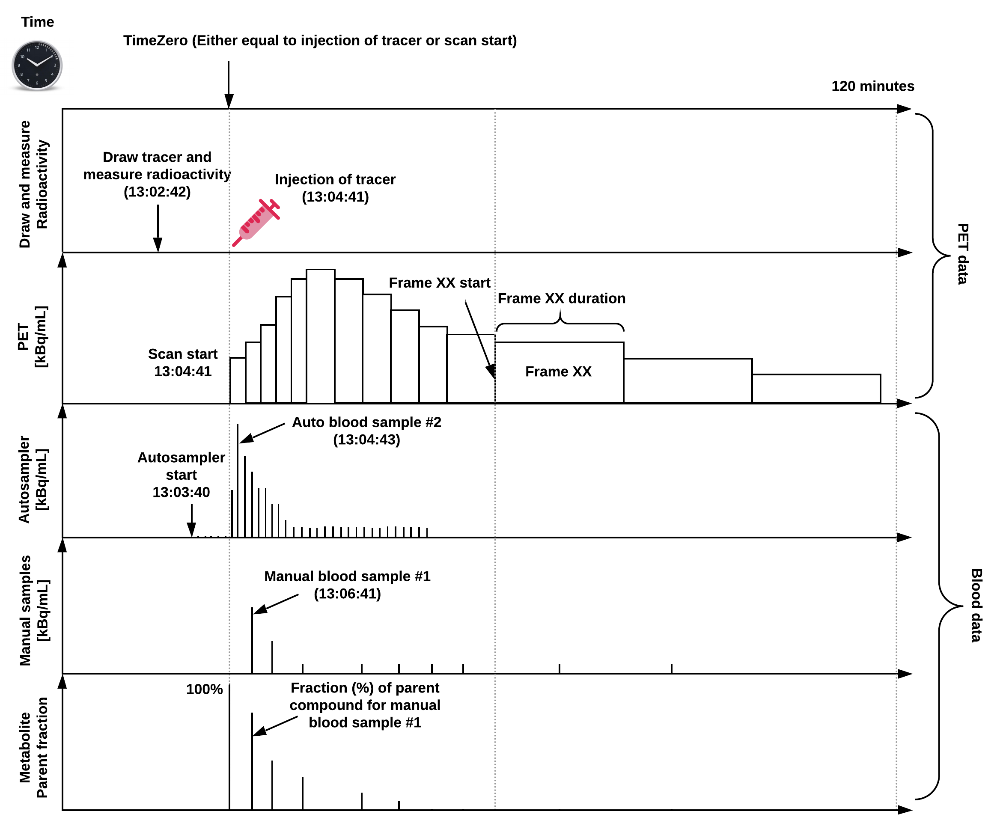

# Positron Emission Tomography

Support for Positron Emission Tomography (PET) was developed as a
[BIDS Extension Proposal](../07-extensions.md#bids-extension-proposals).
Please see [Citing BIDS](../01-introduction.md#citing-bids)
on how to appropriately credit this extension when referring to it in the
context of the academic literature.

The following example PET datasets have been formatted using this specification
and can be used for practical guidance when curating a new dataset.

-   One subject single dynamic scan (pet, mri, blood):
    [`pet_example1`](https://www.dropbox.com/sh/1wpmmilq18mjquq/AABmA1o4vZMmBuGK1Io3vwf3a?dl=0)

-   One subject single dynamic scan (pet, mri):
    [`pet_example2`](https://www.dropbox.com/sh/33adqfaq3kkn58z/AADF5ZbMp6YOs2lOZgnLxZpaa?dl=0)

-   One subject single dynamic scan (pet, blood):
    [`pet_example3`](https://www.dropbox.com/sh/6egwsy442caribr/AABw6GrfvBQClbgie5Gaa6WLa?dl=0)

Further PET datasets are available from [OpenNeuro](https://openneuro.org).

## Terminology and conventions

PET-BIDS is fully consistent with the BIDS specification as a whole.
However, BIDS was initially developed in the context of MRI,
so some terminology may be unfamiliar to researchers from each field.
This section adds clarifications to
[Common Principles - Definitions](../02-common-principles.md#definitions)
for the PET context, and introduces the term "time zero" which is currently
specific to PET.

1.  **Session** - In most cases, a new session with respect to PET corresponds
    to a visit to the scanning site, and starts with a new injection.
    In situations where different data types are obtained over several visits
    (for example, FDG PET on one day followed by amyloid PET a couple days after)
    these scans may be grouped into the same session.
    In other datasets, a subject leaving the scanner and returning under the same
    injection may be considered separate sessions.

1.  **Run** - In PET, subjects may have to leave the scanner to use the bathroom.
    While leaving the scanner would interrupt an MR acquisition, in PET this
    disruption is more appropriately considered missing data during a run.

1.  **Time zero** - A reference point in time, to which all timestamps pertaining
    to a recording are relative.
    Time zero will most commonly be the time of injection of a radioisotope, or
    the time at which the first scan of an acquisition is begun.
    If a pharmacological within-scan challenge is performed,
    another time zero may be more convenient.

An overview of a common PET experiment (with blood data) can be seen in Figure 1,
defined on a single time scale relative to a predefined "time zero".



Figure 1: Overview of a common PET experiment, including blood measurements,
and defined on a common time scale.
Note, "time zero" is often defined as time of injection or scan start, but if a pharmaceutical challenge is carried out during the scan, this timepoint may also be chosen as time zero. The injected dose, the PET data, and blood data should all be decay-corrected to time zero, but because the time of injection not always coincides with scan start, the PET data may not always be decay-corrected to the time of injection. If this is not the case, this may be indicated in the reconstruction section (`ImageDecayCorrected` and `ImageDecayCorrectionTime´). In the example in the figure, tracer injection coincides with scan start. 
and all the PET and blood data should be decay-corrected to this time point.
In this example, tracer injection coincides with scan start.

## PET recording data

Template:

```Text
sub-<label>/[ses-<label>/]
    pet/
        sub-<label>[_ses-<label>][_task-<label>][_trc-<label>][_rec-<label>][_run-<index>]_pet.nii[.gz]
        sub-<label>[_ses-<label>][_task-<label>][_trc-<label>][_rec-<label>][_run-<index>]_pet.json
```

PET data MUST be stored in the `pet` directory.
PET imaging data SHOULD be stored in 4D (or 3D, if only one volume was acquired)
NIfTI files with the `_pet` suffix.
Volumes MUST be stored in chronological order (the order they were acquired in).

The OPTIONAL [`task-<label>`](../99-appendices/09-entities.md#task) is used to
indicate a task subjects were asked to perform in the scanner.
Those labels MUST be consistent across subjects and sessions.

The [`acq-<label>`](../99-appendices/09-entities.md#acq) entity is used to
indicate the tracer used.
This entity is OPTIONAL if only one tracer is used in the study,
but REQUIRED to distinguish between tracers if multiple are used.
The label used is arbitrary and each file requires a separate JSON sidecar
with details of the tracer used (see below).
Examples are `acq-18FFDG` for fludeoxyglucose or `acq-11CPIB` for Pittsburgh compound B.
Other labels are permitted, as long as they are consistent across subjects and sessions
and consist only of the legal label characters.

If more than one run of the same task and acquisition (tracer) are acquired during
the same session, the [`run-<index>`](../99-appendices/09-entities.md#run) entity MUST be used:
`_run-1`, `_run-2`, `_run-3`, and so on.
If only one run was acquired the `run-<index>` can be omitted.

The OPTIONAL [`rec-<label>`](../99-appendices/09-entities.md#rec) entity
is used to indicate the reconstruction method used for the image,
with four reserved values:

  - `acdyn`, for reconstructions with attenuation correction of dynamic data;
  - `acstat`, for reconstructions with attenuation correction of static data;
  - `nacdyn`, for reconstructions without attenuation correction of dynamic data;
  - `nacstat`, for reconstructions without attenuation correction of static data.

Further details regarding reconstruction are in the `_pet.json` file.
If multiple reconstructions of the data are made with the same type of reconstruction,
a number MAY be appended to the label,
for example `rec-acdyn1` and `rec-acdyn2`.

### Shared MRI data along with PET

PET and MRI images may be aggregated in the same dataset.
When analyzing MRI and PET data together,
it is essential to specify whether MR images have been corrected for gradient non-linearities,
using the `NonLinearGradientCorrection` metadata field
(see [Sequence Specifics](./01-magnetic-resonance-imaging-data.md#sequence-specifics)),
which is REQUIRED for all MR data if PET data is also present in the dataset
(see also [PET-MRI correspondence](../99-appendices/13-cross-modality-correspondence.md#pet-mri-correspondence)).
In the case of studies using combined PET/fMRI,
subject-specific tasks may be carried out during the acquisition within the same session.
If the same task is recorded with both modalities,
the same [`task-<label>`](../99-appendices/09-entities.md#task) entity SHOULD be used.
For further details, see
[Task (including resting state) imaging data](./01-magnetic-resonance-imaging-data.md#task-including-resting-state-imaging-data).

In addition to the imaging data (`*.nii`) a `_pet.json` sidecar file MUST be provided.
The included metadata are divided into sections described below.

### PET metadata

PET data MUST be described by metadata fields, stored in sidecar JSON files.
These fields are derived from the recommendations in
Knudsen et al. 2020, [doi:10.1177/0271678X20905433](https://doi.org/10.1177/0271678X20905433),
which we divide into several categories:

#### Scanner Hardware

| **Key name**              | **Requirement level** | **Data type** | **Description**                                                                                                                                                                        |
| ------------------------- | --------------------- | ------------- | -------------------------------------------------------------------------------------------------------------------------------------------------------------------------------------- |
| Manufacturer              | REQUIRED              | [string][]    | Scanner manufacturer (for example, `"Siemens"`).                                                                                                                                       |
| ManufacturersModelName    | REQUIRED              | [string][]    | PET scanner model name (for example, `"mMR Biograph"`).                                                                                                                                |
| Unit                      | REQUIRED              | [string][]    | Unit of the image file; please see BIDS main spec section 6. SI unit for radioactivity (Becquerel) should be used (for example, `"Bq/mL"`). Corresponds to DICOM Tag 0054, 1001 Units. |
| InstitutionName           | RECOMMENDED           | [string][]    | The name of the institution in charge of the equipment that produced the composite instances. Corresponds to DICOM Tag 0008, 0080 InstitutionName.                                     |
| InstitutionAddress        | RECOMMENDED           | [string][]    | The address of the institution in charge of the equipment that produced the composite instances. Corresponds to DICOM Tag 0008, 0081 InstitutionAddress.                               |
| InstitutionDepartmentName | RECOMMENDED           | [string][]    | The department in the institution in charge of the equipment that produced the composite instances. Corresponds to DICOM Tag 0008, 1040 Institutional Department Name.                 |
| BodyPart                  | RECOMMENDED           | [string][]    | Body part of the organ / body region scanned. Corresponds to DICOM Tag 0018, 0015 Body Part Examined                                                                                   |

#### Radiochemistry

| **Key name**                  | **Requirement level** | **Data type** | **Description**                                                                                                                                                                                                                                                            |
| ----------------------------- | --------------------- | ------------- | -------------------------------------------------------------------------------------------------------------------------------------------------------------------------------------------------------------------------------------------------------------------------- |
| TracerName                    | REQUIRED              | [string][]    | Name of the tracer compound used (for example, `"CIMBI-36"`)                                                                                                                                                                                                               |
| TracerRadionuclide            | REQUIRED              | [string][]    | Radioisotope labelling tracer (for example, `"C11"`).                                                                                                                                                                                                                      |
| InjectedRadioactivity         | REQUIRED              | [number][]    | Total amount of radioactivity injected into the patient (for example, 400). Corresponds to DICOM Tag (0018,1074) Radionuclide Total Dose.                                                                                                                                  |
| InjectedRadioactivityUnit     | REQUIRED              | [string][]    | Unit format of the specified injected radioactivity (for example, `"MBq"`).                                                                                                                                                                                                |
| InjectedMass                  | REQUIRED              | [number][]    | Total mass of radiolabeled compound injected into subject (for example, 10). This can be derived as the ratio of the `InjectedRadioactivity` and `MolarRadioactivity`. **For those tracers in which injected mass is not available (for example FDG) can be set to "n/a"** |
| InjectedMassUnit              | REQUIRED              | [string][]    | Unit format of the mass of compound injected (for example, "ug" or "umol"). **Note this is not required for an FDG acquisition, since it is not available, and SHOULD be set to "-1"**.                                                                                    |
| SpecificRadioactivity         | REQUIRED              | [number][]    | Specific activity of compound injected. **Note this is not required for an FDG acquisition, since it is not available, and SHOULD be set to -1**.                                                                                                                          |
| SpecificRadioactivityUnit     | REQUIRED              | [string][]    | Unit format of specified specific radioactivity (for example, "Bq/g"). **Note this is not required for an FDG acquisition, since it is not available, and SHOULD be set to "-1"**.                                                                                         |
| ModeOfAdministration          | REQUIRED              | [string][]    | Mode of administration of the injection (for example, "bolus" or "infusion").                                                                                                                                                                                              |
| TracerRadLex                  | RECOMMENDED           | [string][]    | ID of the tracer compound from the RadLex Ontology.                                                                                                                                                                                                                        |
| TracerSNOMED                  | RECOMMENDED           | [string][]    | ID of the tracer compound from the SNOMED Ontology (subclass of Radioactive isotope).                                                                                                                                                                                      |
| TracerMolecularWeight         | RECOMMENDED           | [number][]    | Accurate molecular weight of the tracer used.                                                                                                                                                                                                                              |
| TracerMolecularWeightUnit     | RECOMMENDED           | [string][]    | Unit of the molecular weights measurement (for example, `"g/mol"`).                                                                                                                                                                                                        |
| InjectedMassPerWeight         | RECOMMENDED           | [number][]    | Injected mass per kilogram bodyweight.                                                                                                                                                                                                                                     |
| InjectedMassPerWeightUnit     | RECOMMENDED           | [string][]    | Unit format of the injected mass per kilogram bodyweight (for example, "ug/kg").                                                                                                                                                                                           |
| SpecificRadioactivityMeasTime | RECOMMENDED           | [string][]    | Time to which specific radioactivity measurement above applies in the default unit "hh:mm:ss".                                                                                                                                                                             |
| MolarActivity                 | RECOMMENDED           | [number][]    | Molar activity of compound injected. Corresponds to DICOM Tag (0018,1077) Radiopharmaceutical Specific Activity.                                                                                                                                                           |
| MolarActivityUnit             | RECOMMENDED           | [string][]    | Unit of the specified molar radioactivity (for example, "Bq/g").                                                                                                                                                                                                           |
| MolarActivityMeasTime         | RECOMMENDED           | [string][]    | Time to which molar radioactivity measurement above applies in the default unit "hh:mm:ss".                                                                                                                                                                                |
| InfusionSpeed                 | RECOMMENDED           | [number][]    | If given, infusion speed.                                                                                                                                                                                                                                                  |
| InfusionSpeedUnit             | RECOMMENDED           | [string][]    | Unit of infusion speed (for example, "mL/s").                                                                                                                                                                                                                              |
| InjectedVolumeUnit            | RECOMMENDED           | [string][]    | Unit of the injected volume of the radiotracer (for example, "mL").                                                                                                                                                                                                        |
| Purity                        | RECOMMENDED           | [number][]    | Purity of the radiolabeled compound (between 0 and 100%).                                                                                                                                                                                                                  |

#### Pharmaceuticals

| **Key name**              | **Requirement level** | **Data type**                          | **Description**                                                                                                                                                                                                                                                                                                                                                                                                                  |
| ------------------------- | --------------------- | -------------------------------------- | -------------------------------------------------------------------------------------------------------------------------------------------------------------------------------------------------------------------------------------------------------------------------------------------------------------------------------------------------------------------------------------------------------------------------------- |
| PharmaceuticalName        | RECOMMENDED           | [string][]                             | Name of pharmaceutical coadministered with tracer.                                                                                                                                                                                                                                                                                                                                                                               |
| PharmaceuticalDoseAmount  | RECOMMENDED           | [number][] or [array][] of [numbers][] | Dose amount of pharmaceutical coadministered with tracer.                                                                                                                                                                                                                                                                                                                                                                        |
| PharmaceuticalDoseUnit    | RECOMMENDED           | [string][]                             | Unit format relating to pharmaceutical dose (for example, `"mg"` or `"mg/kg"`).                                                                                                                                                                                                                                                                                                                                                  |
| PharmaceuticalDoseRegimen | RECOMMENDED           | [string][]                             | Details of the pharmaceutical dose regimen. Either adequate description or short-code relating to regimen documented elsewhere (for example, `"single oral bolus"`).                                                                                                                                                                                                                                                             |
| PharmaceuticalDoseTime    | RECOMMENDED           | [number][] or [array][] of [numbers][] | Time of administration of pharmaceutical dose, relative to time zero (please see below). For an infusion, this should be a vector with two elements specifying the start and end of the infusion period. For more complex dose regimens, the regimen description should be complete enough to enable unambiguous interpretation of the DoseTime vector. Unit format of the specified pharmaceutical dose time should be seconds. |
| Anaesthesia               | OPTIONAL              | [string][]                             | Details of anaesthesia used, if any.                                                                                                                                                                                                                                                                                                                                                                                             |

#### Time

| **Key name**    | **Requirement level** | **Data type**            | **Description**                                                                                                                                                           |
| --------------- | --------------------- | ------------------------ | ------------------------------------------------------------------------------------------------------------------------------------------------------------------------- |
| TimeZero        | REQUIRED              | [string][]               | Time zero to which all scan and/or blood measurements have been adjusted to, in the unit "hh:mm:ss". This should be equal to `InjectionStart` or `ScanStart`.             |
| ScanStart       | REQUIRED              | [number][]               | Time of start of scan with respect to `TimeZero` in the default unit seconds.                                                                                             |
| InjectionStart  | REQUIRED              | [number][]               | Time of start of injection with respect to `TimeZero` in the default unit seconds. This corresponds to DICOM Tag (0018,1042) converted to seconds relative to `TimeZero`. |
| FrameTimesStart | REQUIRED              | [array][] of [numbers][] | Start times for all frames relative to `TimeZero` in default unit seconds.                                                                                                |
| FrameDuration   | REQUIRED              | [array][] of [numbers][] | Time duration of each frame in default unit seconds. This corresponds to DICOM Tag (0018,1242) converted to seconds.                                                      |
| ScanDate        | RECOMMENDED           | [string][]               | Date of scan in the default unit `"YYYY-MM-DD[Z]"`, with the Z indicator being optional for indicating UTC timezone (see [Units](../02-common-principles.md#units)).      |
| InjectionEnd    | RECOMMENDED           | [number][]               | Time of end of injection with respect to `TimeZero` in the default unit seconds.                                                                                          |

We refer to the common principles for the standards for describing dates and timestamps, including possibilities for anonymization (see the [units section](../02-common-principles.md#units).

#### Reconstruction

| **Key name**                         | **Requirement level** | **Data type**                          | **Description**                                                                                                 |
| ------------------------------------ | --------------------- | -------------------------------------- | --------------------------------------------------------------------------------------------------------------- |
| AcquisitionMode                      | REQUIRED              | [string][]                             | Type of acquisition of the PET data (for example, `"list mode"`)                                                |
| ImageDecayCorrected                  | REQUIRED              | [boolean][]                            | Boolean flag specifying whether the image data have been decay-corrected.                                       |
| ImageDecayCorrectionTime             | REQUIRED              | [number][]                             | Point in time from which the decay correction was applied with respect to TimeZero in the default unit seconds. |
| ReconMethodName                      | REQUIRED              | [string][]                             | Reconstruction method or algorithm (for example, `"3d-op-osem"`).                                               |
| ReconMethodParameterLabels           | REQUIRED              | [array][] of [strings][]               | Names of reconstruction parameters (for example, `["subsets", "iterations"]`)                                   |
| ReconMethodParameterUnit             | REQUIRED              | [array][] of [strings][]               | Unit of reconstruction parameters (for example, `["none", "none"]`).                                            |
| ReconMethodParameterValues           | REQUIRED              | [array][] of [numbers][]               | Values of reconstruction parameters (for example, `[21, 3]`)                                                    |
| ReconFilterType                      | REQUIRED              | [string][] or [array][] of [strings][] | Type of post-recon smoothing (for example, `["Shepp"]`)                                                         |
| ReconFilterSize                      | REQUIRED              | [number][] or [array][] of [numbers][] | Kernel size of post-recon filter (FWHM).                                                                        |
| AttenuationCorrection                | REQUIRED              | [string][]                             | Short description of the attenuation correction method used.                                                    |
| ReconMethodImplementationVersion     | RECOMMENDED           | [string][]                             | Identification for the software used, such as name and version.                                                 |
| AttenuationCorrectionMethodReference | RECOMMENDED           | [string][]                             | Reference paper for the attenuation correction method used.                                                     |
| ScaleFactor                          | RECOMMENDED           | [array][] of [numbers][]               | Scale factor for each frame.                                                                                    |
| ScatterFraction                      | RECOMMENDED           | [array][] of [numbers][]               | Scatter fraction for each frame.                                                                                |
| DecayCorrectionFactor                | RECOMMENDED           | [array][] of [numbers][]               | Decay correction factor for each frame.                                                                         |
| PromptRate                           | RECOMMENDED           | [array][] of [numbers][]               | Prompt rate for each frame.                                                                                     |
| RandomRate                           | RECOMMENDED           | [array][] of [numbers][]               | Random rate for each frame (same units as `Unit´, e.g. `"Bq/mL"`).                                                                                     |
| SinglesRate                          | RECOMMENDED           | [array][] of [numbers][]               | Singles rate for each frame.                                                                                    |

All reconstruction-specific parameters that are not specified, but one wants to include, should go into the `ReconMethodParameterValues` field.

#### Example (`*_pet.json`)

```JSON
{
  "Manufacturer": "Siemens",
  "ManufacturersModelName": "High-Resolution Research Tomograph (HRRT, CTI/Siemens)",
  "BodyPart": "Brain",
  "Unit": "Bq/mL",
  "TracerName": "CIMBI-36",
  "TracerRadionuclide": "C11",
  "TracerMolecularWeight": 380.28,
  "TracerMolecularWeightUnit": "g/mol",

  "InjectedRadioactivity": 573,
  "InjectedRadioActivityUnit": "MBq",
  "InjectedMass": 0.62,
  "InjectedMassUnit": "ug",
  "SpecificRadioactivity": 929.6,
  "SpecificRadioactivityUnit": "MBq/ug",
  "ModeOfAdministration": "bolus",
  "MolarActivity": 353.51,
  "MolarActivityUnit": "GBq/umol",
  "MolarActivityMeasTime": "13:04:42",
  "TimeZero": "13:04:42",
  "ScanStart": 0,
  "InjectionStart": 0,
  "FrameTimesStart": [0, 10, 20, 30, 40, 50, 60, 80, 100, 120, 140, 160, 180, 240, 300, 360, 420, 480, 540, 660, 780, 900, 1020, 1140, 1260, 1380, 1500, 1800, 2100, 2400, 2700, 3000, 3300, 3600, 3900, 4200, 4500, 4800, 5100, 5400, 5700, 6000, 6300, 6600, 6900],
  "FrameDuration": [10, 10, 10, 10, 10, 10, 20, 20, 20, 20, 20, 20, 60, 60, 60, 60, 60, 60, 120, 120, 120, 120, 120, 120, 120, 120, 300, 300, 300, 300, 300, 300, 300, 300, 300, 300, 300, 300, 300, 300, 300, 300, 300, 300, 300],
  "AcquisitionMode": "list mode",
  "ImageDecayCorrected": true,
  "ImageDecayCorrectionTime": 0,
  "ReconMethodName": "3D-OSEM-PSF",
  "ReconMethodParameterLabels": ["subsets","iterations"],
  "ReconMethodParameterUnit": ["none","none"],
  "ReconMethodParameterValues": [16,10],
  "ReconFilterType": "none",
  "AttenuationCorrection": "[137Cs]transmission scan-based"
}
```

### Recommended patient data

Knudsen et al. 2020
([doi:10.1177/0271678X20905433](https://doi.org/10.1177/0271678X20905433))
recommends recording participant body weight.
If recorded once per participant, these data SHOULD be included in the
[Participants file](../03-modality-agnostic-files.md#participants-file) or as
[Phenotypic and assessment data](../03-modality-agnostic-files.md#phenotypic-and-assessment-data).

For example:

```Text
participant_id body_weight
sub-01 58
sub-02 96
sub-03 72
```

If multiple measurements are made, these data SHOULD be included in the
[Sessions file](../06-longitudinal-and-multi-site-studies.md#sessions-file).

For example:

```Text
session_id body_weight
ses-01 58
ses-02 59
```

## Blood recording data

Template:

```Text
sub-<label>/[ses-<label>/]
    pet/
	sub-<label>[_ses-<label>][_task-<label>][_acq-<label>][_rec-<label>][_run-<index>][_recording-<label>]_blood.tsv
	sub-<label>[_ses-<label>][_task-<label>][_acq-<label>][_rec-<label>][_run-<index>][_recording-<label>]_blood.json

```

If collected, blood measurements of radioactivity are be stored in
[Tabular files](../02-common-principles.md#tabular-files) and located in
the `pet/` directory along with the corresponding PET data.

The OPTIONAL `recording` entity is used to distinguish sampling methods.
For example, if an autosampler is used to record continuous blood samples,
and manual measurements are also taken,
then the files may have recording labels `autosampler` and `manual`,
respectively.
If multiple recording methods are used on the same PET acquisition,
the `recording` entity MUST be used to distinguish them.
All blood measurements should be reported according to a single time-scale
in relation to time zero defined by the PET data (Figure 1).
All definitions used below are in accordance with
Innis et al. 2007 ([doi:10.1038/sj.jcbfm.9600493](https://doi.org/10.1038/sj.jcbfm.9600493)).

Some metadata about the recording MUST be provided in an additional JSON
file.

| **Key name**        | **Requirement level** | **Data type** | **Description**                                                                                                                                                                                               |
| ------------------- | --------------------- | ------------- | ------------------------------------------------------------------------------------------------------------------------------------------------------------------------------------------------------------- |
| PlasmaAvail         | REQUIRED              | [boolean][]   | Boolean that specifies if plasma measurements are available.                                                                                                                                                  |
| MetaboliteAvail     | REQUIRED              | [boolean][]   | Boolean that specifies if metabolite measurements are available. If `true`, the `metabolite parent_fraction` and `metabolite_polar_fraction` columns MUST be present in the corresponding `*_blood.tsv` file. |
| WholeBloodAvail     | REQUIRED              | [boolean][]   | Boolean that specifies if whole blood measurements are available. If `true`, the `whole_blood_radioactivity` column MUST be present in the corresponding `*_blood.tsv` file.                                  |
| DispersionCorrected | REQUIRED              | [boolean][]   | Boolean flag specifying whether the blood data have been dispersion-corrected. NOTE: not customary for manual samples, and hence should be set to false.                                                      |
| WithdrawalRate      | RECOMMENDED           | [number][]    | The rate at which the blood was withdrawn from the subject. The unit of the specified withdrawal rate should be in mL/s.                                                                                      |
| TubingType          | RECOMMENDED           | [string][]    | Description of the type of tubing used, ideally including the material and (internal) diameter.                                                                                                               |
| TubingLength        | RECOMMENDED           | [number][]    | The length of the blood tubing, from the subject to the detector in meters.                                                                                                                                   |
| DispersionConstant  | RECOMMENDED           | [number][]    | External dispersion time constant resulting from tubing in default unit seconds.                                                                                                                              |
| Haematocrit         | RECOMMENDED           | [number][]    | Measured haematocrit, meaning the volume of erythrocytes divided by the volume of whole blood.                                                                                                                |
| BloodDensity        | RECOMMENDED           | [number][]    | Measured blood density. Unit of blood density should be in g/mL.                                                                                                                                              |

The following metadata SHOULD or MUST be provided if corresponding flags are `true`.

| **Key name**                        | **Requirement level**                   | **Data type** | **Description**                                                                                                                                                                                                    |
| ----------------------------------- | --------------------------------------- | ------------- | ------------------------------------------------------------------------------------------------------------------------------------------------------------------------------------------------------------------ |
| PlasmaFreeFraction                  | RECOMMENDED if `PlasmaAvail` is `true`  | [number][]    | Measured free fraction in plasma, meaning the concentration of free compound in plasma divided by total concentration of compound in plasma (Units: 0-100%).                                                       |
| PlasmaFreeFractionMethod            | RECOMMENDED if `PlasmaAvail` is `true`  | [string][]    | Method used to estimate free fraction.                                                                                                                                                                             |
| MetaboliteMethod                    | REQUIRED if `MetaboliteAvail` is `true` | [string][]    | Method used to measure metabolites.                                                                                                                                                                                |
| MetaboliteRecoveryCorrectionApplied | REQUIRED if `MetaboliteAvail` is `true` | [boolean][]   | Metabolite recovery correction from the HPLC, for tracers where it changes with time postinjection. If `true`, the `metabolite_recovery_fractions` column MUST be present in the corresponding `*_blood.tsv` file. |

The following columns are defined for `_blood.tsv` files:

| **Column name**              | **Requirement level**                                       | **Description**                                                                   | **Units**                                                                         |
| ---------------------------- | ----------------------------------------------------------- | --------------------------------------------------------------------------------- | --------------------------------------------------------------------------------- |
| `time`                       | REQUIRED                                                    | Time in relation to `TimeZero` defined by the `*_pet.json`. (for example, 5)      | Seconds                                                                           |
| `plasma_radioactivity`       | REQUIRED if `PlasmaAvail` is `true`                         | Radioactivity in plasma                                                           | Unit of plasma radioactivity (for example, "kBq/mL")                              |
| `metabolite_parent_fraction` | REQUIRED if `MetaboliteAvail` is `true`                     | Parent fraction of the radiotracer (0-1)                                          | Unit of parent fraction (for example, "unitless")                                 |
| `metabolite_polar_fraction`  | RECOMMENDED if `MetaboliteAvail` is `true`                  | Polar metabolite fraction of the radiotracer (0-1)                                | Unit of polar metabolite fraction (for example, "unitless")                       |
| `hplc_recovery_fractions`    | REQUIRED if `MetaboliteRecoveryCorrectionApplied` is `true` | HPLC recovery fractions (the fraction of activity that gets loaded onto the HPLC) | Unit of recovery fractions (for example, "unitless")                              |
| `whole_blood_radioactivity`  | REQUIRED if `WholeBloodAvail` is `true`                     | Radioactivity in whole blood samples                                              | Unit of radioactivity measurements in whole blood samples (for example, "kBq/mL") |

As with all [tabular files](../02-common-principles.md#tabular-files),
additional columns MAY be defined in `_blood.json`.
For clarity, it is RECOMMENDED to include the above column definitions in `_blood.json`,
as shown in the following example.

### Example blood data

**`*_recording-manual_blood.json`**:

```JSON
{
    "PlasmaAvail": true,
    "WholeBloodAvail": true,
    "MetaboliteAvail": true,
    "MetaboliteMethod": "",
    "MetaboliteRecoveryCorrectionApplied": false,
    "DispersionCorrected": false,

    "time": {
        "Description": "Time in relation to time zero defined by the _pet.json",
        "Units": "s"
    },
    "plasma_radioactivity": {
        "Description": "Radioactivity in plasma samples. Measured using COBRA counter.",
        "Units": "kBq/mL"
    },
    "whole_blood_radioactivity": {
        "Description": "Radioactivity in whole blood samples. Measured using COBRA counter.",
        "Units": "kBq/mL"
    },
    "metabolite_parent_fraction": {
        "Description": "Parent fraction of the radiotracer.",
        "Units": "arbitrary"
    },
    "metabolite_polar_fraction": {
        "Description": "Polar metabolite fraction of the radiotracer.",
        "Units": "arbitrary"
    },
    "metabolite_lipophilic_fraction": {
        "Description": "Lipophilic metabolite fraction of the radiotracer.",
        "Units": "arbitrary"
    }
}
```

**`*_recording-manual_blood.tsv`**:

```Text
time plasma_radioactivity whole_blood_radioactivity metabolite_parent_fraction metabolite_polar_fraction
0    0    0    1    0
145    43.31    33.79    0.5749    0.1336
292    48.96    37.42    0.3149    0.2746
602    39.84    32.05    0.1469    0.3548
1248    37.38    31.52    0.073    0.444
1785    36.40    28.83    0.078    0.429
2390    33.13    26.32    0.061    0.453
3059    30.83    25.22    0.049    0.473
4196    27.28    21.98    0.036    0.503
5407    22.70    19.49    0.032    0.523
7193    19.71    15.70    0.02    0.559
```

<!-- Link Definitions -->

[deprecated]: ../02-common-principles.md#definitions
[string]: https://www.w3schools.com/js/js_json_datatypes.asp
[strings]: https://www.w3schools.com/js/js_json_datatypes.asp
[integer]: https://www.w3schools.com/js/js_json_datatypes.asp
[number]: https://www.w3schools.com/js/js_json_datatypes.asp
[numbers]: https://www.w3schools.com/js/js_json_datatypes.asp
[boolean]: https://www.w3schools.com/js/js_json_datatypes.asp
[array]: https://www.w3schools.com/js/js_json_arrays.asp
[arrays]: https://www.w3schools.com/js/js_json_arrays.asp
[object]: https://www.json.org/json-en.html
[uri]: ../02-common-principles.md#uniform-resource-indicator
