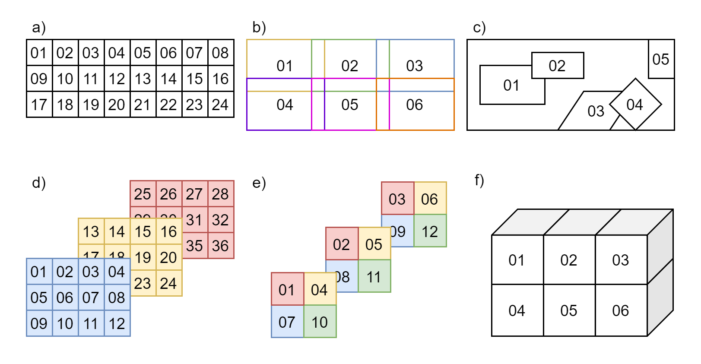
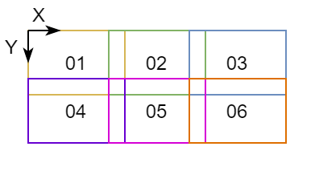
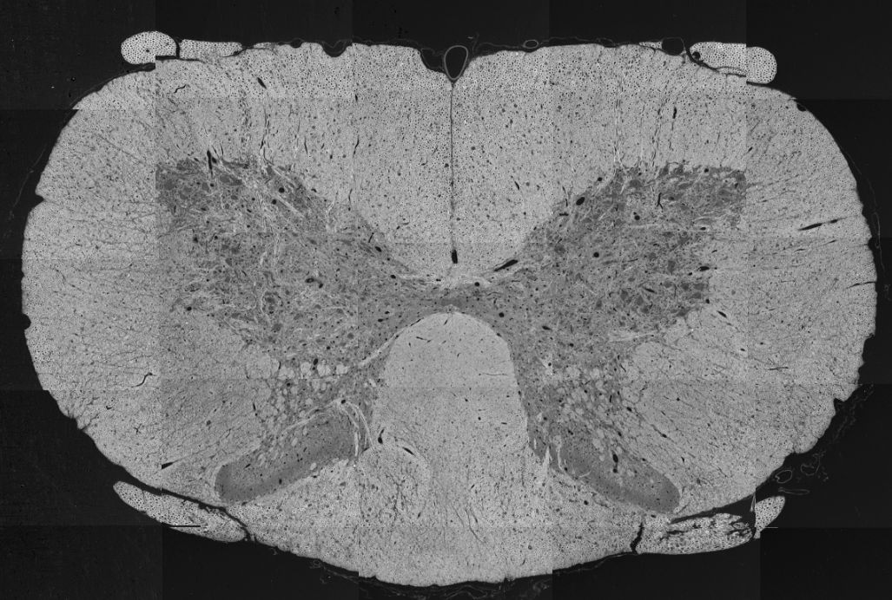

# Microscopy

Support for Microscopy was developed as a
[BIDS Extension Proposal](../07-extensions.md#bids-extension-proposals).

Please see [Citing BIDS](../01-introduction.md#citing-bids)
on how to appropriately credit this extension when referring to it in the
context of the academic literature.

Microscopy datasets formatted using this specification are available on the
[BIDS examples repository](https://github.com/bids-standard/bids-examples#microscopy-datasets)
and can be used for practical guidance when curating a new dataset.

Further Microscopy datasets are available:

-   In PNG format:  [`data_axondeepseg_sem`](https://doi.org/10.5281/zenodo.5498378)
-   In OME-TIFF format: [`Broca's Area Light-Sheet Microscopy`](https://doi.org/10.5281/zenodo.5517223)

## Microscopy imaging data

<!--
This block generates a filename templates.
The inputs for this macro can be found in the folder
  src/schema/rules/datatypes
and a guide for using macros can be found at
 https://github.com/bids-standard/bids-specification/blob/master/macros_doc.md
-->
{{ MACROS___make_filename_template(datatypes=["micr"], suffixes=["TEM", "SEM", "uCT", "BF", "DF",
"PC", "DIC", "FLUO", "CONF", "PLI", "CARS", "2PE", "MPE", "SR", "NLO", "OCT", "SPIM"], n_dupes_to_combine=4) }}

Microscopy data MUST be stored in the `micr` directory.

### File formats
The Microscopy community uses a variety of formats for storing raw data, and there is no single
standard that all researchers agree on. However, a standardized file structure has been developed
by the [Open Microscopy Environment](https://www.openmicroscopy.org/) for whole-slide imaging with
the [OME-TIFF file specifications](https://docs.openmicroscopy.org/ome-model/6.1.2/ome-tiff/file-structure.html).
The OME-TIFF file allows for multi-page TIFF files to store multiple image planes and supports
multi-resolution pyramidal tiled images. An OME-XML data block is also embedded inside the
file’s header.

The BIDS standard accepts microscopy data in a number of file formats to accommodate datasets
stored in 2D image formats and whole-slide imaging formats, to accommodate lossless and lossy
compression, and to avoid unnecessary conversions of the original data from a non-tiled to a
tiled format, or vice-versa.

Microscopy raw data MUST be stored in one of the following formats:

-   [Portable Network Graphics](http://www.libpng.org/pub/png/) (`.png`)

-   [Tag Image File Format](https://en.wikipedia.org/wiki/TIFF) (`.tif`)

-   [OME-TIFF](https://docs.openmicroscopy.org/ome-model/6.1.2/ome-tiff/specification.html#)
    (`.ome.tif` for standard TIFF files or `.ome.btf` for
    [BigTIFF](https://www.awaresystems.be/imaging/tiff/bigtiff.html) files)

If different from PNG, TIFF or OME-TIFF, the original unprocessed data in the native format MAY be
stored in the [`/sourcedata` directory](../02-common-principles.md#source-vs-raw-vs-derived-data).

Future versions may extend this list of supported file formats, for example with the
Next-Generation File Formats currently developed by OME ([OME-NGFF](https://ngff.openmicroscopy.org/latest/))
as a successor to OME-TIFF for better remote sharing of large datasets.

### Modality suffixes
Microscopy data currently support the following imaging modalities:

<!--
This block generates a suffix table.
The definitions of these fields can be found in
  src/schema/rules/datatypes
and a guide for using macros can be found at
 https://github.com/bids-standard/bids-specification/blob/master/macros_doc.md
-->
{{ MACROS___make_suffix_table(
      [
         "TEM",
         "SEM",
         "uCT",
         "BF",
         "DF",
         "PC",
         "DIC",
         "FLUO",
         "CONF",
         "PLI",
         "CARS",
         "2PE",
         "MPE",
         "SR",
         "NLO",
         "OCT",
         "SPIM",
      ]
   )
}}

### Filename entities

In the context of Microscopy, a session ([`ses-<label>`](../99-appendices/09-entities.md#ses))
can refer to all the acquisitions between the start and the end of an imaging experiment
for ex vivo imaging, or a subject lab visit for biopsy procedure and/or in vivo imaging.
Consistent with other data types in BIDS, the session entity is optional.

The [`sample-<label>`](../99-appendices/09-entities.md#sample) entity is REQUIRED for
Microscopy data and is used to distinguish between different samples from the same subject.
The label MUST be unique per subject and is RECOMMENDED to be unique throughout the dataset.

For example: Three brain slices (`sample-01` to `sample-03`) extracted from subject `sub-01`,
imaged by scanning electron microscopy (SEM) in PNG format

<!-- This block generates a file tree.
A guide for using macros can be found at
 https://github.com/bids-standard/bids-specification/blob/master/macros_doc.md
-->
{{ MACROS___make_filetree_example(
   {
   "sub-01": {
      "micr": {
         "sub-01_sample-01_SEM.png": "",
         "sub-01_sample-02_SEM.png": "",
         "sub-01_sample-03_SEM.png": "",
         "sub-01_SEM.json": "",
         },
      }
   }
) }}

In this example, the JSON metadata is common for all samples of `sub-01`.
JSON metadata may be defined per subject or per sample as appropriate, as per the
[inheritance principle](../02-common-principles.md#the-inheritance-principle).

The [`acq-<label>`](../99-appendices/09-entities.md#acq) entity corresponds to a custom label that
MAY be used to distinguish a different set of parameters used for acquiring the same modality.
For example, two images of the same sample acquired by bright-field microscopy (BF) in PNG format at
different magnification of 40x and 60x.
In such case two files could have the following names: `sub-01_sample-01_acq-40x_BF.png` and
`sub-01_sample-01_acq-60x_BF.png`, however the user is free to choose any other label as long as
they are consistent across subjects and sessions.

The [`stain-<label>`](../99-appendices/09-entities.md#stain) entity MAY be used to distinguish
image files from the same sample using different stains or antibodies for contrast enhancement.

For example: One brain slice (`sample-01`) extracted from subject `sub-01` with three
stains (`stain-01`, `stain-02` and `stain-03`) in three separate files, imaged by selective plane
illumination microscopy (SPIM) in OME-TIFF format

<!-- This block generates a file tree.
A guide for using macros can be found at
 https://github.com/bids-standard/bids-specification/blob/master/macros_doc.md
-->
{{ MACROS___make_filetree_example(
   {
   "sub-01": {
      "micr": {
         "sub-01_sample-01_stain-01_SPIM.ome.tif": "",
         "sub-01_sample-01_stain-01_SPIM.json": "",
         "sub-01_sample-01_stain-02_SPIM.ome.tif": "",
         "sub-01_sample-01_stain-02_SPIM.json": "",
         "sub-01_sample-01_stain-03_SPIM.ome.tif": "",
         "sub-01_sample-01_stain-03_SPIM.json": "",
         },
      }
   }
) }}

In this example, the entity stain is used to distinguish images with different
stains in separate files from the same sample.
In the case where a single file contains different staining in each channel, the
`stain-<label>` is omitted.

Stains SHOULD be indicated in the `"SampleStaining"` key in the sidecar JSON file,
although the label may be different.
Description of antibodies SHOULD also be indicated in `"SamplePrimaryAntibodies"`
and/or `"SampleSecondaryAntobodies"` as appropriate.

If more than one run of the same sample, acquisition and stain are acquired during the same
session, the [`run-<index>`](../99-appendices/09-entities.md#run) entity MUST be used:
`_run-1`, `_run-2`, `_run-3`, and so on.
If only one run was acquired the `run-<index>` can be omitted.

The [`chunk-<index>`](../99-appendices/09-entities.md#chunk) entity is used when multiples
regions (2D images or 3D volumes files) of the same physical sample are imaged with different
fields of view, regardless if they overlap or not.

In some cases, the chunks can be "ordered" and, for example, correspond to the displacement of the
microscope stage.
In other cases, the chunks can be different images of the same sample with no explicit
spatial relation between them.

Examples of different chunks configurations can be seen in Figure 1.


Figure 1: Examples of chunks configurations.

-   a) ordered 2D chunks without overlap,
-   b) ordered 2D chunks with overlap,
-   c) unordered 2D chunks with and without overlap,
-   d) and e) ordered 2D chunks on different 3D planes,
-   f) ordered 3D chunks.

For example: Four chunks (`chunk-01` to `chunk-04`) from the same brain sample (`sample-01`)
of subject `sub-01`, imaged by confocal microscopy (CONF) in OME-TIFF format

<!-- This block generates a file tree.
A guide for using macros can be found at
 https://github.com/bids-standard/bids-specification/blob/master/macros_doc.md
-->
{{ MACROS___make_filetree_example(
   {
   "sub-01": {
      "micr": {
         "sub-01_sample-01_chunk-01_CONF.ome.tif": "",
         "sub-01_sample-01_chunk-01_CONF.json": "",
         "sub-01_sample-01_chunk-02_CONF.ome.tif": "",
         "sub-01_sample-01_chunk-02_CONF.json": "",
         "sub-01_sample-01_chunk-03_CONF.ome.tif": "",
         "sub-01_sample-01_chunk-03_CONF.json": "",
         "sub-01_sample-01_chunk-04_CONF.ome.tif": "",
         "sub-01_sample-01_chunk-04_CONF.json": "",
         },
      }
   }
) }}

The index number can be assigned arbitrarily and, in the case of "ordered" chunks, the chunks'
relative positions (in terms of scaling and translation) SHOULD be defined by an affine
transformation matrix in the JSON sidecar file of each chunk, as described in
[Chunk Transformations](10-microscopy.md#chunk-transformations).

In this example, the JSON metadata is different for each chunk of `sub-01_sample-01`.
JSON metadata may be defined per sample or per chunk as appropriate, as per the
[inheritance principle](../02-common-principles.md#the-inheritance-principle).

In microscopy, many pyramidal file formats store multiple resolutions for the same acquisition.
In the case where a multiple resolutions file format is converted to single resolution file format,
only the higher resolution file is present in the raw data.
Lower resolutions files MUST be placed under the `derivatives` directory and use the
[`res-<label>`](../99-appendices/09-entities.md#res) entity.

For example:

<!-- This block generates a file tree.
A guide for using macros can be found at
 https://github.com/bids-standard/bids-specification/blob/master/macros_doc.md
-->
{{ MACROS___make_filetree_example(
   {
   "my_dataset": {
      "derivatives": {
         "downsampled": {
            "sub-01": {
               "micr": {
                  "sub-01_sample-01_res-4x_TEM.png": "",
                  "sub-01_sample-01_res-4x_TEM.json": "",
                  },
               }
            }
         },
      "sub-01": {
         "micr": {
            "sub-01_sample-01_TEM.png": "",
            "sub-01_sample-01_TEM.json": "",
            },
         }
      }
   }
) }}

See [Preprocessed, coregistered and/or resampled volumes](../05-derivatives/03-imaging.md#preprocessed-coregistered-andor-resampled-volumes)
for details.

### Microscopy metadata (Sidecar JSON)

Microscopy data MUST be described by metadata fields, stored in sidecar JSON files.

#### Device Hardware

<!-- This block generates a metadata table.
The definitions of these fields can be found in
  src/schema/objects/metadata.yaml
and a guide for using macros can be found at
 https://github.com/bids-standard/bids-specification/blob/master/macros_doc.md
-->
{{ MACROS___make_metadata_table(
   {
      "Manufacturer": "RECOMMENDED",
      "ManufacturersModelName": "RECOMMENDED",
      "DeviceSerialNumber": "RECOMMENDED",
      "StationName": "RECOMMENDED",
      "SoftwareVersions": "RECOMMENDED",
      "InstitutionName": "RECOMMENDED",
      "InstitutionAddress": "RECOMMENDED",
      "InstitutionalDepartmentName": "RECOMMENDED",
   }
) }}

#### Image Acquisition

<!-- This block generates a metadata table.
The definitions of these fields can be found in
  src/schema/objects/metadata.yaml
and a guide for using macros can be found at
 https://github.com/bids-standard/bids-specification/blob/master/macros_doc.md
-->
{{ MACROS___make_metadata_table(
   {
      "PixelSize": "REQUIRED",
      "PixelSizeUnits": "REQUIRED",
      "Immersion": "OPTIONAL",
      "NumericalAperture": "OPTIONAL",
      "Magnification": "OPTIONAL",
      "ImageAcquisitionProtocol": "OPTIONAL",
      "OtherAcquisitionParameters": "OPTIONAL",
   }
) }}

#### Sample

<!-- This block generates a metadata table.
The definitions of these fields can be found in
  src/schema/objects/metadata.yaml
and a guide for using macros can be found at
 https://github.com/bids-standard/bids-specification/blob/master/macros_doc.md
-->
{{ MACROS___make_metadata_table(
   {
      "BodyPart": ("RECOMMENDED", "From [DICOM Body Part Examined](http://dicom.nema.org/medical/dicom/current/output/chtml/part16/chapter_L.html#chapter_L) (for example `\"BRAIN\"`)."),
      "BodyPartDetails": "RECOMMENDED",
      "BodyPartDetailsOntology": "OPTIONAL",
      "SampleEnvironment": "RECOMMENDED",
      "SampleEmbedding": "OPTIONAL",
      "SampleFixation": "OPTIONAL",
      "SampleStaining": "RECOMMENDED",
      "SamplePrimaryAntibody": "RECOMMENDED",
      "SampleSecondaryAntibody": "RECOMMENDED",
      "SliceThickness": "OPTIONAL",
      "TissueDeformationScaling": "OPTIONAL",
      "SampleExtractionProtocol": "OPTIONAL",
      "SampleExtractionInstitution": "OPTIONAL",
   }
) }}

#### Chunk Transformations

Chunk transformations metadata describes the spatial relation between chunks
of the same sample in an implicit coordinate system.

-   The source frame of reference is the frame of reference of the associated image.

-   The target frame of reference is the implicit coordinate system of the transform.

-   The target frame of reference has the same units as the `PixelSizeUnits` metadata.

-   The chunk transformation is described by 2 metadata fields: an affine transformation matrix
    and a description of the axis of the matrix.

-   Other transformations should be described in derivatives.

<!-- This block generates a metadata table.
The definitions of these fields can be found in
  src/schema/objects/metadata.yaml
and a guide for using macros can be found at
 https://github.com/bids-standard/bids-specification/blob/master/macros_doc.md
-->
{{ MACROS___make_metadata_table(
   {
      "ChunkTransformationMatrix": "RECOMMENDED if `<chunk-index>` is used in filenames",
      "ChunkTransformationMatrixAxis": "REQUIRED if `ChunkTransformationMatrix` is present",
   }
) }}

An example of chunk transformations JSON metadata for `chunk-01` and `chunk-05` of Figure 2
is shown below:



Figure 2: Example figure for chunks transformations.

In this example, there is no scaling and `chunk-01` is at the origin.
`chunk-05` is translated by 5 um along `X+` and by 3 um along `Y+`.

**`*_chunk-01_<suffix>.json`**:
```JSON
{
        "PixelSize": [1, 1],
        "PixelSizeUnits": "um",
        "ChunkTransformationMatrix": [[1, 0, 0],
                                      [0, 1, 0],
                                      [0, 0, 1]],
        "ChunkTransformationMatrixAxis": ["X", "Y"]
}
```

**`*_chunk-05_<suffix>.json`**:
```JSON
{
        "PixelSize": [1, 1],
        "PixelSizeUnits": "um",
        "ChunkTransformationMatrix": [[1, 0, 5],
                                      [0, 1, 3],
                                      [0, 0, 1]],
        "ChunkTransformationMatrixAxis": ["X", "Y"]
}
```

#### Example of sidecar JSON file (`*_<suffix>.json`)
```JSON
{
        "Manufacturer": "Hamamatsu",
        "ManufacturersModelName": "C9600-12",
        "PixelSize": [0.23, 0.23],
        "PixelSizeUnits": "um",
        "Magnification": 40,
        "BodyPart": "BRAIN",
        "BodyPartDetails": "corpus callosum",
        "SampleEnvironment": "ex vivo",
        "SampleFixation": "4% paraformaldehyde, 2% glutaraldehyde",
        "SampleStaining": "LFB",
        "SliceThickness": 5,
        "TissueDeformationScaling": 97
}
```

## Required Samples file

For Microscopy data, the [Samples file](../03-modality-agnostic-files.md#samples-file)
`samples.tsv` is REQUIRED and its associated sidecar `samples.json` file is RECOMMENDED.

Additional optional columns MAY be used to describe other samples' attributes.

## Recommended Participants data

For Microscopy data, we RECOMMEND to make use of the columns `species`, `strain` and
`strain_rrid` in the [Participants file](../03-modality-agnostic-files.md#participants-file)
when applicable.

Additional optional columns MAY be used to describe other subjects' attributes.

`participants.tsv` example:
```Text
participant_id species strain strain_rrid
sub-01 mus musculus C57BL/6J RRID:IMSR_JAX:000664
sub-02 mus musculus C57BL/6J RRID:IMSR_JAX:000664
```

`participants.json` example:
```JSON
{
    "species": {
        "Description": "binomial species name from the NCBI Taxonomy (https://www.ncbi.nlm.nih.gov/Taxonomy/Browser/wwwtax.cgi)"
    },
    "strain": {
        "Description": "name of the strain of the species"
    },
    "strain_rrid": {
        "Description": "research resource identifier (RRID) of the strain (https://scicrunch.org/resources/Organisms/search)"
    }
}
```

## Photos of the samples (`*_photo.<extension>`)
Photos of the tissue sample, overview microscopy scans or blockface images from cutting
MAY be included for visualization of large samples or to indicate the location of chunks
in a sample.

<!--
This block generates a filename templates.
The inputs for this macro can be found in the folder
  src/schema/rules/datatypes
and a guide for using macros can be found at
 https://github.com/bids-standard/bids-specification/blob/master/macros_doc.md
-->
{{ MACROS___make_filename_template(datatypes=["micr"], suffixes=["photo"], n_dupes_to_combine=3) }}

The file `<extension>` for photos MUST be either `.jpg`, `.png` or `.tif`.

The [`acq-<label>`](../99-appendices/09-entities.md#acq) entity MAY be used to indicate
acquisition of different photos of the same sample.

For example:

<!-- This block generates a file tree.
A guide for using macros can be found at
 https://github.com/bids-standard/bids-specification/blob/master/macros_doc.md
-->
{{ MACROS___make_filetree_example(
   {
   "sub-01": {
      "micr": {
         "sub-01_sample-01_acq-1_photo.jpg": "",
         "sub-01_sample-01_acq-2_photo.jpg": "",
         },
      }
   }
) }}

Below is an example of a spinal cord SEM overview, modified from Zaimi et al., 2018.
[doi:10.1038/s41598-018-22181-4](https://doi.org/10.1038/s41598-018-22181-4).
```Text
    sub-01_sample-01_photo.jpg
```


<!-- Link Definitions -->
