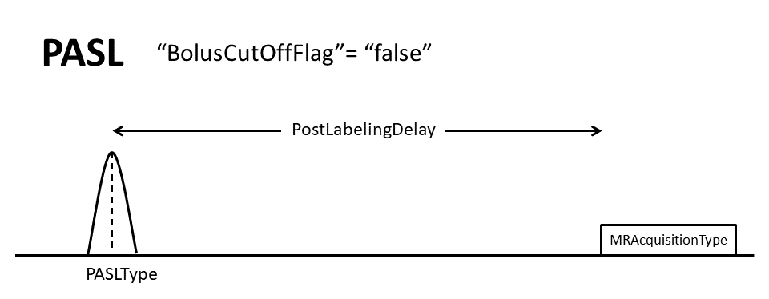
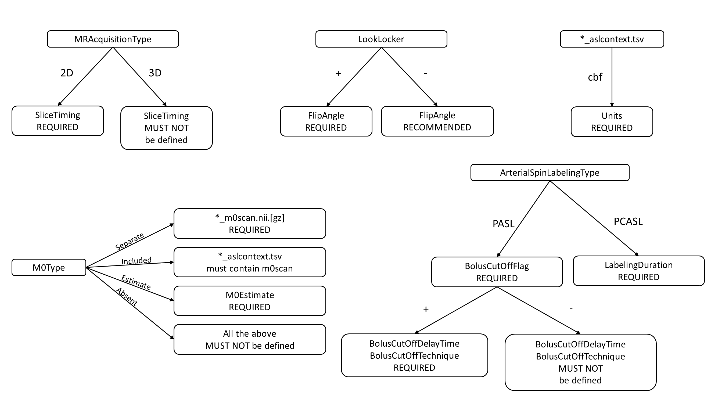

# Appendix XI: Arterial Spin Labeling

These sections provide additional clarification for some specific topics within the BIDS specification for Arterial Spin Labeling.

## Which image is `control` and which is `label`?

The `control` and `label` images are acquired with identical acquisition parameters, except that the blood magnetization flowing into the imaging region is effectively inverted 
in the `label` image compared to the `control` image. In case of doubt, an easy rule of thumb is that the `deltaM`=`control`-`label` subtraction should result in a perfusion-
weighted image with a positive sign. For example, in the case of FAIR this would be selective inversion (`control`) and non-selective inversion (`label`).

## Summary Image of the most common ASL sequences

The following images illustrate the main BIDS metadata fields for three `ArterialSpinLabelingType`'s: `CASL`, `PCASL`, and `PASL`. Images are courtesy of, and adapted with 
permission from Y. Suzuki and [OSIPI Task force 4.1: ASL lexicon milestone 1](https://www.osipi.org/task-force-4-1/)".

### (P)CASL sequence

*For (P)CASL, specifying the `LabelingDuration` and the `PostLabelingDelay` is required. The `LabelingDuration` is defined as the total duration of the labeling pulse train, in 
seconds. `PostLabelingDelay` is the time, in seconds, after the end of the labeling until the middle of the excitation pulse applied to the imaging slab (for 3D acquisition) or 
first slice (for 2D acquisition). Additionally, the `BackgroundSuppressionPulseTime`'s is required in case `BackgroundSuppression` was applied. This an array of numbers 
containing the timing, in seconds, of the background suppression pulses with respect to the start of the labeling. In the case of `PCASL`, the recommended `PCASLType` field 
defines the type of the gradient pulses used in the `control` condition (`balanced` or `unbalanced`), whereas, in case of `CASL`, the recommended `CASLType` field describes if a 
separate coil is used for labeling (`single-coil` or `double-coil`).*

### (P)CASL Labeling Pulses

*Several recommended metadata fields describe the labeling pulses of the labeling pulse train in PCASL. The `LabelingPulseAverageGradient` and the `LabelingPulseMaximumGradient` 
are the average labeling gradient and the maximum amplitude of the gradient switched on during the application of the labeling RF pulse(s), in milliteslas per meter. The 
`LabelingPulseAverageB1` is the average B1-field strength of the RF labeling pulses, in microteslas. The `LabelingPulseDuration` and `LabelingPulseInterval` are the duration of, 
and the delay between the peaks of the individual labeling pulses, in milliseconds.*

### PASL sequence

*For PASL, specifying the `PostLabelingDelay` is required. `PostLabelingDelay` is the time, in seconds, from the middle of the labeling pulse until the middle of 
the excitation pulse applied to the imaging slab (for 3D acquisition) or first slice (for 2D acquisition). Additionally, the `BolusCutOffFlag` field is required, which is a 
boolean indicating if a bolus cut-off technique has been applied.*

*When `BolusCutOffFlag` is set true for `PASL`, two additional metadata fields are required: `BolusCutOffTechnique` and `BolusCutOffDelay`. In this example, the 
`BolusCutOffTechnique`, which is the name of the technique used for applying a bolus cut-off, is QUIPSS-II consisting of only one bolus cut-off pulse. The `BolusCutOffDelay` is 
therefore a number, representing the duration between the end of the labeling and the start of the bolus cut-off saturation pulse, in seconds.*

*In this example, the `BolusCutOffTechnique` applied is Q2TIPS, consisting of multiple bolus cut-off pulses. In this case, only the duration of the first and last pulse should 
be specified in `BolusCutOffDelay`.*

## Flowchart (based on dependency table)

The specification includes a dependency table, describing metadata field dependencies for ASL. This flowchart might further clarify the table.

