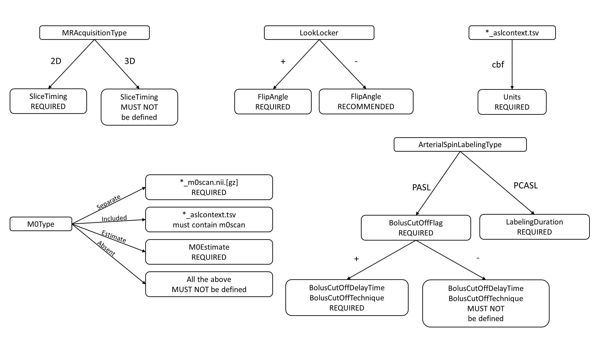

# Arterial Spin Labeling

These sections provide additional clarification for some specific topics within the BIDS specification for Arterial Spin Labeling.

## Which image is `control` and which is `label`?

The `control` and `label` images are acquired with identical acquisition parameters,
except that the blood magnetization flowing into the imaging region is effectively inverted
in the `label` image compared to the `control` image.
In case of doubt, an easy rule of thumb is that the `deltaM`=`control`-`label` subtraction
should result in a perfusion-weighted image with a positive sign.
For example, in the case of FAIR this would be selective inversion (`control`)
and non-selective inversion (`label`).

## `*_aslcontext.tsv`: three possible cases

The `*_aslcontext.tsv` table consists of a single column of labels identifying the `volume_type` of each volume in the corresponding `*_asl.nii[.gz]` file.
See below examples of the three `*_aslcontext.tsv` cases, in order of decreasing preference.

### Case 1: `*_asl.nii[.gz]` consists of volume_types `control`, `label`

In most cases, the ASL timeseries provided by the scanner consist of a series
of `control` and `label`, and optionally `m0scan` volumes.
In this case, only the `control`, `label`, and optionally `m0scan` volumes should be stored in the `*_asl.nii[.gz]`,
and the exact volume_type series should be specified in the `*_aslcontext.tsv`.

Example of `*_aslcontext.tsv`:

```tsv
volume_type
control
label
control
label
m0scan
```

### Case 2: `*_asl.nii[.gz]` consists of volume_types `deltam` (scanner does not export `control` or `label` volumes)

In some cases, `control` and `label` volumes are lacking within the acquired ASL timeseries,
but the intermediate `deltam` - and optionally an `m0scan` -
volume is reconstructed/exported by the scanner.
In this case, the `deltam` should be included in the `*_asl.nii[.gz]` and specified in the `*_aslcontext.tsv`.

Example of `*_aslcontext.tsv`:

```tsv
volume_type
deltam
m0scan
```

### Case 3: `*_asl.nii[.gz]` consists of volume_type `cbf` (scanner does not export `control`, `label`, or `deltaM` volumes)

If `control` and `label` or intermediate ASL volumes are not reconstructed or exported,
but a pre-calculated `cbf` - and optionally a `m0scan` - volume is provided by the scanner,
the `cbf` should be included in the `*_asl.nii[.gz]` and specified in the `*_aslcontext.tsv`.

Example of `*_aslcontext.tsv`:

```tsv
volume_type
cbf
m0scan
```

## Summary Image of the most common ASL sequences

The following images illustrate the main BIDS metadata fields for three `ArterialSpinLabelingType`'s:
`CASL`, `PCASL`, and `PASL`.
Images are courtesy of, and adapted with permission from
Y. Suzuki and [OSIPI Task force 4.1: ASL lexicon milestone 1](https://osipi.github.io/task-force-4-1/).

### (P)CASL sequence


For (P)CASL, specifying the `LabelingDuration` and the `PostLabelingDelay` is required.
The `LabelingDuration` is defined as the total duration of the labeling pulse train in seconds.
`PostLabelingDelay` is the time in seconds after the end of the labeling until the middle of the excitation pulse applied
to the imaging slab (for 3D acquisition) or first slice (for 2D acquisition).
Additionally, the `BackgroundSuppressionPulseTime` is RECOMMENDED if `BackgroundSuppression` was applied.
This an array of numbers containing the timing in seconds of the background suppression pulses
with respect to the start of the labeling.
In the case of `PCASL`, the recommended `PCASLType` field defines the type of the gradient pulses
used in the `control` condition (`balanced` or `unbalanced`),
whereas in case of `CASL`,the recommended `CASLType` field describes if a separate coil is used for labeling
(`single-coil` or `double-coil`).

### (P)CASL Labeling Pulses


Several recommended metadata fields describe the labeling pulses of the labeling pulse train in PCASL.
The `LabelingPulseAverageGradient` and the `LabelingPulseMaximumGradient` are the average labeling gradient
and the maximum amplitude of the gradient switched on during the application of the labeling RF pulse(s),
in milliteslas per meter.
The `LabelingPulseAverageB1` is the average B1-field strength of the RF labeling pulses in microteslas.
The `LabelingPulseDuration` and `LabelingPulseInterval` are the duration of,
and the delay between the peaks of the individual labeling pulses in milliseconds.

### PASL sequence


For PASL, specifying the `PostLabelingDelay` is required.
`PostLabelingDelay` is the time, in seconds, from the middle of the labeling pulse until the middle of
the excitation pulse applied to the imaging slab (for 3D acquisition) or first slice (for 2D acquisition).
Additionally, the `BolusCutOffFlag` field is required,
which is a boolean indicating if a bolus cut-off technique has been applied.


When `BolusCutOffFlag` is set true for `PASL`, two additional metadata fields are required:
`BolusCutOffTechnique` and `BolusCutOffDelay`.
In this example, the `BolusCutOffTechnique`, which is the name of the technique used for applying a bolus cut-off,
is QUIPSS-II consisting of only one bolus cut-off pulse.
The `BolusCutOffDelay` is therefore a number, representing the duration between the end of the labeling and the start of the bolus cut-off saturation pulse, in seconds.


In this example, the `BolusCutOffTechnique` applied is Q2TIPS, consisting of multiple bolus cut-off pulses.
In this case, only the duration of the first and last pulse should be specified in `BolusCutOffDelay`.

## Flowchart (based on dependency table)

The specification includes a dependency table, describing metadata field dependencies for ASL.
This flowchart is intended to further clarify that table.


