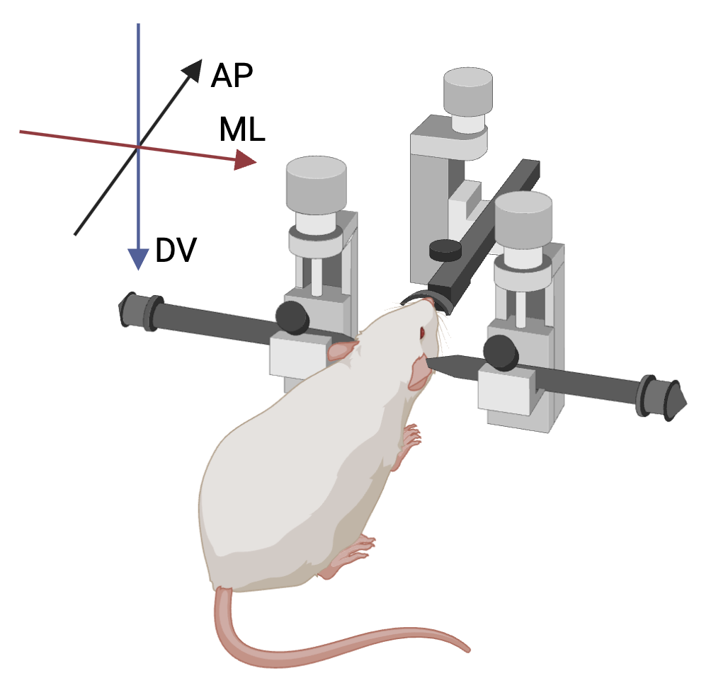
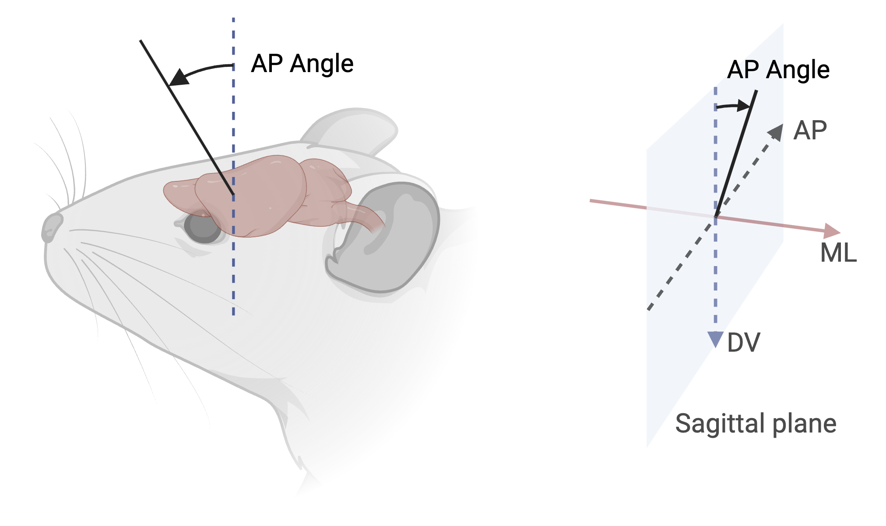
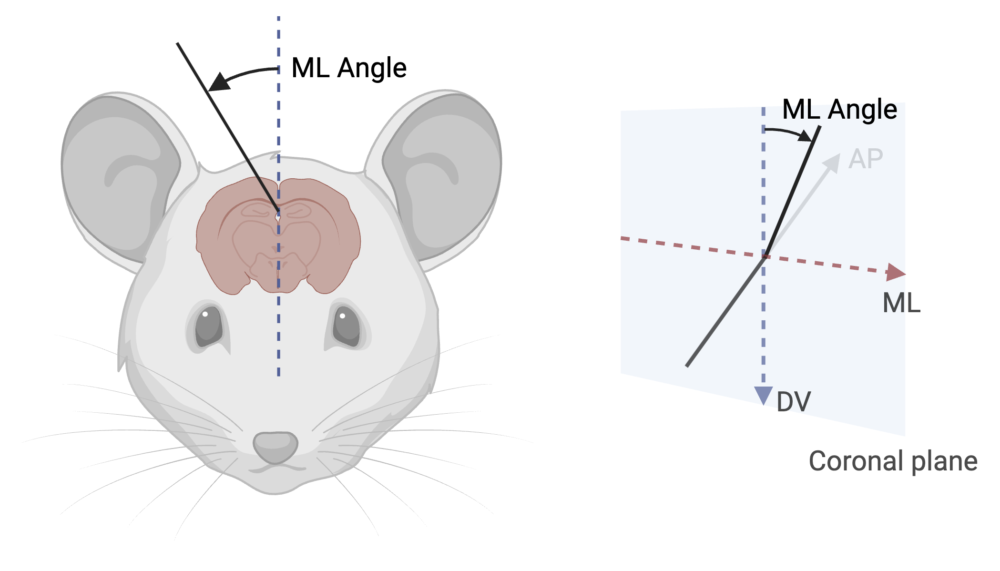
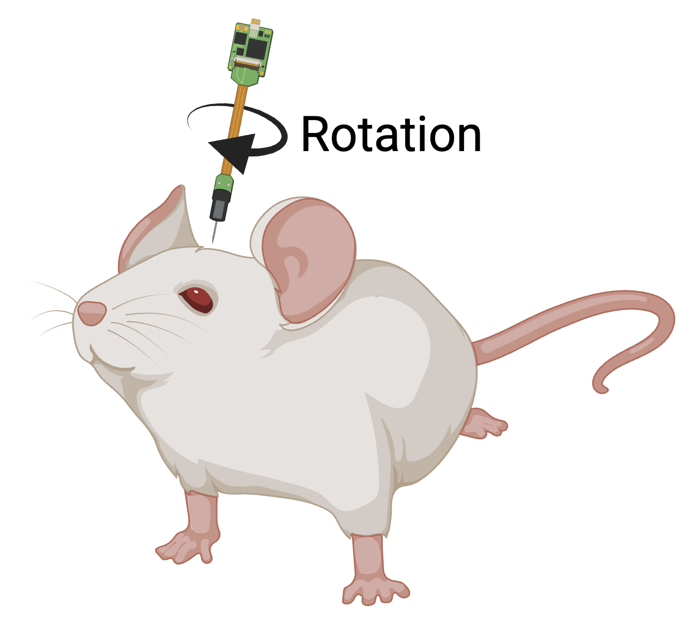

# Microelectrode Surgical Coordinates

The surgical coordinates system provides a standard way to describe the placement of an intracranial probe implantation during surgery.

## Anatomical Reference Points

In neurosurgery and research, it can be important to define coordinates for where in the brain a surgical intervention will take place.
These coordinates rely on anatomical markers that are uniform across individuals.
There are two major anatomical markers on the dorsal surface of the brain that are formed when the plates of the skull fuse during development, and these markers are often used to identify the location of various anatomical structures of the brain.

**Bregma**: the anatomical point on the skull at which the coronal suture (between frontal and parietal bones) is intersected perpendicularly by the sagittal suture (between left and right parietal bones).

**Lambda**: the meeting point of the sagittal suture (between left and right parietal bones) and the lambdoid suture (between parietal and occipital bones).

Both points serve as standard reference points for stereotaxic coordinates in neuroscience research. `(0,0,0)` is assumed to be Bregma when working with rodents. It may optionally be defined differently using `anatomical_reference_point`, and MUST be defined for other species.

## Stereotaxic Coordinate System Conventions

All stereotaxic coordinate systems follow a right-handed coordinate system with the following conventions:

-   **AP (Anterior-Posterior) axis:** Positive values are anterior to reference point
-   **ML (Medial-Lateral) axis:** Positive values are to the right (as seen from behind)
-   **DV (Dorsal-Ventral) axis:** Positive values are ventral (following right-hand rule). For humans, this is the superior-inferior axis, and positive values point to inferior.

Proper understanding and application of these angles is critical for accurate probe placement and experimental reproducibility. All stereotaxic measurements use three angles to specify orientation:

### AP angle (Anterior-Posterior rotation)

-   Measured as rotation from the vertical axis in the sagittal plane
-   0° represents vertical along DV axis
-   Range: -180° to +180°
-   Positive values indicate anterior rotation
-   Example: +15° indicates probe tilted 15° anteriorly from vertical

### ML angle (Medial-Lateral rotation)

-   Measured as rotation from the vertical axis in the coronal plane
-   0° represents vertical along DV axis
-   Range: -180° to +180°
-   Positive values indicate rightward/clockwise rotation (as seen from behind)
-   Example: +20° indicates probe tilted 20° to the right from vertical

### Rotation angle (around probe axis)

-   0° when probe features align with the coronal plane
-   Range: -180° to +180° (or 0° to 360°)
-   Positive rotation is clockwise when viewed from above

!!! note "Source Attribution"

    The coordinate system conventions and angle definitions presented in this section are adapted from the [BrainSTEM documentation](https://support.brainstem.org/datamodel/schemas/coordinates/). MIT License; Copyright (c) 2025 Peter C. Petersen
