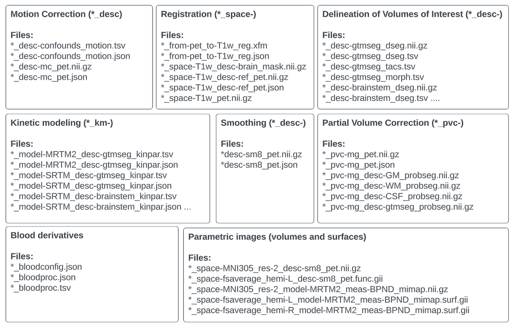

# Positron Emission Tomography Derivatives

Support for PET Derivatives was developed as a [BIDS Extension Proposal](../extensions.md#bids-extension-proposals). Please see [Citing BIDS](../introduction.md#citing-bids) on how to
appropriately credit this extension when referring to it in the context of academic literature.

## Goals and scope of this extension

PET-BIDS Derivatives is a representation of the outputs of common PET preprocessing pipelines, capturing data and meta-data sufficient for a researcher to understand and (critically) reuse those outputs in subsequent processing. It is motivated by use cases where formalized machine readable access to processed data enables higher level processing. In general, it will still follow the “Guidelines for the content and format of PET brain data in publications and archives: A consensus paper”.

## The PET-BIDS Derivatives specification

We can distinguish two broad categories of derivatives, in case 1, the different preprocessing
steps are saved and documented, in case 2, only a few final outputs are saved and all steps are
documented in the corresponding json sidecar file. In both cases, changes are documented both
in the filename and the json file to indicate the chain of events. For example, motion corrected
PET data should have the filename `sub-XX_desc-mc_pet.nii.gz`, and then if partial volume
correction using Muller-Gartner (mg) is subsequently applied, the filename should be
`sub-XX-desc-mc_pvc-mg_pet.nii.gz`. For case 2, description values and the chain of events
can be documented using a descriptions.json file, as specified here. Below, we outline the
set of preprocessing steps often carried out in PET brain imaging
(motion correction, registration etc), and also specify the set of files and naming
conventions adopted in the PET-BIDS derivatives specification.



<!--
This block generates a filename template.
The inputs for this macro can be found in the directory
  src/schema/rules/files/deriv/pet.yaml

{{ MACROS___make_filename_template(
    "raw",
    datatypes=["pet"],
    suffixes=["pet", "kinpar"]
) }} -->

```Text
<pipeline-name>/
    sub-<label>/
        [ses-<label>/]
            <datatype>/
                <source-entities>[]_<suffix>.<extension>
```

## Motion Correction (MC)

Motion correction is a critical preprocessing step in PET imaging to account for patient movements during the scan. The output files should document both the motion-corrected PET images and the estimated motion metrics (e.g. rotation and translation).

```Text
<pipeline-name>/
    sub-<label>/
        [ses-<label>/]
            <datatype>/
                <source-entities>[_desc-<label>]_<suffix>.<extension>
```

Example:

```Text
petprep_hmc/
    sub-01/
        pet/
            sub-01_desc-hmc_pet.nii.gz
            sub-01_desc-hmc_pet.json
            sub-01_desc-hmc_petref.nii.gz
            sub-01_desc-hmc_petref.json
            sub-01_from-orig_to-petpref_mode-image_xfm.txt
            sub-01_from-orig_to-petpref_mode-image_xfm.json
```

*sub-<participant_label>_desc-hmc_pet.nii.gz*
This file represents the PET data after motion correction has been applied. It is crucial
for eliminating artifacts due to patient movement, thereby improving the accuracy of
subsequent analyses.

*sub-<participant_label>_desc-hmc_pet.json*
This file should include details such as the type of motion correction algorithm used,
parameters of the motion model, and reference frame or volume used for correction. This
file enhances reproducibility and allows for critical assessment of the preprocessing steps.

<!-- This block generates a metadata table.
These tables are defined in
  src/schema/rules/sidecars
The definitions of the fields specified in these tables may be found in
  src/schema/objects/metadata.yaml
A guide for using macros can be found at
   https://github.com/bids-standard/bids-specification/blob/master/macros_doc.md
-->

{{ MACROS___make_sidecar_table("pet.PETDerivativesMotionCorrection") }}

### Motion-related time series

Template:

```Text
<pipeline_name>/
<sub-<participant_label>/
    pet/
        <source_entities>[_desc-<label>]_motion.tsv
        <source_entities>[_desc-<label>]_motion.json>
```

For more information, motion-related time series derivatives is specified here:
[https://bids-specification--519.org.readthedocs.build/en/519/05-derivatives/05-functional-derivatives.html#motion-related-time-series](https://bids-specification--519.org.readthedocs.build/en/519/05-derivatives/05-functional-derivatives.html#motion-related-time-series)

## Registration

Registration aligns PET images with anatomical MRI images or other modality images to ensure accurate localization and comparison of functional and structural data. This process is essential in multimodal imaging studies, where precise alignment allows for the integration of functional PET data with high-resolution structural information, improving the accuracy of subsequent analyses.

Template:

```Text
<pipeline_name>/
    sub-<participant_label>/
        <datatype>/
            <source_entities>[_space-<space>][_desc-<label>]_<suffix>.<ext>
            <source_entities>[_from-<label>][_to-<label>]_mode-image_xfm.txt
            <source_entities>[_space-<space>]_desc-ref_<suffix>.<ext>
```

Example:

```Text
petsurfer/
    sub-01/
        pet/
            sub-01_space-T1w_desc-mc_pet.nii.gz
            sub-01_space-T1w_desc-mc_pet.json
            sub-01_from-petref_to-T1w_mode-image_xfm.txt
            sub-01_space-T1w_petref.nii.gz
```

The *\*sub-01_space-T1w_desc-mc_pet.json* file should contain the following columns

<!-- This block generates a metadata table.
These tables are defined in
  src/schema/rules/sidecars
The definitions of the fields specified in these tables may be found in
  src/schema/objects/metadata.yaml
A guide for using macros can be found at
 https://github.com/bids-standard/bids-specification/blob/master/macros_doc.md
-->
{{ MACROS___make_sidecar_table("pet.PETDerivativesRegistration") }}

Example of *\*space-T1w_desc-mc_pet.json* content:

```Json
{
    "Description": "Registration of PET data to T1-weighted MRI using an affine transformation with 12 degrees of freedom, followed by resampling to T1w space.",
    "Sources": [
        "sub-01/ses-01/pet/sub-01_ses-01_pet.nii.gz",
        "sub-01/ses-01/anat/sub-01_ses-01_T1w.nii.gz"
    ],
    "ImageSimilarityMetric": "mutual information",
    "DOF": 12,
    "SpatialInterpolation": "linear",
    "SoftwareName": "ANTS",
    "SoftwareVersion": "2.3.4",
    "CommandLine": "antsRegistrationSyN.sh -d 3 -f sub-01_ses-01_T1w.nii.gz -m sub-01_ses-01_pet.nii.gz -o sub-01_space-T1w_desc-mc_pet.nii.gz”
}
```

## Smoothing

Smoothing is a common preprocessing step in PET data analysis, used to reduce noise and enhance signal detection by applying a spatial filter to the data. The smoothing process is typically defined by the full width at half maximum (FWHM) of the smoothing kernel. The outputs of the smoothing process should be stored in a BIDS-compliant manner, with filenames reflecting the applied smoothing as indicated by the *_desc- entity.

```Text
Template:
<pipeline_name>/
	sub-<participant_label>/
		<datatype>/
		                     <source_entities>[_desc-<label>]_<suffix>.<ext>
```

Example:

```Text
petsurfer/
	sub-01/
		pet/
			sub-01_space-fsaverage_hemi-L_desc-sm8_pet.gii
			sub-01_space-fsaverage_desc-sm8_pet.json
```

The *\*-sm8_pet.json* file should contain the following columns

<!-- This block generates a metadata table.
These tables are defined in
  src/schema/rules/sidecars
The definitions of the fields specified in these tables may be found in
  src/schema/objects/metadata.yaml
A guide for using macros can be found at
 https://github.com/bids-standard/bids-specification/blob/master/macros_doc.md
-->
{{ MACROS___make_sidecar_table("pet.PETDerivativesSmoothing") }}

Example of *desc-mc+sm8_pet.json content:

```json
{
    "Description": "Spatial smoothing applied to PET data with a Gaussian kernel to reduce noise and enhance signal detection.",
    "Sources": [
		"sub-01/ses-01/pet/sub-01_ses-01_desc-mc_pet.nii.gz"
    ],
    "FWHM": 8.0,
    "Kernel": "gaussian",
    "SoftwareName": “",
    "SoftwareVersion": "",
    "CommandLine": ""
}
```

## Delineation of Volumes of interest

Following image processing, regional time activity curves (TACs) extracted from volumes of interest are
commonly used as inputs for kinetic modeling tools in PET analysis. These TACs provide valuable
information about the dynamic uptake of tracers within specific brain regions or other areas of
interest. For these outputs, the suffix *_tacs is reserved, and it is important to follow the BIDS
naming conventions to maintain consistency and clarity across datasets. Additionally, specific
suffixes are reserved to indicate particular regions of interest:

‘-ref’: Reserved for the reference region, which is typically a region with low or negligible specific
binding, used as a baseline or comparison in kinetic modeling.

‘-hb’: Reserved for the high-binding region, which is a region expected to exhibit high levels of tracer
binding. A high-binding region is often used in reference tissue modeling to estimate k2’, which can
subsequently be fixed when modeling other regions.

The segmentation of volumes of interest can be found in the _dseg.[nii.gz/json] file
[https://bids-specification.readthedocs.io/en/stable/derivatives/imaging.html](https://bids-specification.readthedocs.io/en/stable/derivatives/imaging.html), and the corresponding structural
statistics produced by segmentation routines should be stored within tsv files using the
_morph suffix (BEP11).

Template:
```Text
<pipeline_name>/
sub-<participant_label>/
        pet/
        <source_entities>[_space-<space>]_seg-<label>[_desc-<label>]_dseg.<ext>
        <source_entities>[_space-<space>]_seg-<label>[_desc-<label>]_morph.tsv
        <source_entities>[_space-<space>]_seg-<label>[_desc-<label>]_tacs.tsv
```

Example:

```Text
bids_dataset/derivatives/petprep_extract_tacs
    sub-01/
      pet/
        sub-01_seg-brainstem_dseg.nii.gz
        sub-01_seg-brainstem_dseg.json
        sub-01_seg-brainstem_dseg.tsv
        sub-01_seg-brainstem_morph.tsv
        sub-01_seg-brainstem_tacs.tsv
        sub-01_seg-gtm_label-cerebellum_desc-reference_tacs.tsv
        sub-01_seg-gtm_label-cerebellum_desc-reference_mask.nii.gz
        sub-01_seg-gtm_label-thalamus_desc-hb_tacs.tsv
        sub-01_seg-gtm_label-thalamus_desc-hb_mask.nii.gz
```

The *_dseg.json file should contain the following columns:

<!-- This block generates a metadata table.
These tables are defined in
  src/schema/rules/sidecars
The definitions of the fields specified in these tables may be found in
  src/schema/objects/metadata.yaml
A guide for using macros can be found at
 https://github.com/bids-standard/bids-specification/blob/master/macros_doc.md
-->
{{ MACROS___make_sidecar_table("pet.PETDerivativesDseg") }}

The *\*_tacs.tsv* file should contain the following columns:

<!-- This block generates a metadata table.
These tables are defined in
  src/schema/rules/sidecars
The definitions of the fields specified in these tables may be found in
  src/schema/objects/metadata.yaml
A guide for using macros can be found at
 https://github.com/bids-standard/bids-specification/blob/master/macros_doc.md
-->
{{ MACROS___make_columns_table("pet.PETDerivativesTimeActivityCurvesTab") }}

The accompanying *\*_tacs.json* file should contain the following columns:

<!-- This block generates a metadata table.
These tables are defined in
  src/schema/rules/sidecars
The definitions of the fields specified in these tables may be found in
  src/schema/objects/metadata.yaml
A guide for using macros can be found at
 https://github.com/bids-standard/bids-specification/blob/master/macros_doc.md
-->
{{ MACROS___make_sidecar_table("pet.PETDerivativesTimeActivityCurves") }}

## Partial Volume Correction

Partial Volume Correction (PVC) is a crucial step in PET image processing to account for the blurring effects caused by the limited spatial resolution of PET scanners. PVC aims to improve the quantitative accuracy of PET images by correcting for the partial volume effect, which can cause underestimation or overestimation of tracer concentration, particularly in small structures. In PET-BIDS-compliant datasets, PVC outputs should follow specific naming conventions to ensure consistency and clarity. The suffix *_pvc-<pvc-label>* is used to indicate that partial volume correction has been applied, and the *<pvc-label>* specifies the method used for the correction.

Template:

```Text
<pipeline_name>/
    sub-<participant_label>/
        pet/
            <source_entities>_pvc-[<pvc-label>]_<suffix>.<ext>
```

Example:

```Text
petsurfer/
    sub-01/
        pet/
            sub-01_space-T1w_desc-mc_pvc-gtm_pet.nii.gz
            sub-01_space-T1w_desc-mc_pvc-gtm_pet.json
            sub-01_space-T1w_desc-gtm_pvc-gtm_tacs.tsv
            sub-01_space-T1w_desc-gtm_dseg.nii.gz
            sub-01_space-T1w_desc-gtm_dseg.json
            sub-01_space-T1w_desc-gtm_dseg.tsv
            sub-01_space-T1w_desc-gtm_probseg.nii.gz
            sub-01_space-T1w_desc-gtm_probseg.json
            sub-01_space-T1w_probseg.nii.gz
            sub-01_space-T1w_probseg.json
```

The accompanying *\*_pvc-[pvc-label]_<suffix>.json* file should contain the following columns:

<!-- This block generates a metadata table.
These tables are defined in
  src/schema/rules/sidecars
The definitions of the fields specified in these tables may be found in
  src/schema/objects/metadata.yaml
A guide for using macros can be found at
 https://github.com/bids-standard/bids-specification/blob/master/macros_doc.md
-->
{{ MACROS___make_sidecar_table("pet.PETDerivativesPartialVolumeCorrection") }}

## Kinetic Modeling

This section provides guidelines for organizing and documenting the outputs of kinetic modeling processes applied to PET data. Kinetic modeling is essential for quantifying dynamic PET data, allowing researchers to estimate physiological parameters such as blood flow, receptor density, and metabolic rates. For these outputs, *\*_kinpar* is reserved as the suffix for regional outputs, where the model name must be provided as an entity in the filename. For voxelwise and surface-based analyses, the *_mimap* suffix is reserved (molecular imaging map). Output parameters from kinetic modeling include e.g. VT, BPND, BPP, BPF, R1, K1, k2 etc (as specified in Innis et al. 2007, JCBFM and should be in provided in the units specified in Table 2 of Innis et al.), but SUV and SUVR can also be used. If the *\*_mimap* suffix is used, the filename should include a *\*_meas* entity to encode the parameter being modeled (e.g. *\*_meas-BPND*). By standardizing the structure and metadata of these outputs, this section ensures that results are easily interpretable across different studies and modeling approaches. The guidelines accommodate a wide range of models and methodologies, including parameter estimation, delay estimation, and specialized modeling techniques, all within a unified framework.

Template:

```Text
<pipeline_name>/
    sub-<participant_label>/
        pet/
            <source_entities>_model-[<model-label>]_<suffix>.<ext>
```

Example:

```Text
petsurfer/
    sub-01/
        pet/
            sub-01_space-T1w_desc-mc_model-SRTM2_meas-BPND_mimap.nii.gz
            sub-01_space-T1w_desc-mc_model-SRTM2_meas-BPND_mimap.json
            sub-01_space-T1w_desc-mc_model-SRTM2_meas-R1_mimap.nii.gz
            sub-01_space-T1w_desc-mc_model-SRTM2_meas-R1_mimap.json
            sub-01_space-T1w_desc-mc_model-SRTM2_kinpar.tsv
            sub-01_space-T1w_desc-mc_model-SRTM2_kinpar.json
```

The *_kinpar.json file should contain the following columns:

<!-- This block generates a metadata table.
These tables are defined in
  src/schema/rules/sidecars
The definitions of the fields specified in these tables may be found in
  src/schema/objects/metadata.yaml
A guide for using macros can be found at
 https://github.com/bids-standard/bids-specification/blob/master/macros_doc.md
-->
{{ MACROS___make_sidecar_table("pet.PETDerivativesKineticModeling") }}

The accompanying *\*_kinpar.tsv* file should contain the following columns:

<!-- This block generates a metadata table.
These tables are defined in
  src/schema/rules/sidecars
The definitions of the fields specified in these tables may be found in
  src/schema/objects/metadata.yaml
A guide for using macros can be found at
 https://github.com/bids-standard/bids-specification/blob/master/macros_doc.md
-->
{{ MACROS___make_columns_table("pet.PETDerivativesKineticModeling") }}

### Kinetic Model and Parameter Name Guidelines

In order to promote standardisation without sacrificing flexibility, we provide the following guidelines for defining the names of kinetic models and their parameters in either filenames or column names in .tsv files.

Kinetic model parameters 

Parameter names should be defined with the accepted capitalisation without the need for indicating subscript and superscripts, i.e. VT, BPND, Ki,  K1, k4, VB, fP and fND.

For column titles in *_kinpar.tsv documents, auxiliary estimates such as the standard error should be designated with a hyphen, i.e. VT-se.

For parameter ratios, this can be described by the parameter names followed by ratio, i.e. K1k2ratio, k2k3ratio, or for a standard error estimate, k2k3ratio-se.  When possible, please use the accepted macroparameter name when applicable (i.e. K1k2ratio should preferably be designated as VND for the 2TCM whenever appropriate).

For inverse parameter values, such as 1/k4, this can be described by the parameter name followed by inv, e.g. k4inv or k4inv-se

For unconventional parameter names, please use an appropriate abbreviated name, and provide a more full description of what the parameter represents in the accompanying *_kinpar.json file.

Kinetic model names 

Although there are many ways of fitting conventional kinetic models, e.g. by fixing one parameter to a common value, the kinetic model name is intended to just broadly define which model was used, allowing for a fuller description in the relevant *.json file. We RECOMMEND using the following abbreviations for these common models.

| Model Abbreviation | Model Name |
| ------------------ | ---------- |
| 1TCM | One-Tissue Compartment Model |
| 2TCM | Two-Tissue Compartment Model |
| 3TCM | Three-Tissue Compartment Model |
| 2TCM3k | Irreversible Two-Tissue Compartment Model (i.e. k4=0) |
| LS2TCM | Least Squares Estimation of the Two-Tissue Compartment Model |
| Logan | Logan Graphical Analysis (Invasive) |
| MA1 | Ichise Multilinear Analysis 1 |
| MA2 | Ichise Multilinear Analysis 2 |
| LEGA | Likelihood Estimation Graphical Analysis |
| Patlak | Patlak Plot (Invasive) |
| MLAIR1 | Multiple Linear Analysis for Irreversible Radiotracers 1 |
| MLAIR2 | Multiple Linear Analysis for Irreversible Radiotracers 2 |
| SRTM | Simplified Reference Tissue Model |
| SRTM2 | Simplified Reference Tissue Model 2 |
| FRTM | Full Reference Tissue Model |
| LoganRef | Logan Graphical Analysis (Non-Invasive) |
| MRTM0 | Ichise Multilinear Reference Tissue Model 0 |
| MRTM1 | Ichise Multilinear Reference Tissue Model 1 |
| MRTM2 | Ichise Multilinear Reference Tissue Model 2 |
| PatlakRef | Patlak Plot (Non-Invasive) |
| SIMEVND | Simultaneous Estimation for Estimation of Non-Displaceable Binding |
| SIMEAIF | Simultaneous Estimation for Estimation of the Arterial Input Function |
| Novel Models | For models not included on this list, please make use of a short abbreviation consisting of only letters and numbers|

## PET volumes and surfaces

PET imaging involves the acquisition and processing of PET data, which can be analyzed at various stages, including before and after kinetic modeling. The data can be represented as volumes or surfaces, and different naming conventions are used to ensure consistency and clarity.

### Pre-modeling data:

Volumes and Surfaces: Before kinetic modeling, PET data may be represented as volumes (e.g., preprocessed PET data with _pet.nii file extension) and surfaces (_pet.func.gii file extension). 

### Parametric Images and Surfaces (Post-Modeling):

Parametric images: Derived from dynamic PET data using kinetic models, these images estimate physiological parameters such as receptor density, blood flow, and metabolic rates. Parametric images can be either unitless (e.g., SUVR, BPND, DVR, R1) or have physical units (e.g., K1, k2). For voxelwise parameter estimates, the suffix mimap should be used. The filename should include a meas entity to encode the specific parameter being modeled (e.g., meas-BPND, meas-K1). See the “Kinetic Model and Parameter Name Guidelines” section above. 

Surface-based analyses: Surface representations of parametric data can be stored in GIFTI format, which allows for a variety of data types such as functional data, shapes, and surface coordinates. The suffixes used for GIFTI files include _mimap.surf.gii for modeled PET data.

Template:

```Text
<pipeline_name>/
    sub-<participant_label>/
        pet/
        <source_entities>_model-[<model-label>]_meas-[<meas-label>]_<suffix>.<ext>
```

Example:

```Text
petsurfer/
    sub-01/
        pet/
        sub-01_space-T1w_desc-mc_model-SRTM2_meas-BPND_mimap.nii.gz
        sub-01_space-T1w_desc-mc_model-SRTM2_meas-BPND_mimap.json
        sub-01_space-T1w_hemi-L_desc-mc_model-SRTM2_meas-BPND_mimap.surf.gii
        sub-01_space-T1w_hemi-R_desc-mc_model-SRTM2_meas-BPND_mimap.surf.gii
        sub-01_space-fsaverage_hemi-L_desc-mc_pet.func.gii
        sub-01_space-fsaverage_hemi-R_desc-mc_pet.func.gii
```

## Blood data processing

Blood data processing in PET studies is required for generating arterial input
functions (AIFs) and other blood-related measures, which are necessary for invasive
kinetic modeling. This process involves interpolating measurements derived from
blood samples to be used as inputs for subsequent modeling. The resulting data is
stored in specific files, with *\*_bloodproc.tsv* and *\*_bloodproc.json* being the primary
outputs, and *\*_bloodconfig.json* used to document the blood modeling parameters.

Template:

```Text
<dataset>/
    derivatives/
        <pipeline-name>/
            sub-<label>/
                [ses-<session-label>]/
                    <pet>/
                        <raw_file_name>_<variant-label>_bloodproc.tsv
                        <raw_file_name>_<variant-label>_bloodproc.json
                        <raw_file_name>_<variant-label>_bloodconfig.json
```

The columns of the *\*_bloodproc.tsv* file should follow the following column naming conventions when the following data outputs are present and estimated for each time point. Only the time column is required.

<!-- This block generates a metadata table.
These tables are defined in
  src/schema/rules/sidecars
The definitions of the fields specified in these tables may be found in
  src/schema/objects/metadata.yaml
A guide for using macros can be found at
 https://github.com/bids-standard/bids-specification/blob/master/macros_doc.md
-->
{{ MACROS___make_columns_table("pet.PETDerivativesBloodProcessing") }}

The accompanying *\*_bloodproc.json* file should contain labels for each of the
columns in the *\*_bloodproc.tsv* file with at at least a sub-heading describing the units.:

| Label Name | Sub-group Name | Description |
| ---------- | -------------- | ----------- |
| <column name> | Units | the units of the column |

Example:

```Json
{
    "time": {
        "Description": ["Interpolated time in relation to time zero defined in _pet.json"],
        "Units": ["s"]
    },
    "whole_blood_radioactivity": {
        "Description": ["Estimated interpolated radioactivity in whole blood samples"],
        "Units": ["Bq"]
    },
    "plasma_radioactivity": {
        "Description": ["Estimated interpolated radioactivity in whole plasma samples"],
        "Units": ["Bq"]
    },
    "AIF": {
        "Description": ["Estimated interpolated radioactivity in metabolite-corrected arterial plasma samples"],
        "Units": ["Bq"]
    }
}
```

### Blood Modeling Parameters Configuration File 

The *\*_bloodconfig.json* file should contain the following columns:

<!-- This block generates a metadata table.
These tables are defined in
  src/schema/rules/sidecars
The definitions of the fields specified in these tables may be found in
  src/schema/objects/metadata.yaml
A guide for using macros can be found at
 https://github.com/bids-standard/bids-specification/blob/master/macros_doc.md
-->
{{ MACROS___make_sidecar_table("pet.PETDerivativesBloodProcessingConfig") }}

Example:

```Json
{
  "Description": "Blood data modeling including parent fraction, blood-to-plasma ratio, arterial input function (AIF), and whole blood modeling.",
  "Sources": [
    "sub-01/ses-01/pet/sub-01_ses-01_recording-manual_blood.json",
    "sub-01/ses-01/pet/sub-01_ses-01_recording-manual_blood.tsv",
    "sub-01/ses-01/pet/sub-01_ses-01_recording-autosampler_blood.json",
    "sub-01/ses-01/pet/sub-01_ses-01_recording-autosampler_blood.tsv"
  ],
  "ParentFraction": {
    "Method": "Power",
    "SetInitialValue": true,
    "StartTime": 0
    "EndTime": 150
  },
  "BPR": {
    "Method": "GAM",
    "EndTime": 150,
    "Parameters": {
      "gam_k": 6
    }
  },
  "AIF": {
    "Method": "Feng",
    "StartTime": 0,
    "EndTime": 150,
    "FitDetails": {
      "expdecay_props": [null, null]
    },
    "Parameters": {
      "A": 6230.7189,
      "alpha": 0.1013,
      "B": 1010.2721,
      "beta": 0.0715,
      "C": 260.3221,
      "gamma": 0.0001,
      "t0": 69.1824
    },
    "Units": {
      "time": "s",
      "AIF": "Bq"
    }
  },
  "WholeBlood": {
    "Method": "Splines",
    "StartTime": 0,
    "EndTime": 150,
    "Parameters": {
      "dispcor": true,
      "spline_kb": 2,
      "spline_ka_m": 1,
      "spline_ka_a": ""
    }
  },
  "SoftwareName": "bloodstream",
  "SoftwareVersion": "0.1.0",
  "CommandLine": "docker run -v /path-to-bids-dataset/:/data/ bloodstream bs_config.json"
}
```
