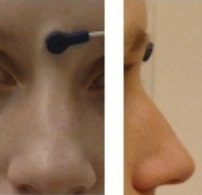

# Electroencephalography

Support for Electroencephalography (EEG) was developed as a
[BIDS Extension Proposal](../extensions.md#bids-extension-proposals).
Please see [Citing BIDS](../introduction.md#citing-bids)
on how to appropriately credit this extension when referring to it in the
context of the academic literature.

!!! example "Example datasets"

    Several [example EEG datasets](https://bids-standard.github.io/bids-examples/#eeg)
    have been formatted using this specification
    and can be used for practical guidance when curating a new dataset.

## EEG recording data

<!--
This block generates a filename templates.
The inputs for this macro can be found in the directory
  src/schema/rules/files/raw
and a guide for using macros can be found at
 https://github.com/bids-standard/bids-specification/blob/master/macros_doc.md
-->
{{ MACROS___make_filename_template(
   "raw",
   datatypes=["eeg"],
   suffixes=["eeg", "events", "physio", "stim"])
}}

The EEG community uses a variety of formats for storing raw data, and there is
no single standard that all researchers agree on. For BIDS, EEG data MUST be
stored in one of the following formats:

| **Format**                                        | **Extension(s)**         | **Description**                                                                                                                                                                                      |
| ------------------------------------------------- | ------------------------ | ---------------------------------------------------------------------------------------------------------------------------------------------------------------------------------------------------- |
| [European data format](https://www.edfplus.info/) | `.edf`                   | Each recording consists of a single `.edf` file. [`edf+`](https://www.edfplus.info/specs/edfplus.html) files are permitted. The capital `.EDF` extension MUST NOT be used.                           |
| [BrainVision Core Data Format][bvformat]          | `.vhdr`, `.vmrk`, `.eeg` | Each recording consists of a  `.vhdr`, `.vmrk`, `.eeg` file triplet.                                                                                                                                 |
| [EEGLAB](https://sccn.ucsd.edu/eeglab/index.php)  | `.set`, `.fdt`           | The format used by the MATLAB toolbox [EEGLAB](https://sccn.ucsd.edu/eeglab/index.php). Each recording consists of a `.set` file with an OPTIONAL `.fdt` file.                                       |
| [Biosemi](https://www.biosemi.com/)               | `.bdf`                   | Each recording consists of a single `.bdf` file. [`bdf+`](https://www.teuniz.net/edfbrowser/bdfplus%20format%20description.html) files are permitted. The capital `.BDF` extension MUST NOT be used. |

It is RECOMMENDED to use the European data format, or the BrainVision data
format. It is furthermore discouraged to use the other accepted formats over
these RECOMMENDED formats, particularly because there are conversion scripts
available in most commonly used programming languages to convert data into the
RECOMMENDED formats.

We encourage users to provide additional metadata extracted from the
manufacturer-specific data files in the sidecar JSON file.

Note the `RecordingType`, which depends on whether the data stream on disk
is interrupted or not.
Continuous data is by definition 1 segment without interruption.
Epoched data consists of multiple segments that all have the same length
(for example, corresponding to trials) and that have gaps in between.
Discontinuous data consists of multiple segments of different length,
for example due to a pause in the acquisition.

Note that for proper documentation of EEG recording metadata it is important to
understand the difference between electrode and channel: An EEG electrode is
attached to the skin, whereas a channel is the combination of the analog
differential amplifier and analog-to-digital converter that result in a
potential (voltage) difference that is stored in the EEG dataset. We employ
the following short definitions:

-   Electrode = A single point of contact between the acquisition system and
    the recording site (for example, scalp, neural tissue, ...). Multiple electrodes
    can be organized as caps (for EEG), arrays, grids, leads, strips, probes,
    shafts, and so on.

-   Channel = A single analog-to-digital converter in the recording system that
    regularly samples the value of a transducer, which results in the signal
    being represented as a time series in the digitized data. This can be
    connected to two electrodes (to measure the potential difference between
    them), a magnetic field or magnetic gradient sensor, temperature sensor,
    accelerometer, and so on.

Although the *reference* and *ground* electrodes are often referred to as
channels, they are in most common EEG systems not recorded by
themselves. Therefore they are not represented as channels in the data.
The type of referencing for all channels and optionally the location of
the reference electrode and the location of the ground electrode MAY
be specified.

### Sidecar JSON (`*_eeg.json`)

For consistency between studies and institutions,
we encourage users to extract the values of these fields from the actual raw data.
Whenever possible, please avoid using ad hoc wording.

Those fields MUST be present:

<!-- This block generates a metadata table.
These tables are defined in
  src/schema/rules/sidecars
The definitions of the fields specified in these tables may be found in
  src/schema/objects/metadata.yaml
A guide for using macros can be found at
 https://github.com/bids-standard/bids-specification/blob/master/macros_doc.md
-->
{{ MACROS___make_sidecar_table("eeg.EEGRequired") }}

Those fields SHOULD be present:

<!-- This block generates a metadata table.
These tables are defined in
  src/schema/rules/sidecars
The definitions of the fields specified in these tables may be found in
  src/schema/objects/metadata.yaml
A guide for using macros can be found at
 https://github.com/bids-standard/bids-specification/blob/master/macros_doc.md
-->
{{ MACROS___make_sidecar_table("eeg.EEGRecommended") }}

These fields MAY be present:

<!-- This block generates a metadata table.
These tables are defined in
  src/schema/rules/sidecars
The definitions of the fields specified in these tables may be found in
  src/schema/objects/metadata.yaml
A guide for using macros can be found at
 https://github.com/bids-standard/bids-specification/blob/master/macros_doc.md
-->
{{ MACROS___make_sidecar_table("eeg.EEGOptional") }}

#### Hardware information

<!-- This block generates a metadata table.
These tables are defined in
  src/schema/rules/sidecars
The definitions of the fields specified in these tables may be found in
  src/schema/objects/metadata.yaml
A guide for using macros can be found at
 https://github.com/bids-standard/bids-specification/blob/master/macros_doc.md
-->
{{ MACROS___make_sidecar_table("eeg.EEGHardware") }}

#### Task information

<!-- This block generates a metadata table.
These tables are defined in
  src/schema/rules/sidecars
The definitions of the fields specified in these tables may be found in
  src/schema/objects/metadata.yaml
A guide for using macros can be found at
 https://github.com/bids-standard/bids-specification/blob/master/macros_doc.md
-->
{{ MACROS___make_sidecar_table("eeg.EEGTaskInformation") }}

#### Institution information

<!-- This block generates a metadata table.
These tables are defined in
  src/schema/rules/sidecars
The definitions of the fields specified in these tables may be found in
  src/schema/objects/metadata.yaml
A guide for using macros can be found at
 https://github.com/bids-standard/bids-specification/blob/master/macros_doc.md
-->
{{ MACROS___make_sidecar_table("eeg.EEGInstitutionInformation") }}

#### Example `*_eeg.json`

```JSON
{
  "TaskName":"Seeing stuff",
  "TaskDescription":"Subjects see various images for which phase, amplitude spectrum, and color vary continuously",
  "Instructions":"Your task is to detect images when they appear for the 2nd time, only then press the response button with your right/left hand (counterbalanced across subjects)",
  "InstitutionName":"The world best university, 10 Beachfront Avenue, Papeete",
  "SamplingFrequency":2400,
  "Manufacturer":"Brain Products",
  "ManufacturersModelName":"BrainAmp DC",
  "CapManufacturer":"EasyCap",
  "CapManufacturersModelName":"M1-ext",
  "EEGChannelCount":87,
  "EOGChannelCount":2,
  "ECGChannelCount":1,
  "EMGChannelCount":0,
  "MiscChannelCount":0,
  "TriggerChannelCount":1,
  "PowerLineFrequency":50,
  "EEGPlacementScheme":"10 percent system",
  "EEGReference":"single electrode placed on FCz",
  "EEGGround":"placed on AFz",
  "SoftwareFilters":{
    "Anti-aliasing filter":{
      "half-amplitude cutoff (Hz)": 500,
      "Roll-off": "6dB/Octave"
    }
  },
  "HardwareFilters":{
    "ADC's decimation filter (hardware bandwidth limit)":{
      "-3dB cutoff point (Hz)":480,
      "Filter order sinc response":5
    }
  },
  "RecordingDuration":600,
  "RecordingType":"continuous"
}
```

Note that the date and time information SHOULD be stored in the Study key file
([`scans.tsv`](../modality-agnostic-files.md#scans-file)).
Date time information MUST be expressed as indicated in [Units](../common-principles.md#units)

## Channels description (`*_channels.tsv`)

<!--
This block generates a filename templates.
The inputs for this macro can be found in the directory
  src/schema/rules/files/raw
and a guide for using macros can be found at
 https://github.com/bids-standard/bids-specification/blob/master/macros_doc.md
-->
{{ MACROS___make_filename_template("raw", datatypes=["eeg"], suffixes=["channels"]) }}

This file is RECOMMENDED as it provides easily searchable information across BIDS datasets.
For example for general curation, response to queries, or for batch analysis.
To avoid confusion, the channels SHOULD be listed in the order they appear in the EEG data file.
Any number of additional columns MAY be added to provide additional information about the channels.

Note that electrode positions SHOULD NOT be added to this file, but to
[`*_electrodes.tsv`](./electroencephalography.md#electrodes-description-_electrodestsv).
Furthermore, the entries in `*_electrodes.tsv` and `*_channels.tsv` do not have to match exactly,
as for example in the case of recording a single `EOG` channel from a bipolar referencing scheme
of two electrodes, or a data channel originating from an auxiliary, non-electrode device.
That is, in most cases `*_electrodes.tsv` will have more entries than `*_channels.tsv`.
See the examples for `*_channels.tsv` below, and for `*_electrodes.tsv` in
["Electrodes description"](./electroencephalography.md#electrodes-description-_electrodestsv).

The columns of the channels description table stored in `*_channels.tsv` are:

<!-- This block generates a columns table.
The definitions of these fields can be found in
  src/schema/rules/tabular_data/*.yaml
and a guide for using macros can be found at
 https://github.com/bids-standard/bids-specification/blob/master/macros_doc.md
-->
{{ MACROS___make_columns_table("eeg.EEGChannels") }}

Restricted keyword list for field `type` in alphabetic order (shared with the
MEG and iEEG modality; however, only the types that are common in EEG data are listed here).
Note that upper-case is REQUIRED:

| **Keyword** | **Description**                                              |
| ----------- | ------------------------------------------------------------ |
| AUDIO       | Audio signal                                                 |
| EEG         | Electroencephalogram channel                                 |
| EOG         | Generic electrooculogram (eye), different from HEOG and VEOG |
| ECG         | Electrocardiogram (heart)                                    |
| EMG         | Electromyogram (muscle)                                      |
| EYEGAZE     | Eye tracker gaze                                             |
| GSR         | Galvanic skin response                                       |
| HEOG        | Horizontal EOG (eye)                                         |
| MISC        | Miscellaneous                                                |
| PPG         | Photoplethysmography                                         |
| PUPIL       | Eye tracker pupil diameter                                   |
| REF         | Reference channel                                            |
| RESP        | Respiration                                                  |
| SYSCLOCK    | System time showing elapsed time since trial started         |
| TEMP        | Temperature                                                  |
| TRIG        | Analog (TTL in Volt) or digital (binary TTL) trigger channel |
| VEOG        | Vertical EOG (eye)                                           |

Examples of free-form text for field `description`

-   n/a
-   stimulus
-   response
-   skin conductance
-   battery status

### Example `*_channels.tsv`

See also the corresponding [`electrodes.tsv` example](#example-_electrodestsv).

```Text
name     type  units  description                     reference     status  status_description
VEOG     VEOG  uV     left eye                        VEOG-, VEOG+  good    n/a
FDI      EMG   uV     left first dorsal interosseous  FDI-, FDI+    good    n/a
Cz       EEG   uV     n/a                             REF           bad     high frequency noise
UADC001  MISC  n/a    envelope of audio signal        n/a           good    n/a
```

## Electrodes description (`*_electrodes.tsv`)

<!--
This block generates a filename templates.
The inputs for this macro can be found in the directory
  src/schema/rules/files/raw
and a guide for using macros can be found at
 https://github.com/bids-standard/bids-specification/blob/master/macros_doc.md
-->
{{ MACROS___make_filename_template("raw", datatypes=["eeg"], suffixes=["electrodes"]) }}

File that gives the location of EEG electrodes. Note that coordinates are
expected in cartesian coordinates according to the `EEGCoordinateSystem` and
`EEGCoordinateUnits` fields in `*_coordsystem.json`. **If an
`*_electrodes.tsv` file is specified, a [`*_coordsystem.json`](#coordinate-system-json-_coordsystemjson)
file MUST be specified as well**. The order of the required columns in the
`*_electrodes.tsv` file MUST be as listed below.

<!-- This block generates a columns table.
The definitions of these fields can be found in
  src/schema/rules/tabular_data/*.yaml
and a guide for using macros can be found at
 https://github.com/bids-standard/bids-specification/blob/master/macros_doc.md
-->
{{ MACROS___make_columns_table("eeg.EEGElectrodes") }}

`*_electrodes.tsv` files SHOULD NOT be duplicated for each data file,
for example, during multiple runs of a task.
The [inheritance principle](../common-principles.md#the-inheritance-principle) MUST
be used to find the appropriate electrode positions for a given data file.
If electrodes are repositioned, it is RECOMMENDED to use multiple sessions to indicate this.

### Example `*_electrodes.tsv`

See also the corresponding [`channels.tsv` example](#example-_channelstsv).

```Text
name   x        y	       z        type     material
VEOG+  n/a      n/a      n/a      cup      Ag/AgCl
VEOG-  n/a      n/a      n/a      cup      Ag/AgCl
FDI+   n/a      n/a      n/a      cup      Ag/AgCl
FDI-   n/a      n/a      n/a      cup      Ag/AgCl
GND    -0.0707  0.0000   -0.0707  clip-on  Ag/AgCl
Cz     0.0000   0.0714   0.0699   cup      Ag/AgCl
REF    -0.0742  -0.0200  -0.0100  cup      Ag/AgCl
```

The [`acq-<label>`](../appendices/entities.md#acq) entity can be used to
indicate acquisition of the same data. For
example, this could be the recording of electrode positions with a different
electrode position recording device, or repeated digitization before and after
the recording.

## Coordinate System JSON (`*_coordsystem.json`)

<!--
This block generates a filename templates.
The inputs for this macro can be found in the directory
  src/schema/rules/files/raw
and a guide for using macros can be found at
 https://github.com/bids-standard/bids-specification/blob/master/macros_doc.md
-->
{{ MACROS___make_filename_template("raw", datatypes=["eeg"], suffixes=["coordsystem"]) }}

A `*_coordsystem.json` file is used to specify the fiducials, the location of
anatomical landmarks, and the coordinate system and units in which the position
of electrodes and landmarks is expressed. **The `*_coordsystem.json` is
REQUIRED if the optional `*_electrodes.tsv` is specified**. If a corresponding
anatomical MRI is available, the locations of landmarks and fiducials according
to that scan should also be stored in the [`*_T1w.json`](./magnetic-resonance-imaging-data.md)
file which goes alongside the MRI data.

For disambiguation, we employ the following definitions for fiducials and
anatomical landmarks respectively:

-   **Fiducials** are objects with a well defined location used to facilitate the
    localization of electrodes and co-registration with other geometric data
    such as the participant's own T1 weighted magnetic resonance head image, a
    T1 weighted template head image, or a spherical head model. Commonly used
    fiducials are vitamin-E pills, which show clearly in an MRI, or reflective
    spheres that are localized with an infrared optical tracking system.

-   **Anatomical landmarks** are locations on a research subject such as the nasion,
    which is the intersection of the frontal bone and two nasal bones of the
    human skull.

Fiducials are typically used in conjunction with anatomical landmarks. An
example would be the placement of vitamin-E pills on top of anatomical
landmarks, or the placement of LEDs on the nasion and preauricular points to
triangulate the position of other LED-lit electrodes on a research subject's
head.

-   For more information on the definition of anatomical landmarks, please visit:
    [How are the Left and Right Pre-Auricular (LPA and RPA) points defined? - FieldTrip Toolbox](https://www.fieldtriptoolbox.org/faq/how_are_the_lpa_and_rpa_points_defined/)

-   For more information on coordinate systems for coregistration, please visit:
    [How are the different head and MRI coordinate systems defined? - FieldTrip Toolbox](https://www.fieldtriptoolbox.org/faq/coordsys/)

General fields:

<!-- This block generates a metadata table.
These tables are defined in
  src/schema/rules/sidecars
The definitions of the fields specified in these tables may be found in
  src/schema/objects/metadata.yaml
A guide for using macros can be found at
 https://github.com/bids-standard/bids-specification/blob/master/macros_doc.md
-->
{{ MACROS___make_json_table("json.eeg.EEGCoordsystemGeneral") }}

Fields relating to the EEG electrode positions:

<!-- This block generates a metadata table.
These tables are defined in
  src/schema/rules/sidecars
The definitions of the fields specified in these tables may be found in
  src/schema/objects/metadata.yaml
A guide for using macros can be found at
 https://github.com/bids-standard/bids-specification/blob/master/macros_doc.md
-->
{{ MACROS___make_json_table("json.eeg.EEGCoordsystemPositions") }}

Fields relating to the position of fiducials measured during an EEG session/run:

<!-- This block generates a metadata table.
These tables are defined in
  src/schema/rules/sidecars
The definitions of the fields specified in these tables may be found in
  src/schema/objects/metadata.yaml
A guide for using macros can be found at
 https://github.com/bids-standard/bids-specification/blob/master/macros_doc.md
-->
{{ MACROS___make_json_table("json.eeg.EEGCoordsystemFiducials") }}

Fields relating to the position of anatomical landmark measured during an EEG session/run:

<!-- This block generates a metadata table.
These tables are defined in
  src/schema/rules/sidecars
The definitions of the fields specified in these tables may be found in
  src/schema/objects/metadata.yaml
A guide for using macros can be found at
 https://github.com/bids-standard/bids-specification/blob/master/macros_doc.md
-->
{{ MACROS___make_json_table(["json.eeg.EEGCoordsystemLandmark", "json.eeg.EEGCoordsystemLandmarkDescriptionRec"]) }}

If the position of anatomical landmarks is measured using the same system or
device used to measure electrode positions, and if thereby the anatomical
landmarks are expressed in the same coordinates, the coordinates of the
anatomical landmarks can be specified in `electrodes.tsv`. The same applies to
the coordinates of the fiducials.

Anatomical landmarks or fiducials measured on an anatomical MRI  that match the
landmarks or fiducials during an EEG session/run, must be stored separately in
the corresponding `*_T1w.json` or `*_T2w.json` file and should be expressed in
voxels (starting from `[0, 0, 0]`).

`*_coordsystem.json` files SHOULD NOT be duplicated for each data file,
for example, across multiple tasks.
The [inheritance principle](../common-principles.md#the-inheritance-principle) MUST
be used to find the appropriate coordinate system description for a given data file.
If electrodes are repositioned, it is RECOMMENDED to use multiple sessions to indicate this.

### Example `*_coordsystem.json`

```JSON
{
  "IntendedFor":"bids::sub-01/ses-01/anat/sub-01_T1w.nii",
  "EEGCoordinateSystem":"Other",
  "EEGCoordinateUnits":"mm",
  "EEGCoordinateSystemDescription":"RAS orientation: Origin halfway between LPA and RPA, positive x-axis towards RPA, positive y-axis orthogonal to x-axis through Nasion,  z-axis orthogonal to xy-plane, pointing in superior direction.",
  "FiducialsDescription":"Electrodes and fiducials were digitized with Polhemus, fiducials were recorded as the center of vitamin E capsules sticked on the left/right pre-auricular and on the nasion, these are also visible on the T1w MRI"
}
```

## Landmark photos (`*_photo.<extension>`)

Photos of the anatomical landmarks and/or fiducials.

<!--
This block generates a filename templates.
The inputs for this macro can be found in the directory
  src/schema/rules/files/raw
and a guide for using macros can be found at
 https://github.com/bids-standard/bids-specification/blob/master/macros_doc.md
-->
{{ MACROS___make_filename_template("raw", datatypes=["eeg"], suffixes=["photo"]) }}

Photos of the anatomical landmarks and/or fiducials are OPTIONAL.
Please note that the photos may need to be cropped or blurred to conceal
identifying features prior to sharing, depending on the terms of the consent
given by the participant.

The [`acq-<label>`](../appendices/entities.md#acq) entity can be used to
indicate acquisition of different photos of
the same face (or other body part in different angles to show, for example, the
location of the nasion (NAS) as opposed to the right periauricular point (RPA).

### Example `*_photo.<extension>`

Picture of a NAS fiducial placed between the eyebrows, rather than at the
actual anatomical nasion: `sub-0001_ses-001_acq-NAS_photo.jpg`



<!-- Link Definitions -->

[bvformat]: https://www.brainproducts.com/support-resources/brainvision-core-data-format-1-0/
