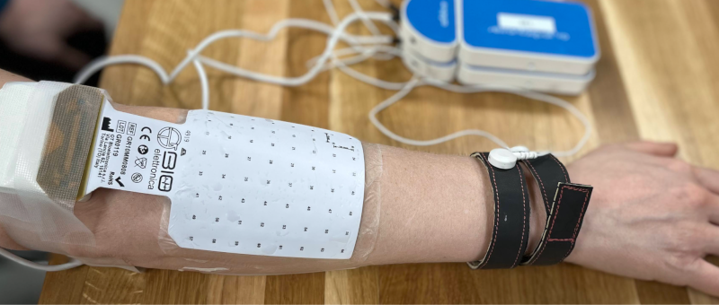

# Electromyography

Support for Electromyography (EMG) was developed as a
[BIDS Extension Proposal](../extensions.md#bids-extension-proposals).
Please see [Citing BIDS](../introduction.md#citing-bids) on how to appropriately credit
this extension when referring to it in the context of the academic literature.

!!! example "Example datasets"

    Electromyography datasets formatted according to this specification are available on
    the [BIDS examples repository](https://github.com/bids-standard/bids-examples#emg)
    and can be emulated when curating new datasets.

## EMG data

{{ MACROS___make_filename_template(
"raw",
datatypes=["emg"],
suffixes=["emg", "channels", "electrodes", "coordsystem"])
}}

EMG device manufacturers use a variety of formats for storing raw data, and there is
no single standard that all researchers agree on. For BIDS, EMG data MUST be
stored in one of the following formats:

| **Format**                                                         | **Extension(s)**         | **Description**                                                                                                                                                                                      |
| ------------------------------------------------------------------ | ------------------------ | ---------------------------------------------------------------------------------------------------------------------------------------------------------------------------------------------------- |
| [European data format](https://www.edfplus.info/)                  | `.edf`                   | Each recording consists of a single `.edf` file. [`edf+`](https://www.edfplus.info/specs/edfplus.html) files are permitted. The capital `.EDF` extension MUST NOT be used.                           |
| [Biosemi data format](https://www.biosemi.com/faq/file_format.htm) | `.bdf`                   | Each recording consists of a single `.bdf` file. [`bdf+`](https://www.teuniz.net/edfbrowser/bdfplus%20format%20description.html) files are permitted. The capital `.BDF` extension MUST NOT be used. |

It is RECOMMENDED to use the BDF+ data format.
Future versions of BIDS may extend this list of supported file formats.
File formats for future consideration MUST have open access documentation, MUST have
open source implementation for both reading and writing in at least two programming
languages and SHOULD be widely supported in multiple software packages.
Other formats that may be considered in the future should have a clear added advantage
over the existing formats and should have wide adoption in the BIDS community.

We encourage users to provide additional metadata extracted from the
manufacturer-specific data files in the sidecar JSON file.

Note the `RecordingType`, which depends on whether the data stream on disk is interrupted or not.
Continuous data is by definition 1 segment without interruption.
Epoched data consists of multiple segments that all have the same length
(for example, corresponding to trials) and that have gaps in between.
Discontinuous data consists of multiple segments of different length,
for example due to a pause in the acquisition.

### Terminology: Electrodes vs. Channels

For proper documentation of EMG recording metadata it is important to understand the
difference between electrode and channel: an EMG electrode is a single point of electrical
contact with the body, whereas a channel is the combination of the analog differential
amplifier and analog-to-digital converter that result in a potential (voltage) difference
that is stored in the EMG dataset.
We employ the following short definitions:

-   Electrode = A single point of contact between the acquisition system and
    the recording site (whether on the skin surface or intramuscular).
    Multiple electrodes can be organized as arrays, grids, leads, strips, probes,
    shafts, and so on.

-   Channel = A single analog-to-digital converter in the recording system that
    regularly samples the value of a transducer, which results in the signal being
    represented as a time series in the digitized data.
    This can be connected to two electrodes (to measure the potential difference between
    them), a magnetic field or magnetic gradient sensor, temperature sensor,
    accelerometer, and so forth.

This distinction is especially important for EMG because a common type of EMG device comprises
two electrodes at a fixed distance, wired such that the electrode pair is necessarily converted
to a single channel by the amplifier (in other words, one of the electrodes necessarily acts
as the _reference_ for the other).
In other devices, researchers may have control over which electrode(s) to use as the reference
for each channel.
Although the _reference_ and _ground_ electrodes are often referred to as channels,
they are in most common EMG systems not recorded by themselves.
Therefore they are not represented as channels in the data.
The type of referencing for all channels and optionally the location of the reference
electrode and the location of the ground electrode MAY be specified.

### Sidecar JSON (`*_emg.json`)

For consistency between studies and institutions,
we encourage users to extract the values of metadata fields from the actual raw data.
Whenever possible, please avoid using ad hoc wording.

Those fields MUST be present:

<!-- This block generates a metadata table.
These tables are defined in
  src/schema/rules/sidecars
The definitions of the fields specified in these tables may be found in
  src/schema/objects/metadata.yaml
A guide for using macros can be found at
 https://github.com/bids-standard/bids-specification/blob/master/macros_doc.md
-->
{{ MACROS___make_sidecar_table("emg.EMGRequired") }}

Those fields SHOULD be present:

<!-- This block generates a metadata table.
These tables are defined in
  src/schema/rules/sidecars
The definitions of the fields specified in these tables may be found in
  src/schema/objects/metadata.yaml
A guide for using macros can be found at
 https://github.com/bids-standard/bids-specification/blob/master/macros_doc.md
-->
{{ MACROS___make_sidecar_table("emg.EMGRecommended") }}

These fields MAY be present:

<!-- This block generates a metadata table.
These tables are defined in
  src/schema/rules/sidecars
The definitions of the fields specified in these tables may be found in
  src/schema/objects/metadata.yaml
A guide for using macros can be found at
 https://github.com/bids-standard/bids-specification/blob/master/macros_doc.md
-->
{{ MACROS___make_sidecar_table("emg.EMGOptional") }}

Note that the date and time information SHOULD be stored in the study key file
([`scans.tsv`](../modality-agnostic-files.md#scans-file)).
Date time information MUST be expressed as indicated in [Units](../common-principles.md#units)

#### Hardware information

<!-- This block generates a metadata table.
These tables are defined in
  src/schema/rules/sidecars
The definitions of the fields specified in these tables may be found in
  src/schema/objects/metadata.yaml
A guide for using macros can be found at
 https://github.com/bids-standard/bids-specification/blob/master/macros_doc.md
-->
{{ MACROS___make_sidecar_table("emg.EMGHardware") }}

#### Task information

<!-- This block generates a metadata table.
These tables are defined in
  src/schema/rules/sidecars
The definitions of the fields specified in these tables may be found in
  src/schema/objects/metadata.yaml
A guide for using macros can be found at
 https://github.com/bids-standard/bids-specification/blob/master/macros_doc.md
-->
{{ MACROS___make_sidecar_table("emg.EMGTaskInformation") }}

Note that the `TaskName` field does not have to be a "behavioral task" that subjects perform,
but can reflect some information about the conditions present when the data was acquired
(for example, `"treatment"`, `"control"`, or `"sleep"`).

#### Institution information

<!-- This block generates a metadata table.
These tables are defined in
  src/schema/rules/sidecars
The definitions of the fields specified in these tables may be found in
  src/schema/objects/metadata.yaml
A guide for using macros can be found at
 https://github.com/bids-standard/bids-specification/blob/master/macros_doc.md
-->
{{ MACROS___make_sidecar_table("emg.EMGInstitutionInformation") }}

#### Example `*_emg.json`

<!-- TODO do we need separate ElectrodeManufacturer and Manufacturer fields like iEEG? -->
<!-- TODO check if hardware filters are plausible for an EMG system -->
```JSON
{
  "EMGChannelCount":4,
  "EMGGround":"n/a",
  "EMGPlacementScheme":"midpoint between cubital fossa and radial styloid process",
  "EMGReference":"4 reference electrodes built-in to device, placed near the midpoint between radial and ulnar styloid processes on the volar surface",
  "HardwareFilters":{"Highpass RC filter": {"Half amplitude cutoff (Hz)": 0.0159, "Roll-off": "6dBOctave"}},
  "InstitutionAddress":"9500 Gilman Drive 0559, La Jolla, CA 92093",
  "InstitutionName":"Swartz Center for Computational Neuroscience",
  "Instructions":"Jump straight upward as high as you can, while keeping your arms at your sides.",
  "Manufacturer":"Delsys",
  "ManufacturersModelName":"Trigno® Galileo",
  "PowerLineFrequency":60,
  "RecordingDuration":123.456,
  "RecordingType":"continuous",
  "SamplingFrequency":1000,
  "SoftwareFilters":"n/a",
  "TaskDescription":"jumping with stationary arms",
  "TaskName":"jumping",
}
```

## Channels description (`*_channels.tsv`)

<!--
This block generates a filename templates.
The inputs for this macro can be found in the directory
  src/schema/rules/files/raw
and a guide for using macros can be found at
 https://github.com/bids-standard/bids-specification/blob/master/macros_doc.md
-->
{{ MACROS___make_filename_template("raw", datatypes=["emg"], suffixes=["channels"]) }}

A channel represents one time series recorded with the recording system.
Although this information can often be extracted from the EMG recording,
listing it in a simple `.tsv` document makes it easy to browse or search
(for example, searching for recordings with a sampling frequency of >=1000 Hz).
Hence, the `channels.tsv` file is RECOMMENDED.
Channels SHOULD appear in the table in the same order they do in the EMG data file.
Any number of additional columns MAY be provided to provide additional information about the channels.
Note that electrode positions SHOULD NOT be added to this file but to `*_electrodes.tsv`.

The columns of the channels description table stored in `*_channels.tsv` are:

<!-- This block generates a columns table.
The definitions of these fields can be found in
  src/schema/rules/tabular_data/*.yaml
and a guide for using macros can be found at
 https://github.com/bids-standard/bids-specification/blob/master/macros_doc.md
-->
{{ MACROS___make_columns_table("emg.EMGChannels") }}

Restricted keyword list for field type in alphabetic order (shared with the MEG
and EEG modality; however, only types that are common in EMG data are listed here).
Note that upper-case is REQUIRED:

| **Keyword** | **Description**                                                        |
| ----------- | ---------------------------------------------------------------------- |
| VEOG        | Vertical EOG (electrooculogram)                                        |
| HEOG        | Horizontal EOG                                                         |
| EOG         | Generic EOG channel if HEOG or VEOG information not available          |
| ECG         | ElectroCardioGram (heart)                                              |
| EMG         | ElectroMyoGram (muscle)                                                |
| TRIG        | Analog (TTL in Volt) or digital (binary TTL) trigger channel           |
| EYEGAZE     | Eye Tracker gaze                                                       |
| PUPIL       | Eye Tracker pupil diameter                                             |
| MISC        | Miscellaneous                                                          |
| SYSCLOCK    | System time showing elapsed time since trial started                   |
| ADC         | Analog to Digital input                                                |
| DAC         | Digital to Analog output                                               |
| REF         | Reference channel                                                      |
| OTHER       | Any other type of channel                                              |

Examples of free-form text for field `description`:

-   n/a
-   stimulus
-   response
-   skin conductance
-   battery status

### Example `*_channels.tsv`

See also the corresponding [`electrodes.tsv` example](#example-electrodestsv).
```Text
name  type  units  signal_electrode  reference  target_muscle
emg1  EMG   V      E1                E2         anterior belly of the digastric
emg2  EMG   V      E3                E4         levator angulis oris, zygomaticus major
emg3  EMG   V      E5                E6         platysma
emg4  EMG   V      E7                E8         obicularis oris
```

## Electrodes description (`*_electrodes.tsv`)

<!--
This block generates a filename templates.
The inputs for this macro can be found in the directory
  src/schema/rules/files/raw
and a guide for using macros can be found at
 https://github.com/bids-standard/bids-specification/blob/master/macros_doc.md
-->
{{ MACROS___make_filename_template("raw", datatypes=["emg"], suffixes=["electrodes"]) }}

File that gives the measured location, size, and other properties of EMG electrodes.
If an `*_electrodes.tsv` file is specified, a `*_coordsystem.json` file MUST be specified
as well.

When 3D electrode locations are digitized in situ, the origin, orientation, and measurement
unit of the coordinate system MUST be recorded in cartesian coordinates according to the
`EMGCoordinateSystem` and `EMGCoordinateUnits` fields in `*_coordsystem.json`,
as described in the [Coordinate Systems Appendix](../appendices/coordinate-systems.md).
In such cases, `EMGCoordinateSystem` SHOULD be specified as `Other`, the
`EMGCoordinateSystemDescription` SHOULD contain a description of the origin and axis
orientations of the 3D coordinate system, and the `coordinate_system` column in
`electrodes.tsv` MUST say `EMGCoordinateSystem`.

When accurate 3D locations are unavailable, 2D locations may be provided to define the
geometry of an electrode grid or group, and the group's placement on the body may be
described by defining the coordinates of an "anchor" point (typically an electrode in the
group) within a "parent" coordinate system defined in reference to subject anatomy.
See the [`electrodes.tsv` example](#example-electrodestsv) section for an example.
In such cases, the `coordsystem.json` file SHOULD contain separate named mappings for the
parent and child coordinate systems.
Each mapping should itself contain an `EMGCoordinateSystem` entry specified as `Other` an
`EMGCoordinateSystemDescription` entry describing the orientation of `x`, `y`, and `z` axes,
and an `EMGCoordinateSystemUnits` entry indicating the units of measure for the coordinates.
Additionally, each child coordinate system SHOULD contain an entry `ParentCoordinateSystem`
giving the name of the (anatomically-defined) parent coordinate system,
entries `AnchorElectrode` and `AnchorCoordinates` that name an electrode and provide its
coordinates _in the parent coordinate system_ (respectively).
See the [`coordsystem.json` section](#example-coordsystemjson) for an example.

The order of the required columns in the `*_electrodes.tsv` file MUST be as listed below.

<!-- This block generates a columns table.
The definitions of these fields can be found in
  src/schema/rules/tabular_data/*.yaml
and a guide for using macros can be found at
 https://github.com/bids-standard/bids-specification/blob/master/macros_doc.md
-->
{{ MACROS___make_columns_table("emg.EMGElectrodes") }}

The [`acq-<label>`](../appendices/entities.md#acq) entity MUST be used to indicate
simultaneous acquisition of data from multiple EMG devices, in cases where the devices
store data in separate data files.
For example:

<!-- This block generates a file tree.
A guide for using macros can be found at
 https://github.com/bids-standard/bids-specification/blob/master/macros_doc.md
-->
{{ MACROS___make_filetree_example(
   {
   "sub-01": {
      "ses-01":{
         "emg": {
            "sub-01_ses-01_acq-RectusFemoris_electrodes.tsv": "",
            "sub-01_ses-01_acq-VastusLateralis_electrodes.tsv": "",
            "sub-01_ses-01_acq-VastusMedialis_electrodes.tsv": ""
            },
         },
      }
   }
) }}

Above, acquisitions are labeled with the target muscle, but other naming schemes are also
appropriate. For example, if bipolar and grid EMG devices are used simultaneously,
acquisitions may be labeled "bipolar" and "grid", or use the device manufacturer names.
For cases of multiple devices recording simultaneously into _the same data file_,
the `group` column MUST be used to distinguish which electrodes belong to which device.

Except in cases of simultaneous acquisitions from different devices into different data
files (as mentioned above), `*_electrodes.tsv` files SHOULD NOT be duplicated for each data file,
for example, during multiple runs of a task.
The [inheritance principle](../common-principles.md#the-inheritance-principle) MUST
be used to find the appropriate electrode positions for a given data file.
If electrodes are repositioned, it is RECOMMENDED to use multiple sessions to indicate this.

### Example `*_electrodes.tsv`

Example `*_electrodes.tsv` for a 2 by 2 grid of EMG electrodes with 2.5 mm electrode diameter
and 10 mm inter-electrode distance.

```Text
name  x     y     coordinate_system  group  diameter
001   0.0   0.0   VolarForearm       grid1  2.5
002   10.0  0.0   VolarForearm       grid1  2.5
003   0.0   10.0  VolarForearm       grid1  2.5
004   10.0  10.0  VolarForearm       grid1  2.5
001   0.0   0.0   DorsalForearm      grid2  2.5
002   10.0  0.0   DorsalForearm      grid2  2.5
003   0.0   10.0  DorsalForearm      grid2  2.5
004   10.0  10.0  DorsalForearm      grid2  2.5
```

## Coordinate System JSON (`*_coordsystem.json`)

<!--
This block generates a filename templates.
The inputs for this macro can be found in the directory
  src/schema/rules/files/raw
and a guide for using macros can be found at
 https://github.com/bids-standard/bids-specification/blob/master/macros_doc.md
-->
{{ MACROS___make_filename_template("raw", datatypes=["emg"], suffixes=["coordsystem"]) }}

This `*_coordsystem.json` file contains the coordinate system in which electrode positions
are expressed.
Associated photos can also be provided.
<!-- **The `*_coordsystem.json` is REQUIRED if the optional `*_electrodes.tsv` is specified**. -->

Fields relating to the EMG electrode positions:

<!-- This block generates a metadata table.
These tables are defined in
  src/schema/rules/sidecars
The definitions of the fields specified in these tables may be found in
  src/schema/objects/metadata.yaml
A guide for using macros can be found at
 https://github.com/bids-standard/bids-specification/blob/master/macros_doc.md
-->
{{ MACROS___make_json_table("json.emg.EMGCoordsystemPositions") }}

The [`acq-<label>`](../appendices/entities.md#acq) entity MUST be used to indicate
simultaneous acquisition of data from multiple EMG devices, in cases where the devices
store data in separate data files.
Except in cases of simultaneous acquisitions from different devices into different data
files (as just mentioned), `*_coordsystem.json` files SHOULD NOT be duplicated for each data file,
for example, during multiple runs of a task.
The [inheritance principle](../common-principles.md#the-inheritance-principle) MUST
be used to find the appropriate coordinate system description for a given data file.

### Nested coordinate systems

In the absence of digitized electrode locations, specifying the position of electrodes in
large arrays may be simplified by defining multiple coordinate systems: a "child" coordinate
system to specify the relative locations of each electrode within the device array,
and a "parent" coordinate system defined in reference to anatomical landmarks.
The two coordinate systems are linked by an "anchor" electrode whose coordinates in _both_
coordinate systems are given: its coordinates in the child (device) coordinate system are
given in `*_electrodes.tsv` (along with the device-relative locations of all other electrodes
in the array), and its coordinates in the parent (anatomical) coordinate system are given
in `*_coordsystem.json`.

### Example 1: `*_coordsystem.json` for digitized electrode positions

```json
{
    "EMGCoordinateSystem": "Other",
    "EMGCoordinateSystemDescription": "x: left helix-tragus junction (LHJ) → right helix-tragus junction (RHJ); y: inion → nasion; z: midpoint between mastoid processes → vertex",
    "EMGCoordinateSystemUnits": "m"
}
```

### Example 2: `*_coordsystem.json` with nested/anchored coordinate systems

```json
{
    "Forearm": {
        "EMGCoordinateSystem": "Other",
        "EMGCoordinateSystemDescription": "x: radial styloid process (RSP) → ulnar styloid process (USP); y: oleacranon process → cubital fossa; z: RSP-USP → lateral humerus epicondyle",
        "EMGCoordinateSystemUnits": "percent"
    },
    "Humerus": {
        "EMGCoordinateSystem": "Other",
        "EMGCoordinateSystemDescription": "x: medial humerus epicondyle (MHE) → lateral humerus epicondyle (LHE), y: oleacranon process → cubital fossa, z: MHE-LHE → greater humerus tubercule",
        "EMGCoordinateSystemUnits": "percent"
    },
    "BicepGrid": {
        "EMGCoordinateSystem": "Other",
        "EMGCoordinateSystemDescription": "x-axis left → right, y-axis bottom → top, when grid is oriented with leads at the bottom",
        "EMGCoordinateSystemUnits": "mm",
        "ParentCoordinateSystem": "Humerus",
        "AnchorCoordinates": [40, 70, 0],
        "AnchorElectrode": "E1"
    },
    "VolarForearmGrid": {
        "EMGCoordinateSystem": "Other",
        "EMGCoordinateSystemDescription": "x-axis left → right, y-axis bottom → top, when grid is oriented with leads at the bottom",
        "EMGCoordinateSystemUnits": "mm",
        "ParentCoordinateSystem": "Forearm",
        "AnchorCoordinates": [25, 50, 10],
        "AnchorElectrode": "E1"
    },
    "DorsalForearmGrid": {
        "EMGCoordinateSystem": "Other",
        "EMGCoordinateSystemDescription": "x-axis left → right, y-axis bottom → top, when grid is oriented with leads at the bottom",
        "EMGCoordinateSystemUnits": "mm",
        "ParentCoordinateSystem": "Forearm",
        "AnchorCoordinates": [75, 0, 90],
        "AnchorElectrode": "E1",
    }
}
```

## Photos of the electrode positions (`*_photo.<extension>`)

<!--
This block generates a filename templates.
The inputs for this macro can be found in the directory
  src/schema/rules/files/raw
and a guide for using macros can be found at
 https://github.com/bids-standard/bids-specification/blob/master/macros_doc.md
-->
{{ MACROS___make_filename_template("raw", datatypes=["emg"], suffixes=["photo"]) }}

Photos of the electrode locations are OPTIONAL.
Photos SHOULD include sufficient surrounding context to distinguish anatomical location.
For example, photographs of electrodes on the limbs should include at least one adjacent joint.
Photos may need to be cropped and/or blurred to conceal identifying features
or entirely omitted prior to dataset distribution, depending on obtained consent.

If there are photos of the electrodes, the [`acq-<label>`](../appendices/entities.md#acq) entity
MAY be specified, if separate photos are provided of each EMG device and the devices recorded
into separate data files.
The [`ses-<label>`](../appendices/entities.md#ses) entity may be used to specify when the photo was taken.

### Example `*_photo.<extension>`

<!-- This block generates a file tree.
A guide for using macros can be found at
 https://github.com/bids-standard/bids-specification/blob/master/macros_doc.md
-->
{{ MACROS___make_filetree_example(
   {
   "sub-01": {
      "ses-01":{
         "sub-01_ses-01_acq-DorsalForearmGrid_photo.jpg": "",
         "...": "",
         },
      }
   }
) }}


