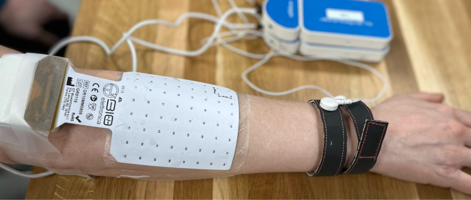

# Electromyography

Support for Electromyography (EMG) was developed as a
[BIDS Extension Proposal](../extensions.md#bids-extension-proposals).
Please see [Citing BIDS](../introduction.md#citing-bids) on how to appropriately credit
this extension when referring to it in the context of the academic literature.

!!! example "Example datasets"

    Electromyography datasets formatted according to this specification are available on
    the [BIDS examples repository](https://github.com/bids-standard/bids-examples#emg)
    and can be emulated when curating new datasets.

## EMG data

{{ MACROS___make_filename_template(
"raw",
datatypes=["emg"],
suffixes=["emg", "events"])
}}

EMG device manufacturers use a variety of formats for storing raw data, and there is
no single standard that all researchers agree on. For BIDS, EMG data MUST be
stored in one of the following formats:

| **Format**                                                         | **Extension(s)**         | **Description**                                                                                                                                                                                      |
| ------------------------------------------------------------------ | ------------------------ | ---------------------------------------------------------------------------------------------------------------------------------------------------------------------------------------------------- |
| [Biosemi data format](https://www.biosemi.com/faq/file_format.htm) | `.bdf`                   | Each recording consists of a single `.bdf` file. [`bdf+`](https://www.teuniz.net/edfbrowser/bdfplus%20format%20description.html) files are permitted. The capital `.BDF` extension MUST NOT be used. |
| [European data format](https://www.edfplus.info/)                  | `.edf`                   | Each recording consists of a single `.edf` file. [`edf+`](https://www.edfplus.info/specs/edfplus.html) files are permitted. The capital `.EDF` extension MUST NOT be used.                           |

It is RECOMMENDED to use the BDF+ data format.
Future versions of BIDS may extend this list of supported file formats.
File formats for future consideration MUST have open access documentation, MUST have
open source implementation for both reading and writing in at least two programming
languages and SHOULD be widely supported in multiple software packages.
Other formats that may be considered in the future should have a clear added advantage
over the existing formats and should have wide adoption in the BIDS community.

The [`acq-<label>`](../appendices/entities.md#acq) entity MAY be used to indicate
simultaneous acquisition of data from multiple EMG devices, in cases where the devices
store data in separate data files.
If separate devices are being used with separate sampling rates, start times, or other
acquisition parameters, the `acq-<label>` entity MUST be used to distinguish between them.
The synchronization of data from multiple devices SHOULD be described in the
[Scans](../modality-agnostic-files.md#scans-file) (`scans.tsv`) file, using the
`acq_time` entity.

In cases where the allowed formats do not encode all relevant metadata present in the
device manufacturer's native file format, we encourage users to provide the additional
metadata in the sidecar JSON file.

### Terminology: Electrodes vs. Channels

For proper documentation of EMG recording metadata it is important to understand the
difference between an electrode and a channel: an EMG electrode is a single point of
electrical contact with the body, whereas a channel is the combination of the analog
differential amplifier (which combines signals from two electrode sources) and the
analog-to-digital converter, which results in a potential difference (voltage) that forms
the actual data stored in the EMG dataset. We employ the following short definitions:

-   Electrode = A single point of contact between the acquisition system and
    the recording site (whether on the skin surface or intramuscular).
    Multiple electrodes can be organized as arrays, grids, leads, strips, probes,
    shafts, and so on.

-   Channel = A single analog-to-digital converter in the recording system that
    regularly samples the value of a transducer, which results in the signal being
    represented as a time series in the digitized data.
    This can be connected to two electrodes (to measure the potential difference between
    them), a magnetic field or magnetic gradient sensor, temperature sensor,
    accelerometer, and so forth.

This distinction is especially important for EMG because a common type of EMG device
(often erroneously called a "bipolar electrode") comprises two electrodes at a fixed distance,
wired such that the electrode pair is necessarily converted to a single channel by the amplifier
(in other words, one of the electrodes necessarily acts as the _reference_ for the other).
In other kinds of devices, researchers may have control over which electrode(s) to use as
the reference for each channel.

Note also that although the _reference_ and _ground_ electrodes are often referred to as
channels, in most common EMG systems they are not recorded by themselves.
Therefore they are usually not represented as channels in the data.
<!-- The type of referencing for all channels and optionally the location of the reference
electrode and the location of the ground electrode MAY be specified. -->

### Sidecar JSON (`*_emg.json`)

For consistency between studies and institutions,
we encourage users to extract the values of metadata fields from the actual raw data.
Whenever possible, please avoid using ad hoc wording.

These fields MUST be present:

<!-- This block generates a metadata table.
These tables are defined in
  src/schema/rules/sidecars
The definitions of the fields specified in these tables may be found in
  src/schema/objects/metadata.yaml
A guide for using macros can be found at
 https://github.com/bids-standard/bids-specification/blob/master/macros_doc.md
-->
{{ MACROS___make_sidecar_table("emg.EMGRequired") }}

Those fields SHOULD be present:

<!-- This block generates a metadata table.
These tables are defined in
  src/schema/rules/sidecars
The definitions of the fields specified in these tables may be found in
  src/schema/objects/metadata.yaml
A guide for using macros can be found at
 https://github.com/bids-standard/bids-specification/blob/master/macros_doc.md
-->
{{ MACROS___make_sidecar_table("emg.EMGRecommended") }}

Note the `RecordingType`, which depends on whether the data stream on disk is interrupted or not.
Continuous data is by definition 1 segment without interruption.
Epoched data consists of multiple segments that all have the same length
(for example, corresponding to trials) and that have gaps in between.
Discontinuous data consists of multiple segments of different length,
for example due to a pause in the acquisition.

These fields MAY be present:

<!-- This block generates a metadata table.
These tables are defined in
  src/schema/rules/sidecars
The definitions of the fields specified in these tables may be found in
  src/schema/objects/metadata.yaml
A guide for using macros can be found at
 https://github.com/bids-standard/bids-specification/blob/master/macros_doc.md
-->
{{ MACROS___make_sidecar_table("emg.EMGOptional") }}

Note that the date and time information SHOULD be stored in the study key file
([`scans.tsv`](../modality-agnostic-files.md#scans-file)).
Date time information MUST be expressed as indicated in [Units](../common-principles.md#units).

#### Hardware information

<!-- This block generates a metadata table.
These tables are defined in
  src/schema/rules/sidecars
The definitions of the fields specified in these tables may be found in
  src/schema/objects/metadata.yaml
A guide for using macros can be found at
 https://github.com/bids-standard/bids-specification/blob/master/macros_doc.md
-->
{{ MACROS___make_sidecar_table("emg.EMGHardware") }}

#### Task information

<!-- This block generates a metadata table.
These tables are defined in
  src/schema/rules/sidecars
The definitions of the fields specified in these tables may be found in
  src/schema/objects/metadata.yaml
A guide for using macros can be found at
 https://github.com/bids-standard/bids-specification/blob/master/macros_doc.md
-->
{{ MACROS___make_sidecar_table("emg.EMGTaskInformation") }}

Note that the `TaskName` field does not have to be a "behavioral task" that subjects perform,
but can reflect some information about the conditions present when the data was acquired
(for example, `"treatment"`, `"control"`, or `"sleep"`).

#### Institution information

<!-- This block generates a metadata table.
These tables are defined in
  src/schema/rules/sidecars
The definitions of the fields specified in these tables may be found in
  src/schema/objects/metadata.yaml
A guide for using macros can be found at
 https://github.com/bids-standard/bids-specification/blob/master/macros_doc.md
-->
{{ MACROS___make_sidecar_table("emg.EMGInstitutionInformation") }}

#### Example `*_emg.json`

<!-- TODO do we need separate ElectrodeManufacturer and Manufacturer fields like iEEG? -->
<!-- TODO check if hardware filters are plausible for an EMG system -->
```JSON
{
  "EMGChannelCount":4,
  "EMGGround":"n/a",
  "EMGPlacementScheme":"midpoint between cubital fossa and radial styloid process",
  "EMGReference":"4 reference electrodes built-in to device, placed near the midpoint between radial and ulnar styloid processes on the volar surface",
  "HardwareFilters":{"Highpass RC filter": {"Half amplitude cutoff (Hz)": 0.0159, "Roll-off": "6dBOctave"}},
  "InstitutionAddress":"9500 Gilman Drive 0559, La Jolla, CA 92093",
  "InstitutionalDepartmentName":"Swartz Center for Computational Neuroscience",
  "InstitutionName":"University of California San Diego",
  "Instructions":"Jump straight upward as high as you can, while keeping your arms at your sides.",
  "Manufacturer":"Delsys",
  "ManufacturersModelName":"Trigno® Galileo",
  "PowerLineFrequency":60,
  "RecordingDuration":123.456,
  "RecordingType":"continuous",
  "SamplingFrequency":1000,
  "SoftwareFilters":"n/a",
  "TaskDescription":"jumping with stationary arms",
  "TaskName":"jumping",
}
```

## Channels description (`*_channels.tsv`)

<!--
This block generates a filename templates.
The inputs for this macro can be found in the directory
  src/schema/rules/files/raw
and a guide for using macros can be found at
 https://github.com/bids-standard/bids-specification/blob/master/macros_doc.md
-->
{{ MACROS___make_filename_template("raw", datatypes=["emg"], suffixes=["channels"]) }}

A channel represents one time series recorded with the recording system.
Although this information can often be extracted from the EMG recording,
listing it in a simple `.tsv` document makes it easy to browse or search
(for example, searching for recordings with a sampling frequency of >=1000 Hz).
Hence, the `*_channels.tsv` file is RECOMMENDED.
Channels SHOULD appear in the table in the same order they do in the EMG data file.
Additional columns MAY be included to provide additional information about the channels.
Note that electrode positions SHOULD NOT be added to this file but to `*_electrodes.tsv`.

The columns of the channels description table stored in `*_channels.tsv` are:

<!-- This block generates a columns table.
The definitions of these fields can be found in
  src/schema/rules/tabular_data/*.yaml
and a guide for using macros can be found at
 https://github.com/bids-standard/bids-specification/blob/master/macros_doc.md
-->
{{ MACROS___make_columns_table("emg.EMGChannels") }}

Restricted keyword list for field type in alphabetic order (shared with the MEG
and EEG modality; however, only types that are common in EMG data are listed here).
Note that upper-case is REQUIRED:

| **Keyword** | **Description**                                                        |
| ----------- | ---------------------------------------------------------------------- |
| VEOG        | Vertical EOG (electrooculogram)                                        |
| HEOG        | Horizontal EOG                                                         |
| EOG         | Generic EOG channel if HEOG or VEOG information not available          |
| ECG         | ElectroCardioGram (heart)                                              |
| EMG         | ElectroMyoGram (muscle)                                                |
| TRIG        | Analog (TTL in Volt) or digital (binary TTL) trigger channel           |
| EYEGAZE     | Eye Tracker gaze                                                       |
| PUPIL       | Eye Tracker pupil diameter                                             |
| MISC        | Miscellaneous                                                          |
| SYSCLOCK    | System time showing elapsed time since trial started                   |
| ADC         | Analog to Digital input                                                |
| DAC         | Digital to Analog output                                               |
| REF         | Reference channel                                                      |
| OTHER       | Any other type of channel                                              |

Examples of free-form text for field `description`:

-   n/a
-   stimulus
-   response
-   skin conductance
-   battery status

### Example `*_channels.tsv`

See also the corresponding [`electrodes.tsv` example](#example-electrodestsv).
```Text
name  type  units  signal_electrode  reference  target_muscle
emg1  EMG   V      E1                E2         anterior belly of the digastric
emg2  EMG   V      E3                E4         levator angulis oris, zygomaticus major
emg3  EMG   V      E5                E6         platysma
emg4  EMG   V      E7                E8         obicularis oris
```

## Electrodes description (`*_electrodes.tsv`)

<!--
This block generates a filename templates.
The inputs for this macro can be found in the directory
  src/schema/rules/files/raw
and a guide for using macros can be found at
 https://github.com/bids-standard/bids-specification/blob/master/macros_doc.md
-->
{{ MACROS___make_filename_template("raw", datatypes=["emg"], suffixes=["electrodes"]) }}

File that gives the measured location, size, and other properties of EMG electrodes.
If an `*_electrodes.tsv` file is specified, a `*_coordsystem.json` file MUST be specified
as well.

Electrode locations may be specified in one of four ways:

1.  **Coordinates and landmarks digitized in situ.**
    When 3D electrode locations are digitized in situ, the origin, orientation, and measurement
    unit of the coordinate system MUST be recorded in cartesian coordinates according to the
    `EMGCoordinateSystem` and `EMGCoordinateUnits` fields in `*_coordsystem.json`,
    as described in the [Coordinate Systems Appendix](../appendices/coordinate-systems.md).
    In such cases, `EMGCoordinateSystem` SHOULD be specified as `Other`, the
    `EMGCoordinateSystemDescription` SHOULD contain a description of the origin and axis
    orientations of the 3D coordinate system, and the `coordinate_system` column in
    `*_electrodes.tsv` may be omitted.

2.  **Measured coordinates in a single coordinate system defined by anatomical landmarks.**
    This approach is suitable for individual electrodes placed close together on a single
    body part.
    In this case the `*_coordsystem.json` file MUST contain fields `EMGCoordinateSystem`,
    `EMGCoordinateUnits`, and `EMGCoordinateSystemDescription` as described in (1) above.
    For example, 4 electrodes all placed on the forearm (2 on the volar surface and 2 on
    the dorsal surface) could be located with coordinates in the following coordinate system:

    - `x`: radial styloid process (RSP) → ulnar styloid process (USP);
    - `y`: oleacranon process → cubital fossa;
    - `z`: RSP-USP → lateral humerus epicondyle

    It may be possible to omit the `z` column when all electrodes are on the same surface
    (in the above example, if all electrodes were on the volar surface and none were on
    the dorsal surface).
    Likewise it may be possible to omit both `z` and `y` if all electrodes are colinear
    along the anatomically defined `x` axis.

3.  **Measured coordinates in multiple anatomically-defined coordinate systems.**
    This approach is suitable for individual electrodes placed on multiple body parts.
    In this case the `*_coordsystem.json` file MUST contain a separate, arbitrarily-named
    JSON object for each coordinate system, each of which MUST contain the fields
    `EMGCoordinateSystem`, `EMGCoordinateUnits`, and `EMGCoordinateSystemDescription` as
    described in (1) above.
    Additionally, the `coordinate_system` column in `*_electrodes.tsv` MUST indicate which
    named coordinate system the coordinate values in that row reflect.
    For example, `*_coordsystem.json` may a coordinate system called "lower-leg" defined
    by lower leg landmarks for electrodes below the knee, and another called "thigh"
    defined by upper-leg landmarks for electrodes above the knee.
    In such a case, entries in the `coordinate_system` column of `*_electrodes.tsv` MUST
    specify either `"lower-leg"` or `"thigh"`.
    As in (2) above, it may be possible to omit the `z` and `y` columns, depending on the
    details of the electrode placements.

4.  **Measured coordinates in "nested" coordinate systems.**
    This approach is suitable for large electrode grids or similar devices.
    In this case, measured 2D locations in the `x` and `y` columns define the geometry
    of an electrode grid or group, relative to an arbitrary device-internal origin and
    axes (this is the "child" coordinate system).
    The group's placement on the body is then described by selecting an "anchor"
    electrode and providing its coordinates within a "parent" coordinate system defined
    in reference to subject anatomy (as in (2) above).
    The `*_coordsystem.json` file MUST contain separate, arbitrarily-named JSON objects
    for each of the parent and child coordinate systems, each containing the fields
    `EMGCoordinateSystem`, `EMGCoordinateUnits`, and `EMGCoordinateSystemDescription` as
    described in (1) above.
    Additionally, each child coordinate system MUST contain an entry `ParentCoordinateSystem`
    giving the name of the JSON object that defines the parent (anatomical) coordinate system,
    and entries `AnchorElectrode` and `AnchorCoordinates` that name an electrode and provide
    its coordinates in the parent coordinate system (respectively).
    For example, a coordinate system called "forearm" defined by forearm anatomical landmarks
    (as in (2) above) could be the parent coordinate system for two electrode grids placed on
    the volar and dorsal surfaces of the forearm.
    Each grid would have its own coordinate system (named, for example, "volar-grid" and
    "dorsal-grid") in which coordinates of each electrode are relative to a device-internal
    origin, such as the lower-leftmost electrode when the device is in a specified orientation.
    Note that the parent coordinate system may be defined in different units than the child
    coordinate system; for example, if an anchor electrode was placed 50% of the distance
    between the ulnar styloid process and cubital fossa, the unit of the parent coordinate
    system is `"percent"` and `AnchorCoordinates` would have a value of `50` for the `x`
    coordinate in `*_coordsystem.json`.
    Meanwhile, the `x` column of `*_electrodes.tsv` gives the device-internal coordinates
    of the grid electrodes, which may be in a different unit such as `"mm"`.
    See the [`coordsystem.json` section](#example-coordsystemjson) for further details.

For details of how to specify the coordinate systems in each of these cases, see the
[`coordsystem.json` section](#example-coordsystemjson).

### Required columns

The order of the required columns in the `*_electrodes.tsv` file MUST be as listed below.

<!-- This block generates a columns table.
The definitions of these fields can be found in
  src/schema/rules/tabular_data/*.yaml
and a guide for using macros can be found at
 https://github.com/bids-standard/bids-specification/blob/master/macros_doc.md
-->
{{ MACROS___make_columns_table("emg.EMGElectrodes") }}

The [`acq-<label>`](../appendices/entities.md#acq) entity MUST be used to indicate
simultaneous acquisition of data from multiple EMG devices, in cases where the devices
store data in separate data files.
For example:

<!-- This block generates a file tree.
A guide for using macros can be found at
 https://github.com/bids-standard/bids-specification/blob/master/macros_doc.md
-->
{{ MACROS___make_filetree_example(
   {
   "sub-01": {
      "ses-01":{
         "emg": {
            "sub-01_ses-01_acq-RectusFemoris_electrodes.tsv": "",
            "sub-01_ses-01_acq-VastusLateralis_electrodes.tsv": "",
            "sub-01_ses-01_acq-VastusMedialis_electrodes.tsv": ""
            },
         },
      }
   }
) }}

Above, acquisitions are labeled with the target muscle, but other naming schemes are also
appropriate. For example, if bipolar and grid EMG devices are used simultaneously,
acquisitions may be labeled "bipolar" and "grid", or use the device manufacturer names.
For cases of multiple devices recording simultaneously into _the same data file_,
the `group` column MUST be used to distinguish which electrodes belong to which device.

Except in cases of simultaneous acquisitions from different devices into different data
files (as mentioned above), `*_electrodes.tsv` files SHOULD NOT be duplicated for each data file,
for example, during multiple runs of a task.
The [inheritance principle](../common-principles.md#the-inheritance-principle) MUST
be used to find the appropriate electrode positions for a given data file.
If electrodes are repositioned, it is RECOMMENDED to use multiple sessions to indicate this.

### Example `*_electrodes.tsv`

Example `*_electrodes.tsv` for a 2 by 2 grid of EMG electrodes with 2.5 mm electrode diameter
and 10 mm inter-electrode distance.

```Text
name  x     y     coordinate_system  group  diameter
001   0.0   0.0   VolarForearm       grid1  2.5
002   10.0  0.0   VolarForearm       grid1  2.5
003   0.0   10.0  VolarForearm       grid1  2.5
004   10.0  10.0  VolarForearm       grid1  2.5
001   0.0   0.0   DorsalForearm      grid2  2.5
002   10.0  0.0   DorsalForearm      grid2  2.5
003   0.0   10.0  DorsalForearm      grid2  2.5
004   10.0  10.0  DorsalForearm      grid2  2.5
```

## Coordinate System JSON (`*_coordsystem.json`)

<!--
This block generates a filename templates.
The inputs for this macro can be found in the directory
  src/schema/rules/files/raw
and a guide for using macros can be found at
 https://github.com/bids-standard/bids-specification/blob/master/macros_doc.md
-->
{{ MACROS___make_filename_template("raw", datatypes=["emg"], suffixes=["coordsystem"]) }}

This `*_coordsystem.json` file contains the coordinate system in which electrode positions
are expressed.
Associated photos can also be provided.
**The `*_coordsystem.json` is REQUIRED if the optional `*_electrodes.tsv` is specified**;
please see the [electrodes description section](#electrodes-description-electrodestsv) for
important guidance regarding how to specify electrode location.

Fields relating to the EMG coordinate system(s):

<!-- This block generates a metadata table.
These tables are defined in
  src/schema/rules/sidecars
The definitions of the fields specified in these tables may be found in
  src/schema/objects/metadata.yaml
A guide for using macros can be found at
 https://github.com/bids-standard/bids-specification/blob/master/macros_doc.md
-->
{{ MACROS___make_json_table("json.emg.EMGCoordsystemPositions") }}

The [`acq-<label>`](../appendices/entities.md#acq) entity MUST be used to indicate
simultaneous acquisition of data from multiple EMG devices, in cases where the devices
store data in separate data files.
Except in cases of simultaneous acquisitions from different devices into different data
files (as just mentioned), `*_coordsystem.json` files SHOULD NOT be duplicated for each data file,
for example, during multiple runs of a task.
The [inheritance principle](../common-principles.md#the-inheritance-principle) MUST
be used to find the appropriate coordinate system description for a given data file.

### Example 1: `*_coordsystem.json` for digitized electrode positions

Here, a coordinate system is defined based on digitized cranial landmarks, and is suitable
for EMG electrodes on the face whose locations are digitized with the same equipment as the
cranial landmarks:

```json
{
    "EMGCoordinateSystem": "Other",
    "EMGCoordinateSystemDescription": "x: left helix-tragus junction (LHJ) → right helix-tragus junction (RHJ); y: inion → nasion; z: midpoint between mastoid processes → vertex",
    "EMGCoordinateSystemUnits": "m"
}
```

### Example 2: `*_coordsystem.json` for measured electrode positions in a single coordinate system defined by anatomical landmarks

Here, a coordinate system is defined based on percentage of distances between anatomical
landmarks of the forearm, and is suitable for localizing individual electrodes on the
same body part:

```json
{
    "EMGCoordinateSystem": "Other",
    "EMGCoordinateSystemDescription": "x: radial styloid process (RSP) → ulnar styloid process (USP); y: oleacranon process → cubital fossa; z: RSP-USP → lateral humerus epicondyle",
    "EMGCoordinateSystemUnits": "percent"
}
```

### Example 3: `*_coordsystem.json` for measured electrode positions in in multiple anatomically-defined coordinate systems

Here, separate anatomically-based coordinate systems are defined for electrodes above and
below the elbow joint, and each is given a unique name ("Forearm" or "Humerus") which can
be referenced in the `coordinate_system` column of `*_electrodes.tsv`:

```json
    "Forearm": {
        "EMGCoordinateSystem": "Other",
        "EMGCoordinateSystemDescription": "x: radial styloid process (RSP) → ulnar styloid process (USP); y: oleacranon process → cubital fossa; z: RSP-USP → lateral humerus epicondyle",
        "EMGCoordinateSystemUnits": "percent"
    },
    "Humerus": {
        "EMGCoordinateSystem": "Other",
        "EMGCoordinateSystemDescription": "x: medial humerus epicondyle (MHE) → lateral humerus epicondyle (LHE), y: oleacranon process → cubital fossa, z: MHE-LHE → greater humerus tubercule",
        "EMGCoordinateSystemUnits": "percent"
    }
```

### Example 4: `*_coordsystem.json` with nested/anchored coordinate systems

Here, coordinate systems for the _relative_ locations of electrodes in grids or groups are
given in "child" coordinate systems ("BicepGrid", "VolarForearmGrid", "DorsalForearmGrid"),
each of which is anchored to a "parent" coordinate system that is defined anatomically:

```json
{
    "Forearm": {
        "EMGCoordinateSystem": "Other",
        "EMGCoordinateSystemDescription": "x: radial styloid process (RSP) → ulnar styloid process (USP); y: oleacranon process → cubital fossa; z: RSP-USP → lateral humerus epicondyle",
        "EMGCoordinateSystemUnits": "percent"
    },
    "Humerus": {
        "EMGCoordinateSystem": "Other",
        "EMGCoordinateSystemDescription": "x: medial humerus epicondyle (MHE) → lateral humerus epicondyle (LHE), y: oleacranon process → cubital fossa, z: MHE-LHE → greater humerus tubercule",
        "EMGCoordinateSystemUnits": "percent"
    },
    "BicepGrid": {
        "EMGCoordinateSystem": "Other",
        "EMGCoordinateSystemDescription": "x-axis left → right, y-axis bottom → top, when grid is oriented with leads at the bottom",
        "EMGCoordinateSystemUnits": "mm",
        "ParentCoordinateSystem": "Humerus",
        "AnchorCoordinates": [40, 70, 0],
        "AnchorElectrode": "E1"
    },
    "VolarForearmGrid": {
        "EMGCoordinateSystem": "Other",
        "EMGCoordinateSystemDescription": "x-axis left → right, y-axis bottom → top, when grid is oriented with leads at the bottom",
        "EMGCoordinateSystemUnits": "mm",
        "ParentCoordinateSystem": "Forearm",
        "AnchorCoordinates": [25, 50, 10],
        "AnchorElectrode": "E1"
    },
    "DorsalForearmGrid": {
        "EMGCoordinateSystem": "Other",
        "EMGCoordinateSystemDescription": "x-axis left → right, y-axis bottom → top, when grid is oriented with leads at the bottom",
        "EMGCoordinateSystemUnits": "mm",
        "ParentCoordinateSystem": "Forearm",
        "AnchorCoordinates": [75, 0, 90],
        "AnchorElectrode": "E1",
    }
}
```

## Photos of the electrode positions (`*_photo.<extension>`)

<!--
This block generates a filename templates.
The inputs for this macro can be found in the directory
  src/schema/rules/files/raw
and a guide for using macros can be found at
 https://github.com/bids-standard/bids-specification/blob/master/macros_doc.md
-->
{{ MACROS___make_filename_template("raw", datatypes=["emg"], suffixes=["photo"]) }}

Photos of the electrode locations are OPTIONAL.
Photos SHOULD include sufficient surrounding context to distinguish anatomical location.
For example, photographs of electrodes on the limbs should include at least one adjacent joint.
Photos may need to be cropped and/or blurred to conceal identifying features
or entirely omitted prior to dataset distribution, depending on obtained consent.

If there are photos of the electrodes, the [`acq-<label>`](../appendices/entities.md#acq) entity
MAY be specified, if separate photos are provided of each EMG device and the devices recorded
into separate data files.
The [`ses-<label>`](../appendices/entities.md#ses) entity may be used to specify when the photo was taken.

### Example `*_photo.<extension>`

<!-- This block generates a file tree.
A guide for using macros can be found at
 https://github.com/bids-standard/bids-specification/blob/master/macros_doc.md
-->
{{ MACROS___make_filetree_example(
   {
   "sub-01": {
      "ses-01":{
         "sub-01_ses-01_acq-DorsalForearmGrid_photo.jpg": "",
         "...": "",
         },
      }
   }
) }}


