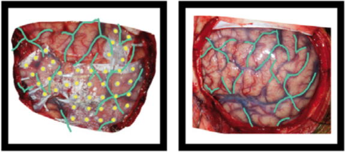

# Intracranial Electroencephalography

Support for Intracranial Electroencephalography (iEEG) was developed as a
[BIDS Extension Proposal](../extensions.md#bids-extension-proposals).
Please see [Citing BIDS](../introduction.md#citing-bids)
on how to appropriately credit this extension when referring to it in the
context of the academic literature.

!!! example "Example datasets"

    Several [example iEEG datasets](https://bids-standard.github.io/bids-examples/#ieeg)
    have been formatted using this specification
    and can be used for practical guidance when curating a new dataset.

## iEEG recording data

<!--
This block generates a filename templates.
The inputs for this macro can be found in the directory
  src/schema/rules/files/raw
and a guide for using macros can be found at
 https://github.com/bids-standard/bids-specification/blob/master/macros_doc.md
-->
{{ MACROS___make_filename_template(
   "raw",
   datatypes=["ieeg"],
   suffixes=["ieeg", "events", "physio", "stim"])
}}

The iEEG community uses a variety of formats for storing raw data, and there is
no single standard that all researchers agree on. For BIDS, iEEG data MUST be
stored in one of the following formats:

| **Format**                                                                | **Extension(s)**         | **Description**                                                                                                                                                            |
| ------------------------------------------------------------------------- | ------------------------ | -------------------------------------------------------------------------------------------------------------------------------------------------------------------------- |
| [European data format](https://www.edfplus.info/)                         | `.edf`                   | Each recording consists of a `.edf` single file. [`edf+`](https://www.edfplus.info/specs/edfplus.html) files are permitted. The capital `.EDF` extension MUST NOT be used. |
| [BrainVision Core Data Format][bvformat]                                  | `.vhdr`, `.vmrk`, `.eeg` | Each recording consists of a  `.vhdr`, `.vmrk`, `.eeg` file triplet.                                                                                                       |
| [EEGLAB](https://sccn.ucsd.edu/eeglab/index.php)                          | `.set`, `.fdt`           | The format used by the MATLAB toolbox [EEGLAB](https://sccn.ucsd.edu/eeglab/index.php). Each recording consists of a `.set` file with an OPTIONAL `.fdt` file.             |
| [Neurodata Without Borders](https://nwb-schema.readthedocs.io/en/latest/) | `.nwb`                   | Each recording consists of a single `.nwb` file.                                                                                                                           |
| [MEF3](https://osf.io/e3sf9/)                                             | `.mefd`                  | Each recording consists of a `.mefd` directory.                                                                                                                            |
| [MED](https://medformat.org/)                                             | `.medd`                  | Each recording consists of a `.medd` directory.                                                                                                                            |

It is RECOMMENDED to use the European data format, or the BrainVision data
format. It is furthermore discouraged to use the other accepted formats over
these RECOMMENDED formats, particularly because there are conversion scripts
available in most commonly used programming languages to convert data into the
RECOMMENDED formats.

Future versions of BIDS may extend this list of supported file formats. File
formats for future consideration MUST have open access documentation, MUST have
open source implementation for both reading and writing in at least two
programming languages and SHOULD be widely supported in multiple software
packages. Other formats that may be considered in the future should have a clear
added advantage over the existing formats and should have wide adoption in the
BIDS community.

We encourage users to provide additional metadata extracted from the
manufacturer-specific data files in the sidecar JSON file.

Note the RecordingType, which depends on whether the data stream on disk is interrupted or not.
Continuous data is by definition 1 segment without interruption.
Epoched data consists of multiple segments that all have the same length
(for example, corresponding to trials) and that have gaps in between.
Discontinuous data consists of multiple segments of different length,
for example due to a pause in the acquisition.

### Terminology: Electrodes vs. Channels

For proper documentation of iEEG recording metadata it is important to
understand the difference between electrode and channel: an iEEG electrode
is placed on or in the brain, whereas a channel is the combination of the analog
differential amplifier and analog-to-digital converter that result in a
potential (voltage) difference that is stored in the iEEG dataset. We employ the
following short definitions:

-   Electrode = A single point of contact between the acquisition system and the
    recording site (for example, scalp, neural tissue, ...). Multiple electrodes can be
    organized as arrays, grids, leads, strips, probes, shafts, caps (for EEG),
    and so forth.

-   Channel = A single analog-to-digital converter in the recording system that
    regularly samples the value of a transducer, which results in the signal
    being represented as a time series in the digitized data. This can be
    connected to two electrodes (to measure the potential difference between
    them), a magnetic field or magnetic gradient sensor, temperature sensor,
    accelerometer, and so forth.

Although the _reference_ and _ground_ electrodes are often referred to as
channels, they are in most common iEEG systems not recorded by themselves.
Therefore they are not represented as channels in the data. The type of
referencing for all channels and optionally the location of the reference
electrode and the location of the ground electrode MAY be specified.

### Sidecar JSON (`*_ieeg.json`)

For consistency between studies and institutions,
we encourage users to extract the values of metadata fields from the actual raw data.
Whenever possible, please avoid using ad hoc wording.

Those fields MUST be present:

<!-- This block generates a metadata table.
These tables are defined in
  src/schema/rules/sidecars
The definitions of the fields specified in these tables may be found in
  src/schema/objects/metadata.yaml
A guide for using macros can be found at
 https://github.com/bids-standard/bids-specification/blob/master/macros_doc.md
-->
{{ MACROS___make_sidecar_table("ieeg.iEEGRequired") }}

Those fields SHOULD be present:

<!-- This block generates a metadata table.
These tables are defined in
  src/schema/rules/sidecars
The definitions of the fields specified in these tables may be found in
  src/schema/objects/metadata.yaml
A guide for using macros can be found at
 https://github.com/bids-standard/bids-specification/blob/master/macros_doc.md
-->
{{ MACROS___make_sidecar_table("ieeg.iEEGRecommended") }}

These fields MAY be present:

<!-- This block generates a metadata table.
These tables are defined in
  src/schema/rules/sidecars
The definitions of the fields specified in these tables may be found in
  src/schema/objects/metadata.yaml
A guide for using macros can be found at
 https://github.com/bids-standard/bids-specification/blob/master/macros_doc.md
-->
{{ MACROS___make_sidecar_table("ieeg.iEEGOptional") }}

Note that the date and time information SHOULD be stored in the study key file
([`scans.tsv`](../modality-agnostic-files.md#scans-file)).
Date time information MUST be expressed as indicated in [Units](../common-principles.md#units)

#### Hardware information

<!-- This block generates a metadata table.
These tables are defined in
  src/schema/rules/sidecars
The definitions of the fields specified in these tables may be found in
  src/schema/objects/metadata.yaml
A guide for using macros can be found at
 https://github.com/bids-standard/bids-specification/blob/master/macros_doc.md
-->
{{ MACROS___make_sidecar_table("ieeg.iEEGHardware") }}

#### Task information

<!-- This block generates a metadata table.
These tables are defined in
  src/schema/rules/sidecars
The definitions of the fields specified in these tables may be found in
  src/schema/objects/metadata.yaml
A guide for using macros can be found at
 https://github.com/bids-standard/bids-specification/blob/master/macros_doc.md
-->
{{ MACROS___make_sidecar_table("ieeg.iEEGTaskInformation") }}

Note that the `TaskName` field does not have to be a "behavioral task" that subjects perform, but can reflect some information about the conditions present when the data was acquired (for example, `"rest"`, `"sleep"`, or `"seizure"`).

#### Institution information

<!-- This block generates a metadata table.
These tables are defined in
  src/schema/rules/sidecars
The definitions of the fields specified in these tables may be found in
  src/schema/objects/metadata.yaml
A guide for using macros can be found at
 https://github.com/bids-standard/bids-specification/blob/master/macros_doc.md
-->
{{ MACROS___make_sidecar_table("ieeg.iEEGInstitutionInformation") }}

#### Example `*_ieeg.json`

```JSON
{
  "TaskName":"visual",
  "InstitutionName":"Stanford Hospital and Clinics",
  "InstitutionAddress":"300 Pasteur Dr, Stanford, CA 94305",
  "Manufacturer":"Tucker Davis Technologies",
  "ManufacturersModelName":"n/a",
  "TaskDescription":"visual gratings and noise patterns",
  "Instructions":"look at the dot in the center of the screen and press the button when it changes color",
  "iEEGReference":"left mastoid",
  "SamplingFrequency":1000,
  "PowerLineFrequency":60,
  "SoftwareFilters":"n/a",
  "HardwareFilters":{"Highpass RC filter": {"Half amplitude cutoff (Hz)": 0.0159, "Roll-off": "6dBOctave"}},
  "ElectrodeManufacturer":"AdTech",
  "ECOGChannelCount":120,
  "SEEGChannelCount":0,
  "EEGChannelCount":0,
  "EOGChannelCount":0,
  "ECGChannelCount":0,
  "EMGChannelCount":0,
  "MiscChannelCount":0,
  "TriggerChannelCount":0,
  "RecordingDuration":233.639,
  "RecordingType":"continuous",
  "iEEGGround":"placed on the right mastoid",
  "iEEGPlacementScheme":"right occipital temporal surface",
  "ElectricalStimulation":false
}
```

## Channels description (`*_channels.tsv`)

<!--
This block generates a filename templates.
The inputs for this macro can be found in the directory
  src/schema/rules/files/raw
and a guide for using macros can be found at
 https://github.com/bids-standard/bids-specification/blob/master/macros_doc.md
-->
{{ MACROS___make_filename_template("raw", datatypes=["ieeg"], suffixes=["channels"]) }}

A channel represents one time series recorded with the recording system
(for example, there can be a bipolar channel, recorded from two electrodes or contact points on the tissue).
Although this information can often be extracted from the iEEG recording,
listing it in a simple `.tsv` document makes it easy to browse or search
(for example, searching for recordings with a sampling frequency of >=1000 Hz).
Hence, the `channels.tsv` file is RECOMMENDED.
Channels SHOULD appear in the table in the same order they do in the iEEG data file.
Any number of additional columns MAY be provided to provide additional information about the channels.
Note that electrode positions SHOULD NOT be added to this file but to `*_electrodes.tsv`.

The columns of the channels description table stored in `*_channels.tsv` are:

<!-- This block generates a columns table.
The definitions of these fields can be found in
  src/schema/rules/tabular_data/*.yaml
and a guide for using macros can be found at
 https://github.com/bids-standard/bids-specification/blob/master/macros_doc.md
-->
{{ MACROS___make_columns_table("ieeg.iEEGChannels") }}

Restricted keyword list for field type in alphabetic order (shared with the MEG
and EEG modality; however, only types that are common in iEEG data are listed here).
Note that upper-case is REQUIRED:

| **Keyword** | **Description**                                                        |
| ----------- | ---------------------------------------------------------------------- |
| EEG         | Electrode channel from electroencephalogram                            |
| ECOG        | Electrode channel from electrocorticogram (intracranial)               |
| SEEG        | Electrode channel from stereo-electroencephalogram (intracranial)      |
| DBS         | Electrode channel from deep brain stimulation electrode (intracranial) |
| VEOG        | Vertical EOG (electrooculogram)                                        |
| HEOG        | Horizontal EOG                                                         |
| EOG         | Generic EOG channel if HEOG or VEOG information not available          |
| ECG         | ElectroCardioGram (heart)                                              |
| EMG         | ElectroMyoGram (muscle)                                                |
| TRIG        | Analog (TTL in Volt) or digital (binary TTL) trigger channel           |
| AUDIO       | Audio signal                                                           |
| PD          | Photodiode                                                             |
| EYEGAZE     | Eye Tracker gaze                                                       |
| PUPIL       | Eye Tracker pupil diameter                                             |
| MISC        | Miscellaneous                                                          |
| SYSCLOCK    | System time showing elapsed time since trial started                   |
| ADC         | Analog to Digital input                                                |
| DAC         | Digital to Analog output                                               |
| REF         | Reference channel                                                      |
| OTHER       | Any other type of channel                                              |

Examples of free-form text for field `description`:

-   intracranial
-   stimulus
-   response
-   vertical EOG
-   skin conductance

### Example `*_channels.tsv`

```tsv
name	type	units	low_cutoff	high_cutoff	status	status_description
LT01	ECOG	uV	300	0.11	good	n/a
LT02	ECOG	uV	300	0.11	bad	broken
H01	SEEG	uV	300	0.11	bad	line_noise
ECG1	ECG	uV	n/a	0.11	good	n/a
TR1	TRIG	n/a	n/a	n/a	good	n/a
```

## Electrode description (`*_electrodes.tsv`)

<!--
This block generates a filename templates.
The inputs for this macro can be found in the directory
  src/schema/rules/files/raw
and a guide for using macros can be found at
 https://github.com/bids-standard/bids-specification/blob/master/macros_doc.md
-->
{{ MACROS___make_filename_template("raw", datatypes=["ieeg"], suffixes=["electrodes"]) }}

File that gives the location, size and other properties of iEEG electrodes. Note
that coordinates are expected in cartesian coordinates according to the
`iEEGCoordinateSystem` and `iEEGCoordinateUnits` fields in
`*_coordsystem.json`. If an `*_electrodes.tsv` file is specified, a
`*_coordsystem.json` file MUST be specified as well.

The optional [`space-<label>`](../appendices/entities.md#space) entity (`*[_space-<label>]_electrodes.tsv`) can be used to
indicate the way in which electrode positions are interpreted.
The space `<label>` MUST be taken from one of the modality-specific lists in
the [Coordinate Systems Appendix](../appendices/coordinate-systems.md).
For example for iEEG data, the restricted keywords listed under
[iEEG Specific Coordinate Systems](../appendices/coordinate-systems.md#ieeg-specific-coordinate-systems)
are acceptable for `<label>`.

For examples:

-   `*_space-MNI152Lin` (electrodes are coregistred and scaled to a specific MNI
    template)

-   `*_space-Talairach` (electrodes are coregistred and scaled to Talairach
    space)

When referring to the `*_electrodes.tsv` file in a certain _space_ as defined
above, the [`space-<label>`](../appendices/entities.md#space) of the accompanying `*_coordsystem.json` MUST
correspond.

For example:

<!-- This block generates a file tree.
A guide for using macros can be found at
 https://github.com/bids-standard/bids-specification/blob/master/macros_doc.md
-->
{{ MACROS___make_filetree_example(
   {
   "sub-01": {
      "sub-01_space-Talairach_electrodes.tsv": "",
      "sub-01_space-Talairach_coordsystem.json": "",
      "...": "",
      },
   }
) }}

The order of the required columns in the `*_electrodes.tsv` file MUST be as listed below.
The `x`, `y`, and `z` columns indicate the positions of the center of each electrode in Cartesian coordinates.
Units are specified in `space-<label>_coordsystem.json`.

<!-- This block generates a columns table.
The definitions of these fields can be found in
  src/schema/rules/tabular_data/*.yaml
and a guide for using macros can be found at
 https://github.com/bids-standard/bids-specification/blob/master/macros_doc.md
-->
{{ MACROS___make_columns_table("ieeg.iEEGElectrodes") }}

`*_electrodes.tsv` files SHOULD NOT be duplicated for each data file,
for example, during multiple runs of a task.
The [inheritance principle](../common-principles.md#the-inheritance-principle) MUST
be used to find the appropriate electrode positions for a given data file.
If electrodes are repositioned, it is RECOMMENDED to use multiple sessions to indicate this.

### Example `*_electrodes.tsv`

```tsv
name	x	y	z	size	manufacturer
LT01	19	-39	-16	2.3	Integra
LT02	23	-40	-19	2.3	Integra
H01	27	-42	-21	5	AdTech
```

## Coordinate System JSON (`*_coordsystem.json`)

<!--
This block generates a filename templates.
The inputs for this macro can be found in the directory
  src/schema/rules/files/raw
and a guide for using macros can be found at
 https://github.com/bids-standard/bids-specification/blob/master/macros_doc.md
-->
{{ MACROS___make_filename_template("raw", datatypes=["ieeg"], suffixes=["coordsystem"]) }}

This `*_coordsystem.json` file contains the coordinate system in which electrode
positions are expressed. The associated MRI, CT, X-Ray, or operative photo can
also be specified.

General fields:

<!-- This block generates a metadata table.
These tables are defined in
  src/schema/rules/sidecars
The definitions of the fields specified in these tables may be found in
  src/schema/objects/metadata.yaml
A guide for using macros can be found at
 https://github.com/bids-standard/bids-specification/blob/master/macros_doc.md
-->
{{ MACROS___make_json_table("json.ieeg.iEEGCoordsystemGeneral") }}

Fields relating to the iEEG electrode positions:

<!-- This block generates a metadata table.
These tables are defined in
  src/schema/rules/sidecars
The definitions of the fields specified in these tables may be found in
  src/schema/objects/metadata.yaml
A guide for using macros can be found at
 https://github.com/bids-standard/bids-specification/blob/master/macros_doc.md
-->
{{ MACROS___make_json_table("json.ieeg.iEEGCoordsystemPositions") }}

`*_coordsystem.json` files SHOULD NOT be duplicated for each data file,
for example, across multiple tasks.
The [inheritance principle](../common-principles.md#the-inheritance-principle) MUST
be used to find the appropriate coordinate system description for a given data file.
If electrodes are repositioned, it is RECOMMENDED to use multiple sessions to indicate this.

### Recommended 3D coordinate systems

It is preferred that electrodes are localized in a 3D coordinate system (with
respect to a pre- and/or post-operative anatomical MRI or CT scans or in a
standard space as specified in the BIDS [Coordinate Systems Appendix](../appendices/coordinate-systems.md)
about preferred names of coordinate systems, such as ACPC).

### Allowed 2D coordinate systems

If electrodes are localized in 2D space (only x and y are specified and z is `"n/a"`),
then the positions in this file MUST correspond to the locations expressed
in pixels on the photo/drawing/rendering of the electrodes on the brain.
In this case, `iEEGCoordinateSystem` MUST be defined as `"Pixels"`,
and `iEEGCoordinateUnits` MUST be defined as `"pixels"`
(note the difference in capitalization).
Furthermore, the coordinates MUST be (row,column) pairs,
with (0,0) corresponding to the upper left pixel and (N,0) corresponding to the lower left pixel.

### Multiple coordinate systems

If electrode positions are known in multiple coordinate systems (for example, MRI, CT
and MNI), these spaces can be distinguished by the optional [`space-<label>`](../appendices/entities.md#space)
field, see the [`*_electrodes.tsv`-section](#electrode-description-_electrodestsv)
for more information.
Note that the [`space-<label>`](../appendices/entities.md#space) fields must correspond
between `*_electrodes.tsv` and `*_coordsystem.json` if they refer to the same
data.

### Example `*_coordsystem.json`

```json
{
    "IntendedFor": "bids::sub-01/ses-01/anat/sub-01_T1w.nii.gz",
    "iEEGCoordinateSystem": "ACPC",
    "iEEGCoordinateUnits": "mm",
    "iEEGCoordinateSystemDescription": "Coordinate system with the origin at anterior commissure (AC), negative y-axis going through the posterior commissure (PC), z-axis going to a mid-hemisperic point which lies superior to the AC-PC line, x-axis going to the right",
    "iEEGCoordinateProcessingDescription": "surface_projection",
    "iEEGCoordinateProcessingReference": "Hermes et al., 2010 JNeuroMeth"
}
```

## Photos of the electrode positions (`*_photo.<extension>`)

<!--
This block generates a filename templates.
The inputs for this macro can be found in the directory
  src/schema/rules/files/raw
and a guide for using macros can be found at
 https://github.com/bids-standard/bids-specification/blob/master/macros_doc.md
-->
{{ MACROS___make_filename_template("raw", datatypes=["ieeg"], suffixes=["photo"]) }}

These can include photos of the electrodes on the brain surface, photos of
anatomical features or landmarks (such as sulcal structure), and fiducials. Photos
can also include an X-ray picture, a flatbed scan of a schematic drawing made
during surgery, or screenshots of a brain rendering with electrode positions.
The photos may need to be cropped and/or blurred to conceal identifying features
or entirely omitted prior to sharing, depending on obtained consent.

If there are photos of the electrodes, the [`acq-<label>`](../appendices/entities.md#acq) entity should be specified
with:

-   `*_photo.<extension>` in case of an operative photo

-   `*_acq-xray#_photo.<extension>` in case of an x-ray picture

-   `*_acq-drawing#_photo.<extension>` in case of a drawing or sketch of electrode
    placements

-   `*_acq-render#_photo.<extension>` in case of a rendering

The [`ses-<label>`](../appendices/entities.md#ses) entity may be used to specify when the photo was taken.

### Example `*_photo.<extension>`

Example of the operative photo of ECoG electrodes (here is an annotated example in
which electrodes and vasculature are marked, taken from Hermes et al.,
JNeuroMeth 2010).

<!-- This block generates a file tree.
A guide for using macros can be found at
 https://github.com/bids-standard/bids-specification/blob/master/macros_doc.md
-->
{{ MACROS___make_filetree_example(
   {
   "sub-01": {
      "ses-0001": {
         "sub-0001_ses-01_acq-photo1_photo.jpg": "",
         "sub-0001_ses-01_acq-photo2_photo.jpg": "",
         "...": "",
         },
      },
   }
) }}



Below is an example of a volume rendering of the cortical surface with a
superimposed subdural electrode implantation. This map is often provided by the

EEG technician and provided to the epileptologists (for example, see Burneo JG et al.
2014. [doi:10.1016/j.clineuro.2014.03.020](https://doi.org/10.1016/j.clineuro.2014.03.020)).

```Text
    sub-0002_ses-01_acq-render_photo.jpg
```


## Electrical stimulation

In case of electrical stimulation of brain tissue by passing current through the
iEEG electrodes, and the electrical stimulation has an event structure (on-off,
onset, duration), the `*_events.tsv` file can contain the electrical stimulation
parameters in addition to other events. Note that these can be intermixed with
other task events. Electrical stimulation parameters can be described in columns
called `electrical_stimulation_<label>`, with labels chosen by the researcher and
optionally defined in more detail in an accompanying `*_events.json` file (as
per the main BIDS spec). Functions for complex stimulation patterns can, similar
as when a video is presented, be stored in a directory in the `/stimuli/` directory.
For example: `/stimuli/electrical_stimulation_functions/biphasic.tsv`

### Example `*_events.tsv`

```tsv
onset	duration	trial_type	electrical_stimulation_type	electrical_stimulation_site	electrical_stimulation_current
1.2	0.001	electrical_stimulation	biphasic	LT01-LT02	0.005
1.3	0.001	electrical_stimulation	biphasic	LT01-LT02	0.005
2.2	0.001	electrical_stimulation	biphasic	LT02-LT03	0.005
4.2	1	electrical_stimulation	complex	LT02-LT03	n/a
15.2	3	auditory_stimulus	n/a	n/a	n/a
```

<!-- Link Definitions -->

[bvformat]: https://www.brainproducts.com/support-resources/brainvision-core-data-format-1-0/
