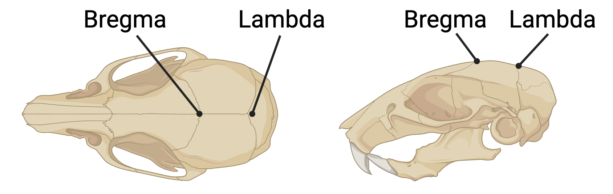
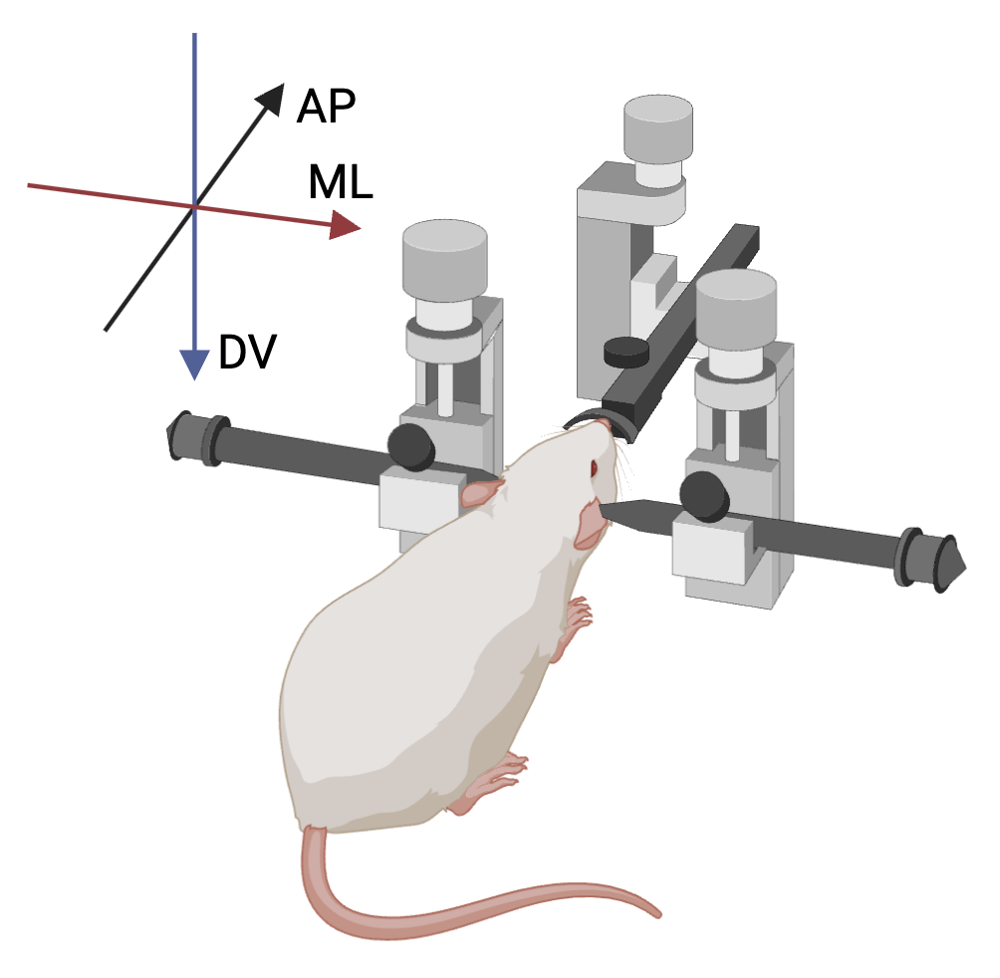
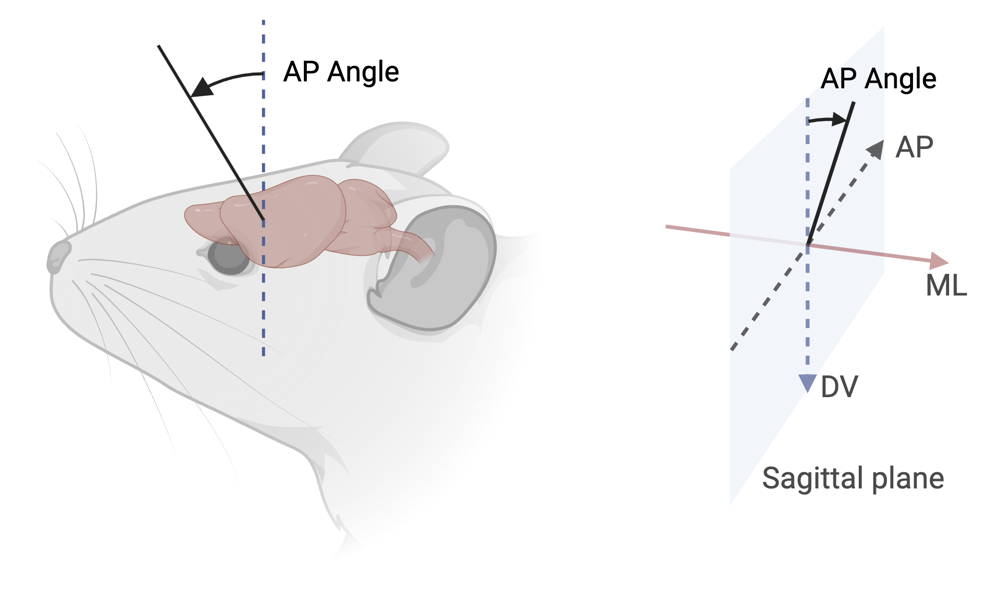
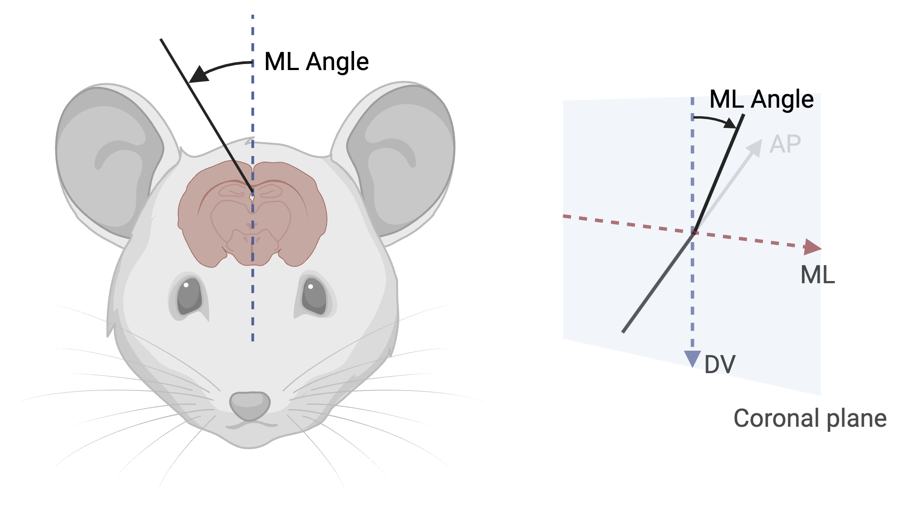
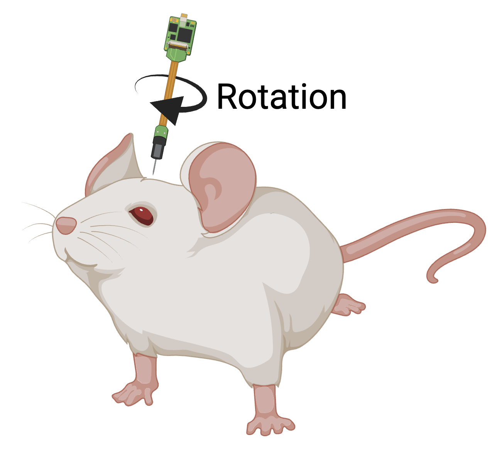

# Microelectrode Electrophysiology

Support for Microelectrode Electrophysiology was developed as a [BIDS Extension Proposal](../extensions.md#bids-extension-proposals) [BEP032: Animal electrophysiology (ephys)](https://bids.neuroimaging.io/bep032).
Please see [Citing BIDS](../introduction.md#citing-bids) on how to appropriately credit this extension
when referring to it in the context of the academic literature.

This BEP was initiated by members of the INCF Working Group on Standardized Data Structures in 2020
to develop specifications and tools for standardizing experimental data recorded with animal models
in neuroscience and its associated metadata.

!!! example "Example datasets"

    Several [example microelectrode electrophysiology datasets](https://bids-standard.github.io/bids-examples/#microephys)
    have been formatted using this specification
    and can be used for practical guidance when curating a new dataset.

## Terminology: Modality and Datatypes

The Microelectrode Electrophysiology modality encompasses recordings made with micrometer-scale electrodes,
distinguishing it from related BIDS modalities (EEG, MEG, iEEG) that use larger electrodes.
This modality is primarily used in animal research.

Within this modality, BIDS defines two datatypes based on fundamentally different recording techniques (see [Issue #1800](https://github.com/bids-standard/bids-specification/issues/1800)):

-   **`ecephys`** (Extracellular Electrophysiology): Electrodes remain in the extracellular space,
    measuring field potentials (μV) from nearby neurons without membrane penetration.
    Examples: Neuropixels probes, tetrodes, multi-electrode arrays.

-   **`icephys`** (Intracellular Electrophysiology): Electrodes penetrate or attach to cell membranes to directly measure
    intracellular potentials (mV) and cellular dynamics.
    Examples: cell-attached patch clamp, whole-cell patch clamp, sharp electrode recordings.

These datatypes differ in recording technique, signal amplitude, required metadata
(for example, `pipette_solution` and `recording_mode` for icephys; probe geometry for ecephys),
and analysis pipelines. The terms are established and used in [Neurodata Without Borders (NWB)](https://www.nwb.org).

Both datatypes share a unified BIDS structure (probes, electrodes, channels) with technique-specific optional metadata fields.
Files are organized into `ecephys/` or `icephys/` subdirectories with corresponding file suffixes.

## Primary Data File Formats

Microelectrode electrophysiology data (of `icephys` or `ecephys` datatypes) MUST be stored in an [open file format](https://en.wikipedia.org/wiki/Open_format),
while the native format, if different, can be stored in an optional `sourcedata/` directory.
The native file format is used in case conversion elicits the loss of crucial metadata specific to manufacturers and specific acquisition systems.
Metadata should be included alongside the data in the `.json` and `.tsv` files.
The current list of allowed data file formats:

| **Format**                                                                           | **Extension(s)** | **Description**                                                                                                                                                                                                           |
| ------------------------------------------------------------------------------------ | ---------------- | ------------------------------------------------------------------------------------------------------------------------------------------------------------------------------------------------------------------------- |
| [Neuroscience Information Exchange Format](https://nixio.readthedocs.io/en/latest/)  | `.nix`            | A generic and open framework with an hdf5 backend and a defined interface to many microephys formats via the [Neo library](https://neo.readthedocs.io/en/latest/). The `.nix` file has to contain a valid Neo structure. |
| [Neurodata Without Borders](https://www.nwb.org)                                     | `.nwb`            | An open data standard for neurophysiology, including data from intracellular and extracellular electrophysiology experiments.                                                                                            |

Both of these formats can also store essential metadata of the datasets.
Some of this metadata needs to be duplicated in BIDS `.tsv` and `.json` sidecar files.
Even though the duplication requires additional effort to ensure the consistency of the data, it provides several advantages:

-   It makes the dataset easier for humans to scan, as essential information is easily accessible without loading the data files.
-   The dataset adheres to the BIDS standard and can benefit from tools built on top of this standard, such as [bids-validator](https://github.com/bids-standard/bids-validator).
-   It simplifies the separation of data and basic metadata, enabling, for example, the publication of a dataset in a lightweight fashion with access to the data files on request (as implemented by [DataLad](https://www.datalad.org)).

<!--
This block generates a filename templates.
The inputs for this macro can be found in the directory
  src/schema/rules/files/raw
and a guide for using macros can be found at
 https://github.com/bids-standard/bids-specification/blob/master/macros_doc.md
-->

<!-- Link Definitions -->

### icephys

{{ MACROS___make_filename_template(
"raw",
datatypes=["icephys"],
suffixes=["icephys", "events", "channels", "electrodes","scans","probes","coordsystem"]
)
}}

### ecephys

{{ MACROS___make_filename_template(
"raw",
datatypes=["ecephys"],
suffixes=["ecephys", "events", "channels", "electrodes","scans","probes","coordsystem"]
)
}}

## Sidecar JSON (`*_icephys.json` and `*_ecephys.json`)

We propose to store all metadata that is not directly related to one of the other metadata files (probe/electrode/channel information) into a single JSON file corresponding to the datatype: `_icephys.json` or `_ecephys.json` for intracellular and extracellular correspondingly.

There should be one such JSON file for each data file.

The `*_ephys.json` file can be used to store any microephys-specific metadata for the dataset. We recommend storing all setup-related metadata in a dedicated node of the JSON file called `Setup`.
We recommend using the following keys to describe the setup:

### Institution Information

{{ MACROS___make_sidecar_table("microephys.microephysInstitutionInformation") }}

### Setup Information

{{ MACROS___make_sidecar_table("microephys.microephysSetup") }}

### Processing Information

{{ MACROS___make_sidecar_table("microephys.microephysProcessing") }}

### Additional Procedure Information

Furthermore, additional information can be stored about the recording procedure.
We RECOMMEND to use a dedicated `Procedure` node with the following keys:

-   `Pharmaceuticals`
-   `Sample`
-   `Supplementary`

<!-- TODO: Yarik replaced Pharmaceuticals with PharmaceuticalName and others for now but we might look to define list of Pharmaceuticals of records with PharmaceuticalDoseAmount and PharmaceuticalDoseUnit -->

#### Pharmaceuticals

For each pharmaceutical we RECOMMEND to use a dedicated node with the name of the Pharmaceuticals containing the following administration details:

{{ MACROS___make_sidecar_table("microephys.microephysPharmaceuticals") }}

#### Sample

{{ MACROS___make_sidecar_table("microephys.microephysSample") }}

#### Supplementary

{{ MACROS___make_sidecar_table("microephys.microephysSupplementary") }}

### Task Information

If the OPTIONAL [` task-<label>`](../appendices/entities.md#task) is used, the following metadata SHOULD be used.

{{ MACROS___make_sidecar_table("microephys.microephysTaskInformation") }}

### Example `*_ecephys.json`

```JSON
{
  "InstitutionName": "Example University",
  "InstitutionAddress": "123 Main St, City, State 12345, Country",
  "InstitutionalDepartmentName": "Neuroscience Department",
  "PowerLineFrequency": 60,
  "Manufacturer": "ExampleManufacturer",
  "ManufacturersModelName": "Model-XYZ",
  "SamplingFrequency": 30000,
  "SoftwareName": "RecordingSoftware",
  "SoftwareVersions": "1.0.0",
  "SoftwareFilters": {
    "LowpassFilter": {
      "Half-amplitude cutoff (Hz)": 300,
      "Roll-off": "6dB/Octave"
    }
  },
  "HardwareFilters": {
    "HighpassFilter": {
      "Half-amplitude cutoff (Hz)": 0.1,
      "Roll-off": "6dB/Octave"
    }
  },
  "PharmaceuticalName": ["anesthetic1", "anesthetic2"],
  "PharmaceuticalDoseAmount": [1.5, 10],
  "PharmaceuticalDoseUnits": ["percent", "mg/kg"],
  "BodyPart": "BRAIN",
  "BodyPartDetails": "Motor Cortex",
  "SampleEnvironment": "in-vivo",
  "TaskName": "ExampleTask",
  "TaskDescription": "Description of the experimental task"
}
```

### Example `*_icephys.json`

```JSON
{
  "InstitutionName": "Example Institute",
  "InstitutionAddress": "456 Science Ave, City, State 67890, Country",
  "PowerLineFrequency": 60,
  "Manufacturer": "PatchClampManufacturer",
  "ManufacturersModelName": "Amplifier-ABC",
  "SamplingFrequency": 20000,
  "SoftwareName": "PatchSoftware",
  "SoftwareVersions": "2.1.0",
  "SoftwareFilters": {
    "BesselFilter": {
      "Half-amplitude cutoff (Hz)": 10000,
      "Roll-off": "12dB/Octave"
    }
  },
  "BodyPart": "BRAIN",
  "BodyPartDetails": "Visual Cortex",
  "SampleEnvironment": "ex-vivo",
  "SliceThickness": 300,
  "TaskName": "MembraneProperties",
  "TaskDescription": "Characterization of intrinsic properties"
}
```

## Coordinate Systems for Electrode Positions

Microelectrode electrophysiology supports two approaches for specifying electrode positions:

### Default: Probe-Relative Coordinates

By default, when no `space-<label>` entity is used:

-   `*_electrodes.tsv`: Electrode positions (`x`, `y`, `z`) are **relative to the probe origin**
-   `*_coordsystem.json`: **NOT REQUIRED** (probe-relative is the default)
-   The probe origin (0, 0, 0) is typically at the probe tip or a standard reference point
-   The reference point can be specified in the `coordinate_reference_point` column of `*_probes.tsv`
-   Units can be specified in the `dimension_unit` column of `*_probes.tsv`

This is the most common case for in-vivo recordings where absolute anatomical localization is not available.

### Optional: Anatomical Coordinate Systems

When electrode positions are known in anatomical or stereotaxic space:

-   `*_space-<label>_electrodes.tsv`: Electrode positions in the specified coordinate system
-   `*_space-<label>_coordsystem.json`: **REQUIRED** to define the coordinate system
-   Examples of `<label>` values include `StereoTaxic`, `AllenCCFv3`, `PaxinosWatson`, `individual`, or other standard spaces listed in the [Coordinate Systems Appendix](../appendices/coordinate-systems.md)

Multiple coordinate systems can coexist in the same dataset.

Example file structure with both probe-relative and stereotaxic coordinates:

{{ MACROS___make_filetree_example(
   {
   "sub-01": {
      "ses-01": {
         "ecephys": {
            "sub-01_ses-01_electrodes.tsv": "",
            "sub-01_ses-01_space-StereoTaxic_electrodes.tsv": "",
            "sub-01_ses-01_space-StereoTaxic_coordsystem.json": "",
            "sub-01_ses-01_probes.tsv": "",
            },
         },
      },
   }
) }}

## Channels description (`*_channels.tsv`)

Channels are recorded signals.
These may be of neuronal origin (for example, online filtered LFP signals) or generated by the recording setup
(for example, synchronization or behavioral signals).

The channel properties are stored in a `.tsv` file.
It should contain information about reference electrodes, amplifier, filtering, time alignment and other metadata pertinent to the data for each channel.

This table stores information about the recorded signals, *not* the electrodes. The distinction is particularly important in cases where multiple signals are recorded from a single electrode (such as Neuropixel probes). For more information about the distinction between electrodes and channels, see [the corresponding section in iEEG](./intracranial-electroencephalography.md#terminology-electrodes-vs-channels).

Columns in the `*_channels.tsv` file are:

{{ MACROS___make_columns_table("microephys.microephysChannels") }}

### Example `*_channels.tsv`

**Extracellular electrophysiology example:**

```tsv
name	reference	type	units	sampling_frequency	hardware_filters	software_filters	gain	status	status_description
ch001	ref01	LFP	uV	1000	HighpassFilter	LowpassFilter	500	good	n/a
ch002	ref01	LFP	uV	1000	HighpassFilter	LowpassFilter	500	good	n/a
ch003	ref01	HP	uV	30000	HighpassFilter	n/a	500	good	n/a
ch004	ref01	HP	uV	30000	HighpassFilter	n/a	500	bad	high_noise
ch005	ref02	LFP	uV	1000	HighpassFilter	LowpassFilter	500	good	n/a
ch006	n/a	SYNC	V	30000	n/a	n/a	1	good	n/a
```

**Intracellular electrophysiology example:**

```tsv
name	type	units	sampling_frequency	recording_mode	gain	ground	status
patch01	VM	mV	20000	current-clamp	10	AgCl	good
patch02	VM	mV	20000	current-clamp	10	AgCl	good
patch03	IM	pA	20000	voltage-clamp	5	AgCl	good
```

Note: In many datasets multiple sets of identifiers are used for probes, electrodes and channels.
We RECOMMEND to include alternative sets of identifiers, for instance identifiers that enumerate electrodes according to their spatial arrangement, as additional custom columns in the `.tsv` file.

### Recommended Channel Type Values

For the `type` column we recommend to use the following terms (adapted from [iEEG](intracranial-electroencephalography.md#channels-description-_channelstsv))

| **Keyword**  | **Description**                                                                                                                 |
| ------------ | ------------------------------------------------------------------------------------------------------------------------------- |
| **LFP**      | Low-pass filtered extracellular voltage signal that represents local field potentials                                           |
| **HP**       | High-pass filtered extracellular voltage signal as used for spike sorting                                                       |
| **MUA**      | High-pass filtered and rectified or thresholded extracellular voltage signal that represents an estimate of multi-unit activity |
| **BB**       | Unfiltered (broadband) extracellular voltage signal                                                                             |
| **SPIKES**   | Discrete signal indicating spike events as derived from spike detection or spike sorting                                        |
| **VM**       | Membrane voltage                                                                                                                |
| **IM**       | Membrane current                                                                                                                |
| **SYNC**     | Signal used for synchronization between different recording systems / channels                                                  |
| **STIM**     | Electrical stimulation                                                                                                          |
| **EEG**      | Electrode channel from electroencephalogram                                                                                     |
| **ECOG**     | Electrode channel from electrocorticogram (intracranial)                                                                        |
| **SEEG**     | Electrode channel from stereo-electroencephalogram (intracranial)                                                               |
| **DBS**      | Electrode channel from deep brain stimulation electrode (intracranial)                                                          |
| **VEOG**     | Vertical EOG (electrooculogram)                                                                                                 |
| **HEOG**     | Horizontal EOG                                                                                                                  |
| **EOG**      | Generic EOG channel if HEOG or VEOG information not available                                                                   |
| **ECG**      | ElectroCardioGram (heart)                                                                                                       |
| **EMG**      | ElectroMyoGram (muscle)                                                                                                         |
| **TRIG**     | System Triggers                                                                                                                 |
| **AUDIO**    | Audio signal                                                                                                                    |
| **PD**       | Photodiode                                                                                                                      |
| **EYEGAZE**  | Eye Tracker gaze                                                                                                                |
| **PUPIL**    | Eye Tracker pupil diameter                                                                                                      |
| **BEH**      | Behavioral signals                                                                                                              |
| **MISC**     | Miscellaneous                                                                                                                   |
| **SYSCLOCK** | System time showing elapsed time since trial started                                                                            |
| **ADC**      | Analog to Digital input                                                                                                         |
| **DAC**      | Digital to Analog output                                                                                                        |
| **REF**      | Reference channel                                                                                                               |
| **OTHER**    | Any other type of channel                                                                                                       |

## Electrodes description (`*_electrodes.tsv`)

Electrodes are the physical recording sites that make electrical contact with neural tissue to capture electrophysiological signals.

The electrode positions and properties are stored in a `.tsv` file (amplifier information is in `channels.tsv`).

This file contains the following information:

-   The electrode name
-   The electrode coordinates in 3 columns (`xyz`) (use `n/a` for values if a dimension is absent). By default, this is the position on the probe (not the brain).
-   The ID of the probe the electrode is located on

{{ MACROS___make_columns_table("microephys.microephysElectrodes") }}

### Example `*_electrodes.tsv`

**Extracellular electrophysiology example (probe-relative coordinates):**

```tsv
name	probe_name	hemisphere	x	y	z	impedance	shank_id	size	material	location
e001	probe01	L	0	0	0	1.2	0	15	iridium-oxide	MOp
e002	probe01	L	0	0	25	1.1	0	15	iridium-oxide	MOp
e003	probe01	L	0	0	50	1.3	0	15	iridium-oxide	MOp
e004	probe01	L	0	0	75	1.4	0	15	iridium-oxide	MOp
e005	probe02	R	0	0	0	2.1	n/a	12	tungsten	CA1
e006	probe02	R	0	0	15	2.3	n/a	12	tungsten	CA1
e007	probe02	R	0	0	30	1.9	n/a	12	tungsten	CA1
e008	probe02	R	0	0	45	2.0	n/a	12	tungsten	CA1
```

**Intracellular electrophysiology example:**

```tsv
name	probe_name	hemisphere	x	y	z	impedance	pipette_solution	internal_pipette_diameter	external_pipette_diameter	material	location
patch01	pipette01	L	0	0	0	5.2	K-gluconate	1.5	2.5	borosilicate-glass	VISp2/3
patch02	pipette02	R	0	0	0	4.8	K-gluconate	1.5	2.5	borosilicate-glass	VISp2/3
sharp01	pipette03	L	0	0	0	80	3M KCl	0.5	1.0	borosilicate-glass	PL5
```

## Probes description (`*_probes.tsv`)

Probes are electrode-bearing devices that interface with neural tissue to record electrophysiological activity, ranging from multi-electrode arrays to single recording pipettes. They can be permanently implanted (chronic recordings) or inserted temporarily for the recording (acute recordings).

The probe positions and properties are stored in a `.tsv` file.
This file contains the probe ID, the type of recording (acute/chronic), and the probe coordinates.

### ProbeInterface Library

[ProbeInterface](https://github.com/SpikeInterface/probeinterface) is a standard for specifying electrode layouts on probes.
The [ProbeInterface library](https://github.com/SpikeInterface/probeinterface_library) includes layouts for many common probes.

Probe information is specified in the `probes.json` sidecar file using the `model` field with `Levels` to define each probe model.

For probes listed in the ProbeInterface library, use `TermURL` to reference the probe definition:

```json
"model": {
    "Levels": {
        "A1x32": {
            "Description": "A1x32-Poly3-10mm-50-177, a 1-shank probe",
            "TermURL": "https://raw.githubusercontent.com/SpikeInterface/probeinterface_library/refs/heads/main/neuronexus/A1x32-Poly3-10mm-50-177/A1x32-Poly3-10mm-50-177.json"
        }
    }
}
```

If the probe is not listed in the ProbeInterface library, you SHOULD define it using the [ProbeInterface format](https://probeinterface.readthedocs.io/en/latest/format_spec.html) and include it in a directory called `probes/` in the root of the dataset. Custom probe files MUST comply with the [ProbeInterface specification](https://probeinterface.readthedocs.io/en/latest/format_spec.html) and [JSON schema](https://raw.githubusercontent.com/SpikeInterface/probeinterface/refs/heads/main/src/probeinterface/schema/probe.json.schema).

For custom probes, reference them using a [BIDS URI](../common-principles.md#bids-uri) with the `bids::` prefix in the `TermURL` field:

```json
"model": {
    "Levels": {
        "customprobe1": {
            "Description": "Custom experimental probe",
            "TermURL": "bids::probes/customprobe1.json"
        }
    }
}
```

Example file structure:

<!-- This block generates a file tree.
A guide for using macros can be found at
 https://github.com/bids-standard/bids-specification/blob/master/macros_doc.md
-->
{{ MACROS___make_filetree_example(
   {
   "probes": {
      "customprobe1.json": "",
      "customprobe2.json": "",
      "...": "",
      },
   }
) }}

{{ MACROS___make_columns_table("microephys.microephysProbes") }}

### Example `*_probes.tsv`

**Extracellular electrophysiology example:**

```tsv
probe_name	type	AP	ML	DV	AP_angle	ML_angle	rotation_angle	hemisphere	manufacturer	device_serial_number	electrode_count	width	height	depth	dimension_unit	coordinate_reference_point	associated_brain_region	associated_brain_region_id	reference_atlas	material
probe01	silicon-probe	-2.5	1.5	-4.0	15	0	0	L	IMEC	NP1100-2205	384	70	20	10000	um	tip	Primary Motor Cortex	MOp	Franklin-Paxinos	silicon
probe02	tetrode	-1.2	-2.1	-3.5	0	10	45	R	Neuralynx	TT-12345	4	n/a	n/a	n/a	um	tip	Hippocampus CA1	CA1	Paxinos-Watson	tungsten
```

**Intracellular electrophysiology example:**

```tsv
probe_name	type	AP	ML	DV	AP_angle	ML_angle	rotation_angle	hemisphere	manufacturer	electrode_count	coordinate_reference_point	associated_brain_region	associated_brain_region_id	reference_atlas
pipette01	patch-pipette	-1.8	0.5	-2.2	30	0	0	L	Sutter	1	tip	Visual Cortex Layer 2/3	VISp2/3	AllenCCFv3
pipette02	patch-pipette	-1.8	-0.5	-2.2	30	0	0	R	Sutter	1	tip	Visual Cortex Layer 2/3	VISp2/3	AllenCCFv3
pipette03	sharp-electrode	-3.2	1.2	-3.8	20	5	0	L	WPI	1	tip	Prefrontal Cortex Layer 5	PL5	Franklin-Paxinos
```

## Surgical Coordinates System

The surgical coordinates system provides a standard way to describe the placement of an intracranial probe implantation during surgery.

### Anatomical Reference Points

In neurosurgery and research, it is important to define coordinates for where in the brain a surgical intervention will take place.
These coordinates rely on anatomical markers that are uniform across individuals.
There are two major anatomical markers on the dorsal surface of the brain that are formed when the plates of the skull fuse during development, and these markers are often used to identify the location of various anatomical structures of the brain.



**Bregma**: the anatomical point on the skull at which the coronal suture (between frontal and parietal bones) is intersected perpendicularly by the sagittal suture (between left and right parietal bones).

**Lambda**: the meeting point of the sagittal suture (between left and right parietal bones) and the lambdoid suture (between parietal and occipital bones).

Both points serve as standard reference points for stereotaxic coordinates in neuroscience research. `(0,0,0)` is assumed to be Bregma when working with rodents. It may optionally be defined differently using `coordinate_reference_point`, and MUST be defined for other species.

### Stereotaxic Coordinate System Conventions

All stereotaxic coordinate systems follow a right-handed coordinate system with the following conventions:



-   **AP (Anterior-Posterior) axis:** Positive values are anterior to reference point
-   **ML (Medial-Lateral) axis:** Positive values are to the right (as seen from behind)
-   **DV (Dorsal-Ventral) axis:** Positive values are ventral (following right-hand rule). For humans, this is the superior-inferior axis, and positive values point to inferior.

Proper understanding and application of these angles is critical for accurate probe placement and experimental reproducibility. All stereotaxic measurements use three angles to specify orientation:

#### AP angle (Anterior-Posterior rotation)



-   Measured as rotation from the vertical axis in the sagittal plane
-   0° represents vertical along DV axis
-   Range: -180° to +180°
-   Positive values indicate anterior rotation
-   Example: +15° indicates probe tilted 15° anteriorly from vertical

#### ML angle (Medial-Lateral rotation)



-   Measured as rotation from the vertical axis in the coronal plane
-   0° represents vertical along DV axis
-   Range: -180° to +180°
-   Positive values indicate rightward/clockwise rotation (as seen from behind)
-   Example: +20° indicates probe tilted 20° to the right from vertical

#### Rotation angle (around probe axis)



-   0° when probe features align with the coronal plane
-   Range: -180° to +180° (or 0° to 360°)
-   Positive rotation is clockwise when viewed from above

!!! note "Source Attribution"

    The coordinate system conventions and angle definitions presented in this section are adapted from the [BrainSTEM documentation](https://support.brainstem.org/datamodel/schemas/coordinates/).

## Coordinate System JSON (`*_coordsystem.json`)

<!--
This block generates a filename templates.
The inputs for this macro can be found in the directory
  src/schema/rules/files/raw
and a guide for using macros can be found at
 https://github.com/bids-standard/bids-specification/blob/master/macros_doc.md
-->
{{ MACROS___make_filename_template("raw", datatypes=["icephys", "ecephys"], suffixes=["coordsystem"]) }}

This `*_coordsystem.json` file contains the coordinate system in which electrode
positions are expressed. The associated MRI, CT, X-Ray, or operative photo can
also be specified.

This file is **OPTIONAL** when using default probe-relative coordinates (no `space-<label>` entity).
This file is **REQUIRED** when the [`space-<label>`](../appendices/entities.md#space) entity is used
in the filename to specify electrode positions in an anatomical or stereotaxic coordinate system.
When a `*_space-<label>_coordsystem.json` file is present, the corresponding `*_space-<label>_electrodes.tsv`
file with the same space label MUST also be present.

General fields:

<!--
This block generates a metadata table.
These tables are defined in
  src/schema/rules/sidecars
The definitions of the fields specified in these tables may be found in
  src/schema/objects/metadata.yaml
A guide for using macros can be found at
 https://github.com/bids-standard/bids-specification/blob/master/macros_doc.md
-->
{{ MACROS___make_json_table("json.microephys.microephysCoordsystemGeneral") }}

Fields relating to the microelectrode electrophysiology electrode positions:

<!--
This block generates a metadata table.
These tables are defined in
  src/schema/rules/sidecars
The definitions of the fields specified in these tables may be found in
  src/schema/objects/metadata.yaml
A guide for using macros can be found at
 https://github.com/bids-standard/bids-specification/blob/master/macros_doc.md
-->
{{ MACROS___make_json_table("json.microephys.microephysCoordsystemPositions") }}

`*_coordsystem.json` files SHOULD NOT be duplicated for each data file,
for example, across multiple tasks.
The [inheritance principle](../common-principles.md#the-inheritance-principle) MUST
be used to find the appropriate coordinate system description for a given data file.
If electrodes are repositioned, it is RECOMMENDED to use multiple sessions to indicate this.

### Default probe-relative coordinate systems

When no [`space-<label>`](../appendices/entities.md#space) entity is specified in the filename,
electrode positions in `*_electrodes.tsv` are **probe-relative coordinates**:

-   The origin (0, 0, 0) SHOULD be at the probe tip or a standard reference point on the probe
-   The reference point SHOULD be specified in the `coordinate_reference_point` column of `*_probes.tsv`
-   The `x`, `y`, and `z` coordinates describe electrode positions relative to this probe origin
-   The x, y, z axes correspond to the probe's local coordinate frame (width, height, depth)
-   This is the most common case for in-vivo recordings where electrodes are not localized in anatomical space
-   **No `*_coordsystem.json` file is required** for probe-relative coordinates

### Recommended 3D coordinate systems

It is preferred that electrodes are localized in a 3D coordinate system (with
respect to anatomical reference images, stereotactic coordinates, or in a
standard space as specified in the BIDS [Coordinate Systems Appendix](../appendices/coordinate-systems.md)
about preferred names of coordinate systems, such as StereoTaxic).

### Allowed 2D coordinate systems

If electrodes are localized in 2D space (only x and y are specified and z is `"n/a"`),
then the positions in this file MUST correspond to the locations expressed
in pixels on the photo/drawing/rendering of the electrodes on the brain.
In this case, `MicroephysCoordinateSystem` MUST be defined as `"Pixels"`,
and `MicroephysCoordinateUnits` MUST be defined as `"pixels"`
(note the difference in capitalization).
Furthermore, the coordinates MUST be (row,column) pairs,
with (0,0) corresponding to the upper left pixel and (N,0) corresponding to the lower left pixel.

### Multiple coordinate systems

If electrode positions are known in multiple coordinate systems (for example, probe-relative, StereoTaxic,
and AllenCCFv3), these spaces can be distinguished by the optional [`space-<label>`](../appendices/entities.md#space)
field, see the [`*_electrodes.tsv`-section](#electrodes-description-_electrodestsv)
for more information.
Note that the [`space-<label>`](../appendices/entities.md#space) fields must correspond
between `*_electrodes.tsv` and `*_coordsystem.json` if they refer to the same
data.

For examples:
-   `*_space-StereoTaxic` (electrodes are localized in stereotactic coordinate system with bregma origin)
  <!-- TODO: Add 'StereoTaxic', 'AllenCCFv3', 'PaxinosWatson', etc coordinate systems to appendix coordinate-systems.md under "Microelectrode Electrophysiology Specific Coordinate Systems" with appropriate definitions for each standard reference frame used in animal electrophysiology -->
-   `*_space-individual` (electrodes are localized in subject-specific anatomical coordinate system)
-   `*_space-AllenCCFv3` (electrodes are mapped to Allen Common Coordinate Framework v3)
-   `*_space-PaxinosWatson` (electrodes are mapped to Paxinos-Watson rat brain atlas coordinates)

When referring to the `*_electrodes.tsv` file in a certain *space* as defined
above, the [`space-<label>`](../appendices/entities.md#space) of the accompanying `*_coordsystem.json` MUST
correspond.

For example:

<!-- This block generates a file tree.
A guide for using macros can be found at
 https://github.com/bids-standard/bids-specification/blob/master/macros_doc.md
-->
{{ MACROS___make_filetree_example(
   {
   "sub-01": {
      "sub-01_electrodes.tsv": "",
      "sub-01_space-StereoTaxic_electrodes.tsv": "",
      "sub-01_space-StereoTaxic_coordsystem.json": "",
      "...": "",
      },
   }
) }}

The order of the required columns in the `*_electrodes.tsv` file MUST be as listed below.
The `x`, `y`, and `z` columns indicate the positions of the center of each electrode in Cartesian coordinates.

!!! note "Coordinate system specification"

    By default, `*_electrodes.tsv` contains probe-relative coordinates:

    - No `*_coordsystem.json` file is required
    - Units SHOULD be specified in the `dimension_unit` column of `*_probes.tsv`
    - The probe origin SHOULD be defined in the `coordinate_reference_point` column of `*_probes.tsv`

    When electrode positions are expressed in anatomical or stereotaxic space:

    - Use `*_space-<label>_electrodes.tsv` with the appropriate space label
    - A corresponding `*_space-<label>_coordsystem.json` file MUST be present
    - Units are specified in the `coordsystem.json` file

    Multiple coordinate systems MAY coexist in the same dataset.

## Photos of the electrode positions (`*_photo.<extension>`)

<!--
This block generates a filename templates.
The inputs for this macro can be found in the directory
  src/schema/rules/files/raw
and a guide for using macros can be found at
 https://github.com/bids-standard/bids-specification/blob/master/macros_doc.md
-->
{{ MACROS___make_filename_template("raw", datatypes=["icephys", "ecephys"], suffixes=["photo"]) }}

These can include photos of the electrodes on the brain surface, photos of
anatomical features or landmarks (such as cortical vasculature, stereotactic coordinates), and fiducials. Photos
can also include histological sections showing electrode tracks, microscope images of electrode placements,
or screenshots of a brain atlas with electrode positions.
The photos may need to be cropped and/or blurred to conceal identifying features
or entirely omitted prior to sharing, depending on obtained consent and institutional protocols.

If there are photos of the electrodes, the [`acq-<label>`](../appendices/entities.md#acq) entity should be specified
with:

-   `*_photo.<extension>` in case of an operative or in-vivo photo
-   `*_acq-<label>_photo.<extension>` where `<label>` describes the acquisition type (for example: `histology` for histological sections showing electrode tracks, `microscopy` for microscope images of electrode placements, `atlas` for screenshots showing electrodes overlaid on brain atlas)
-   `*_acq-drawing#_photo.<extension>` in case of a drawing or sketch of electrode placements

The [`ses-<label>`](../appendices/entities.md#ses) entity may be used to specify when the photo was taken.

The [`sample-<label>`](../appendices/entities.md#sample) entity may be used to specify the tissue sample for histological photos.

The [`space-<label>`](../appendices/entities.md#space) entity may be used to specify the coordinate system for atlas overlay photos.

## Recording Events (`*_events.tsv`)

The `*_events.tsv` and corresponding `*_events.json` sidecar files are OPTIONAL and can be used to
indicate time points of recording events. Each task events file requires a corresponding task data
file. These events can be internal recording system events, task-related events, or events triggered
by the experimentalist (for example, manual reward). Note that these events must share a common clock
with the corresponding microephys recording data. For more details, see the
Task Events documentation.
Note that this file can also be used to describe stimulation performed during the recording. For this,
please follow the iEEG stimulation documentation.

## Multi-part Recordings

Two different procedures are supported to handle multi-part recordings. The two options are:

1.  each recording is stored in an independent data file, and the corresponding metadata is described in the `*_scans.tsv` file; or
1.  several recordings are stored in a single data file, and the corresponding metadata is described in the `*_events.tsv` file.

These two options are made available to support different usages and habits of the experimenters, as
well as to benefit from the capability of the supported data formats (NWB and NIX).
They are described in the following subsections, and made explicit through some of the example data sets.

### Multiple tasks / runs in separate files (`*_scans.tsv`)

The `*_scans.tsv` should be used to provide information about multiple parts of an acquisition
session (for example, recording start times in case the recording was paused and restarted)
when the data from each of these different recordings is stored in separate files.
Each data file should have a name that contains a `_task-XX` and/or `_run-XX` suffix, and
should be described by one row in the `*_scans.tsv` file. See also the BIDS Scans
specification.
Relative paths to files should be used under a compulsory "filename" header.
If acquisition time is included, it should be with the `acq_time` header. Datetime should
be expressed in the RFC3339 "date-time" format, for example `2009-06-15T13:45:30` (year, month, day, hour (24h), minute, second). Time zone is always assumed as local time.
The run and task keywords and the corresponding `*_scans.tsv` file are OPTIONAL and can be
ignored if the dataset consists of only one continuous recording and a single or no task.

Optional: Yes

Example of a `*_scans.tsv`:

```tsv
filename	acq_time
ephys/sub-P001_task-pull_run-01_ephys.nix	2018-07-15T09:45:30
ephys/sub-P001_task-pull_run-02_ephys.nix	2018-07-15T13:24:00
ephys/sub-P001_task-push_run-01_ephys.nix	2018-07-15T14:24:00
ephys/sub-P001_task-push_run-02_ephys.nix	2018-07-15T15:24:00
```

It is recommended to accompany the  `*_scans.tsv` file with a corresponding `*_scans.json`
sidecar file, as described in the [BIDS specifications](https://bids-specification.readthedocs.io/en/stable/03-modality-agnostic-files.html#scans-file).

### Multiple recordings in a single data file (`*_events.tsv`)

The `*_events.tsv` should be used to provide information about multiple parts of an acquisition
session when the data from each of these different recordings is stored in a single data file.
In such a case, this file is REQUIRED.
This allows benefiting from the capability of the supported data formats (NIX and NWB) to store multiple
recordings in a single file, which can be convenient when these recordings share numerous characteristics
(for example, for subsequent recordings obtained on a single cell in intracellular electrophysiology).
In such case, the information about these recordings should be stored in columns added in the
`*_events.tsv` file, which are listed now.

Optional column names in `events.tsv` to support multiple recordings in a single data file:

<!-- TODO: Macro for events -->

## Microelectrode Electrophysiology Examples

### Toy datasets

#### Extracellular Electrophysiology

This dataset contains data from a single subject (subject A), that was recorded on two
days (2022-01-01 and 2022-01-02).
On the first day the subject performed three tasks (nose-poke, reach-to-grasp, and rest), and on the second day only a
rest task was performed.
The electrophysiology data for each of the four recordings are stored in the corresponding
session and ecephys directories in the `nix` format. Metadata about the probes, their electrodes
and the corresponding recording channels are stored in `tsv` format. Note that in this case,
this information is shared between data files (see BIDS Inheritance Principle): in the first session,
the probe, electrode and channel files apply to all data files of that session, as they do not
contain a `task` entity in their name. For the behavioral tasks (nose-poke and reach-to-grasp), additional behavioral timestamps
(events) were recorded and stored in task-specific `events.tsv` files.

{{ MACROS___make_filetree_example(

{
"dataset_description.json": "",
"participants.tsv": "",
"sub-A/": {
"sub-A_sessions.tsv": "",
"ses-20220101/": {
"sub-A_ses-20220101_scans.tsv": "",
"ecephys/": {
"sub-A_ses-20220101_task-nosepoke_ecephys.nix": "",
"sub-A_ses-20220101_task-nosepoke_ecephys.json": "",
"sub-A_ses-20220101_task-nosepoke_events.tsv": "",
"sub-A_ses-20220101_task-reachtograsp_ecephys.nix": "",
"sub-A_ses-20220101_task-reachtograsp_ecephys.json": "",
"sub-A_ses-20220101_task-reachtograsp_events.tsv": "",
"sub-A_ses-20220101_task-rest_ecephys.nix": "",
"sub-A_ses-20220101_task-rest_ecephys.json": "",
"sub-A_ses-20220101_channels.tsv": "",
"sub-A_ses-20220101_electrodes.tsv": "",
"sub-A_ses-20220101_probes.tsv": ""
}
},
"ses-20220102/": {
"sub-A_ses-20220102_scans.tsv": "",
"ecephys/": {
"sub-A_ses-20220102_task-rest_ecephys.nix": "",
"sub-A_ses-20220102_task-rest_ecephys.json": "",
"sub-A_ses-20220102_channels.tsv": "",
"sub-A_ses-20220102_electrodes.tsv": "",
"sub-A_ses-20220102_probes.tsv": ""
}
}
}
}

) }}

Example `sub-A_ses-20220101_task-nosepoke_ecephys.json`:

```json
{
  "TaskName": "Nose Poke Task",
  "TaskDescription": "Subject performs nose-poke responses to visual cues for reward",
  "InstitutionName": "Example University",
  "PowerLineFrequency": 60,
  "SamplingFrequency": 30000,
  "HardwareFilters": {
    "HighpassFilter": {
      "Half-amplitude cutoff (Hz)": 0.1,
      "Roll-off": "6dB/Octave"
    }
  },
  "SoftwareFilters": "n/a",
  "RecordingType": "continuous",
  "PharmaceuticalName": ["ketamine", "xylazine"],
  "PharmaceuticalDoseAmount": [10, 1],
  "PharmaceuticalDoseUnits": ["mg/kg", "mg/kg"],
  "BodyPart": "BRAIN",
  "SampleEnvironment": "in-vivo"
}
```

Example `sub-A_ses-20220101_task-reachtograsp_ecephys.json`:

```json
{
  "TaskName": "Reach to Grasp Task",
  "TaskDescription": "Subject reaches and grasps objects of different shapes and sizes",
  "InstitutionName": "Example University",
  "PowerLineFrequency": 60,
  "SamplingFrequency": 30000,
  "HardwareFilters": {
    "HighpassFilter": {
      "Half-amplitude cutoff (Hz)": 0.1,
      "Roll-off": "6dB/Octave"
    }
  },
  "SoftwareFilters": "n/a",
  "RecordingType": "continuous",
  "PharmaceuticalName": ["ketamine", "xylazine"],
  "PharmaceuticalDoseAmount": [10, 1],
  "PharmaceuticalDoseUnits": ["mg/kg", "mg/kg"],
  "BodyPart": "BRAIN",
  "SampleEnvironment": "in-vivo"
}
```

Example `sub-A_ses-20220101_task-rest_ecephys.json`:

```json
{
  "TaskName": "Resting State",
  "TaskDescription": "Spontaneous activity recording with no task",
  "InstitutionName": "Example University",
  "PowerLineFrequency": 60,
  "SamplingFrequency": 30000,
  "HardwareFilters": {
    "HighpassFilter": {
      "Half-amplitude cutoff (Hz)": 0.1,
      "Roll-off": "6dB/Octave"
    }
  },
  "SoftwareFilters": "n/a",
  "RecordingType": "continuous",
  "PharmaceuticalName": ["ketamine", "xylazine"],
  "PharmaceuticalDoseAmount": [10, 1],
  "PharmaceuticalDoseUnits": ["mg/kg", "mg/kg"],
  "BodyPart": "BRAIN",
  "SampleEnvironment": "in-vivo"
}
```

#### Intracellular Electrophysiology (Patch)

This dataset contains intracellular data from slices acquired from two subjects (20220101-A and 20220101B). Details about the subjects and the sample generation are documented in the samples (tsv/json) files. Data of each subject is stored in separate subject directories (top level directories), each of which contains an 'icephys/' subdirectory. Note that there is no session-level directory in this case. Here, we choose the option of having "multiple tasks/runs in separate files" to demonstrate the high level of readability offered by the filenames in this case.

For the first subject only a single sample (a cell for patch-clamp terminology) was extracted (sample-cell001), on which three different protocol recordings were performed: two runs of current injection to characterize intrinsic properties, and one run of synaptic stimulation. The `scans.tsv` file stores information such as the starting recording times. The detailed information on the recording channel (such as the recording mode used) is stored in the `channels.tsv` which, in this case, is common to all available recordings. The probes and electrodes files provide information on the pipette and solutions used for the recordings and are also shared across data files.

For the second subject two samples (sample-cell002 and sample-cell003) were extracted and recordings of different tasks (current injection and synaptic stimulation) were performed on each of them. Each recording was performed using a different probe (listed in the probes.tsv) having specific electrode and channel information. Therefore, each data file has a dedicated channel and electrode file with the same name as the data file.

{{ MACROS___make_filetree_example(

{
"samples.tsv": "",
"samples.json": "",
"participants.tsv": "",
"dataset_description.json": "",
"sub-20220101A/": {
"sub-20220101A_sample-cell001_scans.tsv": "",
"icephys/": {
"sub-20220101A_sample-cell001_task-IVcurve_run-1_icephys.nwb": "",
"sub-20220101A_sample-cell001_task-IVcurve_run-1_icephys.json": "",
"sub-20220101A_sample-cell001_task-IVcurve_run-1_events.tsv": "",
"sub-20220101A_sample-cell001_task-IVcurve_run-2_icephys.nwb": "",
"sub-20220101A_sample-cell001_task-IVcurve_run-2_icephys.json": "",
"sub-20220101A_sample-cell001_task-IVcurve_run-2_events.tsv": "",
"sub-20220101A_sample-cell001_task-synaptic_icephys.nwb": "",
"sub-20220101A_sample-cell001_task-synaptic_icephys.json": "",
"sub-20220101A_sample-cell001_task-synaptic_events.tsv": "",
"sub-20220101A_channels.tsv": "",
"sub-20220101A_electrodes.tsv": "",
"sub-20220101A_probes.tsv": "",
"sub-20220101A_events.json": ""
}
},
"sub-20220101B/": {
"sub-20220101B_scans.tsv": "",
"icephys/": {
"sub-20220101B_sample-cell002_task-IVcurve_icephys.nwb": "",
"sub-20220101B_sample-cell002_task-IVcurve_icephys.json": "",
"sub-20220101B_sample-cell002_task-IVcurve_events.tsv": "",
"sub-20220101B_sample-cell002_task-IVcurve_channels.tsv": "",
"sub-20220101B_sample-cell002_task-IVcurve_electrodes.tsv": "",
"sub-20220101B_sample-cell002_task-synaptic_icephys.nwb": "",
"sub-20220101B_sample-cell002_task-synaptic_icephys.json": "",
"sub-20220101B_sample-cell002_task-synaptic_events.tsv": "",
"sub-20220101B_sample-cell002_task-synaptic_channels.tsv": "",
"sub-20220101B_sample-cell002_task-synaptic_electrodes.tsv": "",
"sub-20220101B_sample-cell003_task-IVcurve_icephys.nwb": "",
"sub-20220101B_sample-cell003_task-IVcurve_icephys.json": "",
"sub-20220101B_sample-cell003_task-IVcurve_events.tsv": "",
"sub-20220101B_sample-cell003_task-IVcurve_channels.tsv": "",
"sub-20220101B_sample-cell003_task-IVcurve_electrodes.tsv": "",
"sub-20220101B_sample-cell003_task-synaptic_icephys.nwb": "",
"sub-20220101B_sample-cell003_task-synaptic_icephys.json": "",
"sub-20220101B_sample-cell003_task-synaptic_events.tsv": "",
"sub-20220101B_sample-cell003_task-synaptic_channels.tsv": "",
"sub-20220101B_sample-cell003_task-synaptic_electrodes.tsv": "",
"sub-20220101B_probes.tsv": "",
"sub-20220101B_events.json": ""
}
}
}

) }}

Example `sub-20220101A_sample-cell001_task-IVcurve_run-1_icephys.json`:

```json
{
  "TaskName": "IV Curve Characterization",
  "TaskDescription": "Current injection protocol to characterize intrinsic membrane properties and generate current-voltage curves",
  "InstitutionName": "Example University",
  "PowerLineFrequency": 60,
  "SamplingFrequency": 20000,
  "HardwareFilters": "n/a",
  "SoftwareFilters": "n/a",
  "RecordingType": "epoched",
  "BodyPart": "BRAIN",
  "SampleEnvironment": "ex-vivo",
  "SliceThickness": 300,
  "SliceThicknessUnits": "um",
  "TissueOrigin": "Visual Cortex",
  "CellType": "pyramidal"
}
```

Example `sub-20220101A_sample-cell001_task-synaptic_icephys.json`:

```json
{
  "TaskName": "Synaptic Stimulation",
  "TaskDescription": "Electrical stimulation to evoke synaptic responses and characterize synaptic properties",
  "InstitutionName": "Example University",
  "PowerLineFrequency": 60,
  "SamplingFrequency": 20000,
  "HardwareFilters": "n/a",
  "SoftwareFilters": "n/a",
  "RecordingType": "epoched",
  "BodyPart": "BRAIN",
  "SampleEnvironment": "ex-vivo",
  "SliceThickness": 300,
  "SliceThicknessUnits": "um",
  "TissueOrigin": "Visual Cortex",
  "CellType": "pyramidal"
}
```

Example `sub-20220101B_sample-cell002_task-IVcurve_icephys.json`:

```json
{
  "TaskName": "IV Curve Characterization",
  "TaskDescription": "Current injection protocol to characterize intrinsic membrane properties and generate current-voltage curves",
  "InstitutionName": "Example University",
  "PowerLineFrequency": 60,
  "SamplingFrequency": 20000,
  "HardwareFilters": "n/a",
  "SoftwareFilters": "n/a",
  "RecordingType": "epoched",
  "BodyPart": "BRAIN",
  "SampleEnvironment": "ex-vivo",
  "SliceThickness": 350,
  "SliceThicknessUnits": "um",
  "TissueOrigin": "Hippocampus",
  "CellType": "interneuron"
}
```

This toy data set can be found in [this repository,](https://gin.g-node.org/NeuralEnsemble/BEP032-examples/src/master/toy-dataset_patchclamp_single-record-per-file) with the content of the metadata files. The other option available to organize such data consists in storing several recordings in a single data file (as described in 3.8.2); the same data set is presented using this latter option in [this other repository](https://gin.g-node.org/NeuralEnsemble/BEP032-examples/src/master/toy-dataset_patchclamp_multiple-records-per-file), so that both options can be compared for the same data set.

## Examples of Real Datasets

Several real-world datasets have been formatted using this specification and can be used for practical guidance when curating a new dataset.
<!-- TODO: Update with current real datasets. A current version of these datasets [can be found on GIN](https://gin.g-node.org/NeuralEnsemble/BEP032-examples) .

For a complete dataset including all data samples the extracellular microelectrode dataset published in [Brochier (2018)](https://doi.org/10.1038/sdata.2018.55) has been reorganized according to the current version of this BEP, using the NIX data format.
The up-to-date version of the dataset [can be found on GIN](https://gin.g-node.org/sprenger/multielectrode_grasp/src/bep_animalephys) .

We will also publish another dataset using the NWB data format in the near future, and a dataset acquired -->
