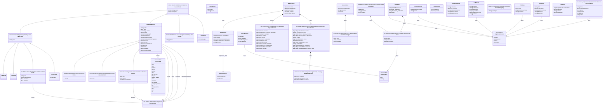

# BIDS LinkML Metaschema — Class Diagram

Auto-generated from `bids_metaschema.yaml` by `gen_class_diagram.py`.

Map wrapper classes (29 classes ending in "Map") are excluded for clarity.

```mermaid
classDiagram

    %% === Data model classes ===

    class GeneralTerm {
        <<Base class for all BIDS schema terms>>
    +string display_name
    +string description
    }

    class ValueTerm {
        <<A term whose identity is a single string value>>
    +string value
    }

    class Datatype {
    }

    class Extension {
    }

    class Suffix {
        <<A filename suffix describing the contents of a file>>
    -string unit
    -JsonSchema[] anyOf
    -float maxValue
    -float minValue
    }

    class NameValueTerm {
    +string name
    -string type
    -FormatType format
    -string[] enum
    -JsonSchema[] anyOf
    -JsonSchema items
    -JsonSchema properties
    -JsonSchema additionalProperties
    -float maximum
    -float minimum
    -float exclusiveMinimum
    -int maxItems
    -int minItems
    -string[] required
    -string[] recommended
    }

    class Entity {
        <<A name-value pair appearing in filenames>>
    +* format
    }

    class MetadataField {
        <<A name-value pair appearing in JSON sidecar files>>
    -string unit
    }

    class Column {
        <<A column heading and its value constraints in TSV files>>
    -string unit
    -string pattern
    -JsonSchema definition
    }

    class Format {
        <<Defines the form that values of a given format may take>>
    +string pattern
    }

    class FileObject {
    +string file_type
    }

    class EnumValue {
    -string[] tags
    }

    class PrivateEnum {
    +string type
    +string[] enum
    }

    class JsonSchema {
        <<An arbitrary JSON Schema fragment>>
    }

    class Issue {
        <<A validation issue with a code, message, and severity>>
    +string code
    +string message
    -IssueSeverity level
    }

    class FieldSpec {
    +RequirementLevel level
    -string level_addendum
    -string description_addendum
    -Issue issue
    }

    class EntityOverride {
    +RequirementLevel level
    -string[] enum
    }

    class SuffixRule {
    +string[] suffixes
    +string[] extensions
    -string[] datatypes
    -Map~any~ entities
    -RequirementLevel level
    -string[] selectors
    }

    class PathRule {
    +string path
    +RequirementLevel level
    -string[] selectors
    }

    class StemRule {
    +string stem
    +string[] extensions
    +RequirementLevel level
    -string[] datatypes
    -string[] selectors
    }

    class SidecarRule {
    +string[] selectors
    -Map~any~ fields
    }

    class TabularDataRule {
    +string[] selectors
    -Map~any~ columns
    +string additional_columns
    -string[] initial_columns
    -string[] index_columns
    }

    class CheckRule {
        <<A validation rule with selectors, checks, and an issue>>
    +Issue issue
    +string[] selectors
    +string[] checks
    }

    class ErrorDefinition {
    -string code
    +string message
    +IssueSeverity level
    -string[] selectors
    }

    class ModalityMapping {
        <<Maps a modality to its constituent datatypes>>
    +string[] datatypes
    }

    class DirectoryEntry {
        <<A directory entry in the dataset directory structure>>
    -string name
    -RequirementLevel level
    -bool opaque
    -string[] subdirs
    -string entity
    -string value
    }

    class AssociationTarget {
        <<The target file specification for a file association>>
    -string suffix
    -string extension
    -string[] entities
    }

    class Association {
    +AssociationTarget target
    -string[] selectors
    -bool inherit
    }

    class ExpressionTest {
    +string expression
    -string result
    }

    class Template {
    -Map~RequirementLevel~ entities
    -string[] selectors
    -string[] suffixes
    -string[] extensions
    }

    class MetaSection {
    -Map~Association~ associations
    -string context
    -ExpressionTest[] expression_tests
    -Map~Map~Template~~ templates
    -string[] versions
    }

    class ObjectsSection {
        <<The objects section containing all term definitions>>
    -Map~Column~ columns
    -Map~GeneralTerm~ common_principles
    -Map~Datatype~ datatypes
    -Map~Entity~ entities
    -Map~any~ enums
    -Map~Extension~ extensions
    -Map~FileObject~ files
    -Map~Format~ formats
    -Map~MetadataField~ metadata
    -Map~GeneralTerm~ metaentities
    -Map~GeneralTerm~ modalities
    -Map~Suffix~ suffixes
    }

    class FileRulesSection {
        <<Container for all file naming rules, organized by category>>
    -Map~any~ common
    -Map~Map~SuffixRule~~ raw
    -Map~Map~SuffixRule~~ deriv
    }

    class RulesSection {
        <<The rules section containing validation and structural rules>>
    -Map~Map~CheckRule~~ checks
    -string[] common_principles
    -Map~SidecarRule~ dataset_metadata
    -Map~Map~DirectoryEntry~~ directories
    -string[] entities
    -Map~ErrorDefinition~ errors
    -FileRulesSection files
    -Map~Map~SidecarRule~~ json
    -string[] metaentities
    -Map~ModalityMapping~ modalities
    -Map~Map~SidecarRule~~ sidecars
    -Map~Map~TabularDataRule~~ tabular_data
    }

    class BidsSchema {
    +MetaSection meta
    +ObjectsSection objects
    +RulesSection rules
    +string bids_version
    +string schema_version
    }

    %% === Enums ===

    class RequirementLevel {
        <<enumeration>>
        required
        recommended
        optional
        deprecated
    }

    class FormatType {
        <<enumeration>>
        index
        label
        boolean
        integer
        number
        string
        hed_version
        bids_uri
        dataset_relative
        date
        datetime
        file_relative
        participant_relative
        rrid
        stimuli_relative
        time
        unit
        uri
    }

    class IssueSeverity {
        <<enumeration>>
        error
        warning
    }

    %% === Inheritance ===

    GeneralTerm <|-- ValueTerm
    ValueTerm <|-- Datatype
    ValueTerm <|-- Extension
    ValueTerm <|-- Suffix
    GeneralTerm <|-- NameValueTerm
    NameValueTerm <|-- Entity
    NameValueTerm <|-- MetadataField
    NameValueTerm <|-- Column
    GeneralTerm <|-- Format
    GeneralTerm <|-- FileObject
    ValueTerm <|-- EnumValue

    %% === Composition relationships ===

    Suffix --> "*" JsonSchema : anyOf
    NameValueTerm --> FormatType : format
    NameValueTerm --> "*" JsonSchema : anyOf
    NameValueTerm --> "1" JsonSchema : items
    NameValueTerm --> "1" JsonSchema : properties
    NameValueTerm --> "1" JsonSchema : additionalProperties
    Column --> "1" JsonSchema : definition
    Issue --> IssueSeverity : level
    FieldSpec --> RequirementLevel : level
    FieldSpec *-- "1" Issue : issue
    EntityOverride --> RequirementLevel : level
    SuffixRule --> RequirementLevel : level
    PathRule --> RequirementLevel : level
    StemRule --> RequirementLevel : level
    CheckRule *-- "1" Issue : issue
    ErrorDefinition --> IssueSeverity : level
    DirectoryEntry --> RequirementLevel : level
    Association *-- "1" AssociationTarget : target
    MetaSection --> "*" ExpressionTest : expression_tests
    RulesSection *-- "1" FileRulesSection : files
    BidsSchema *-- "1" MetaSection : meta
    BidsSchema *-- "1" ObjectsSection : objects
    BidsSchema *-- "1" RulesSection : rules

```
