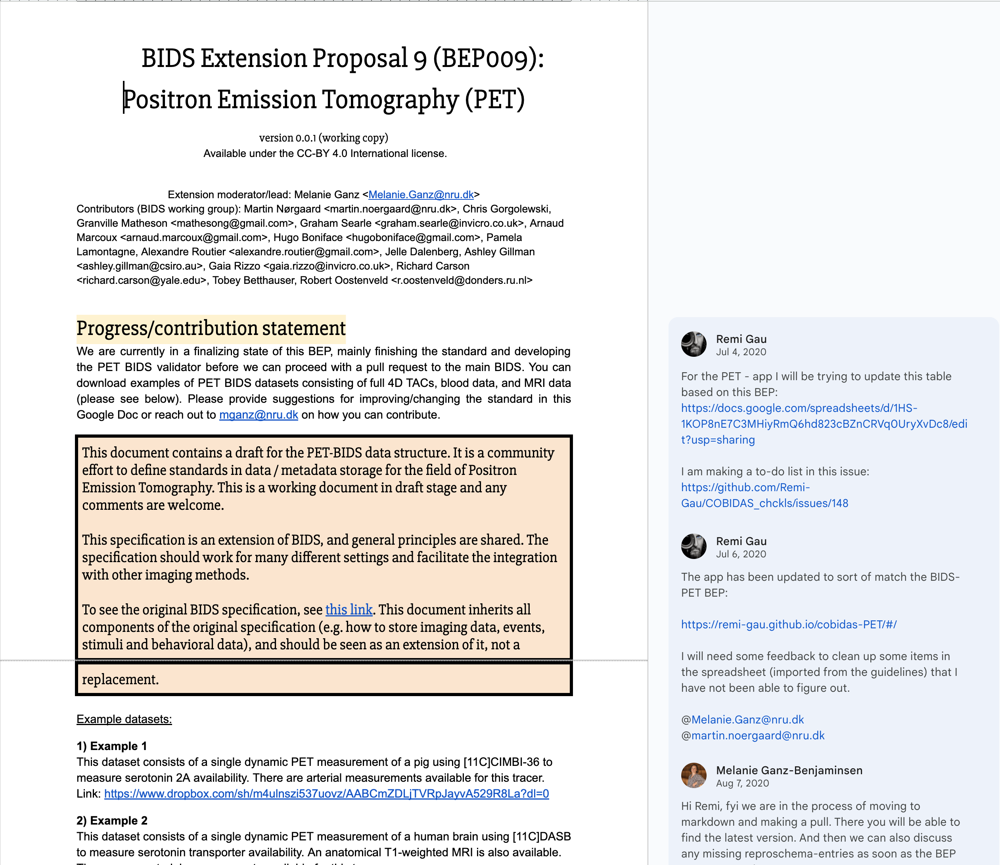
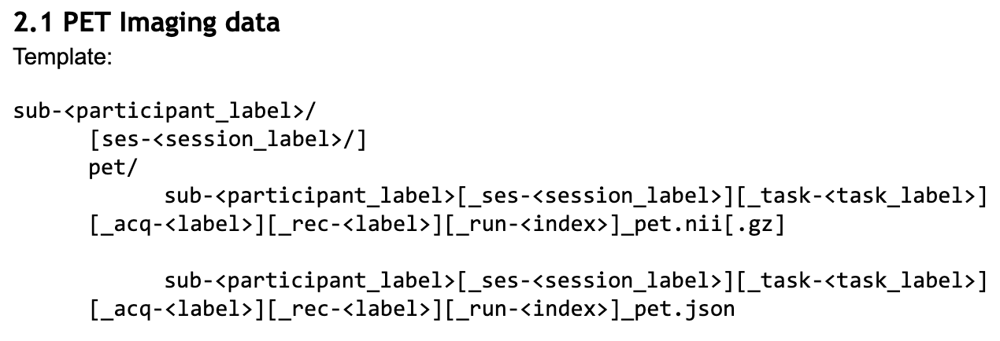
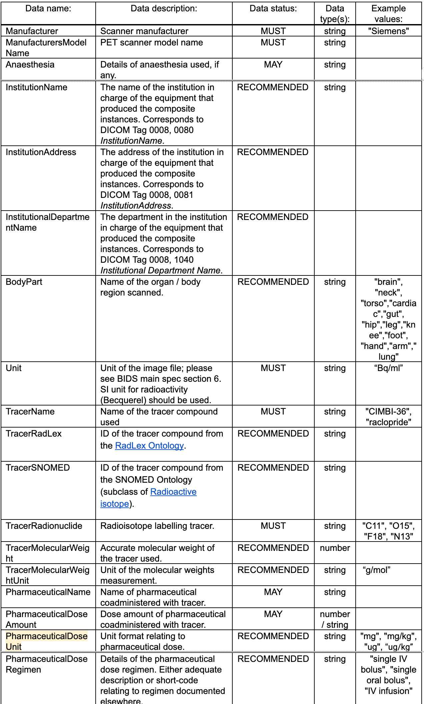
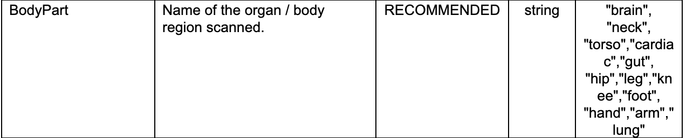

---
jupytext:
  formats: md:myst
  text_representation:
    extension: .md
    format_name: myst
    format_version: 0.13
    jupytext_version: 1.17.2
kernelspec:
  name: python3
  display_name: Python 3 (ipykernel)
  language: python
---

+++ {"editable": true, "slideshow": {"slide_type": "slide"}}

# Translating a BEP Document into Schema Code

One of the most important steps of a BEP is translating it from a plain text (google/microsoft document) as
a yaml schema. The yaml schema necessary for the following steps:

1. render the spec into its [ultimate compiled form](https://bids-specification.readthedocs.io/en/stable/)
2. apply and validate the new rules and requirements introduced by the BEP
3. merge their BEP into the BIDS Spec

For the purpose of this guide we'll be referencing a completed BEP starting from its initial Google doc form
and finishing with its translation into schema.

## The Google Doc



### Defining new file names

BEP 009 introduced files of the form

```
sub-<label>/[ses-<label>/]pet/sub-<label>[_ses-<label>][_task-<label>][_trc-<label>][_rec-<label>][_run-<index>]_pet.nii[.gz]
```

This path consists of the following objects, which are defined in the schema:

| Object type | Description                             | Example       | Defined in                                          | Introduced by BEP009 |
| ----------- | --------------------------------------- | ------------- | --------------------------------------------------- | -------------------- |
| entity      | key-value pairs                         | `sub-<label>` | [`schema/objects/entities.yaml`][entities.yaml]     | `trc-<label>`        |
| data type   | directory describing data               | `pet/`        | [`schema/objects/datatypes.yaml`][datatypes.yaml]   | `pet/`               |
| suffix      | end of the file stem (before extension) | `_pet`        | [`schema/objects/suffixes.yaml`][suffixes.yaml]     | `_pet`               |
| extension   | file type indicator                     | `.nii.gz`     | [`schema/objects/extensions.yaml`][extensions.yaml] | none                 |

BIDS also has the concept of a "modality", which does not always appear in the path,
but is determined by the data type.

| Object type | Description                 | Example | Defined in                                         | Introduced by BEP009 |
| ----------- | --------------------------- | ------- | -------------------------------------------------- | -------------------- |
| modality    | primary recording technique | `pet`   | [`schema/objects/modalities.yaml`][datatypes.yaml] | `pet`                |

#### Datatypes and modalities

PET introduces a new datatype (`pet/`) and modality (`pet`).
For new modalities the first step should be to add that modality to [modalities.yaml][].

```diff
 # src/schema/objects/modalities.yaml
 ---
 # This file describes modalities supported by BIDS.
 mri:
   display_name: Magnetic Resonance Imaging
   description: |
     Data acquired with an MRI scanner.
 [...]
+pet:
+  display_name: Positron Emission Tomography
+  description: |
+    Data acquired with PET.
 [...]
 mrs:
   display_name: Magnetic Resonance Spectroscopy
   description: Data acquired with MRS.
```

Likewise, update [datatypes.yaml][]:

```diff
 # src/schema/objects/datatypes.yaml
 ---
 # This file defines valid BIDS datatypes.
 anat:
   value: anat
   display_name: Anatomical Magnetic Resonance Imaging
   description: |
     Magnetic resonance imaging sequences designed to characterize static, anatomical features.
 [...]
+pet:
+  value: pet
+  display_name: Positron Emission Tomography
+  description: |
+    Positron emission tomography data
 [...]
 nirs:
   value: nirs
   display_name: Near-Infrared Spectroscopy
   description: Near-Infrared Spectroscopy data organized around the SNIRF format
```

Here, the `value` field indicates the string that will appear in the file name.

Finally, `rules/modalities.yaml` must be updated to associate the new
datatype to the new modality:

```diff
 # src/schema/rules/modalities.yaml
 ---
 mri:
   datatypes:
     - anat
     - dwi
     - fmap
     - func
 [...]
+pet:
+  datatypes:
+    - pet
 [...]
 mrs:
   datatypes:
     - mrs
```

#### Suffixes

To add a suffix, update [suffixes.yaml][]:

```diff
 ---
 # This file defines valid BIDS file suffixes.
 # For rules regarding how suffixes relate to datatypes, see files in `rules/files/raw/`.
 TwoPE:
   value: 2PE
   display_name: 2-photon excitation microscopy
   description: |
     2-photon excitation microscopy imaging data
 [...]
+pet:
+  value: pet
+  display_name: Positron Emission Tomography
+  description: |
+    PET imaging data SHOULD be stored in 4D
+    (or 3D, if only one volume was acquired) NIfTI files with the `_pet` suffix.
+    Volumes MUST be stored in chronological order
+    (the order they were acquired in).
 [...]
 unloc:
   value: unloc
   display_name: Unlocalized spectroscopy
   description: |
     MRS acquisitions run without localization.
     This includes signals detected using coil sensitivity only.
```

#### Entities

To add an entity, [entities.yaml] must be updated.
In this case, PET introduced a `trc-<label>` entity, short for "tracer":

```diff
 ---
 # This file describes entities present in BIDS filenames.
 acquisition:
   name: acq
   display_name: Acquisition
   description: ...
   type: string
   format: label
 [...]
+tracer:
+  name: trc
+  display_name: Tracer
+  description: |
+    The `trc-<label>` entity can be used to distinguish sequences using different tracers.
+
+    This entity represents the `"TracerName"` metadata field.
+    Therefore, if the `trc-<label>` entity is present in a filename,
+    `"TracerName"` MUST be defined in the associated metadata.
+    Please note that the `<label>` does not need to match the actual value of the field.
+  type: string
+  format: label
 [...]
 tracksys:
   name: tracksys
   display_name: Tracking System
   description: ...
   type: string
   format: label
```

Note that the `name` is what shows up in filenames before a dash (`-`).
This is often a shortened version of the reference name, in this case, `tracer`.
The `display_name` is a name that might be used when creating a document
or entry form for presenting or requesting the entity value.
`type` and `format` indicate the range of acceptable values.
For entities, `type` is always `string`,
and `format` may be `label` (alphanumeric) or `index` (numeric).

#### Extensions

It is rare, but adding a new extension entails updating [extensions.yaml][].

```yaml
nii:
  value: .nii
  display_name: NIfTI
  description: |
    A Neuroimaging Informatics Technology Initiative (NIfTI) data file.
nii_gz:
  value: .nii.gz
  display_name: Compressed NIfTI
  description: |
    A compressed Neuroimaging Informatics Technology Initiative (NIfTI) data file.
```

As with datatype and suffix, the string that appears in the file path is in the `value` field.

#### File naming rules

Your next steps are to move from this template file name as described in your document to formally defining those entities within the schema.
The definitions for these file entities are located within `src/schema/rules/files`.
Since this BEP is referring to raw data we go one level further to `src/schema/rules/files/raw` and create a new `pet.yaml` file to record each entity/rule.
There are additional directories for common elements (`common`) and derivative files (`derivatives/`), but we're only focusing on raw PET data for this example.

```console
$ tree src/schema/rules/files -L 1
src/schema/rules/files
├── common
├── deriv
└── raw
```



Given the template above we want to mark all entities surrounded by `[]` as optional while everything else not contained in `[]` will be marked as required.
(The `acquisition` entity was dropped in favor of `tracer` after the Google Doc was closed to edits, before the final inclusion of BEP 009.)

So, we create that `pet.yaml` file and begin to populate it.

```yaml
# src/schema/rules/files/pet.yaml
---
pet:
  suffixes:
    - pet
  extensions:
    - .nii.gz
    - .nii
    - .json
  datatypes:
    - pet
  entities:
    subject: required
    session: optional
    task: optional
    tracer: optional
    reconstruction: optional
    run: optional
```

In rare cases, new files may not have any entities.
See [Filename construction rules](#filename-construction-rules) for more details.

### Sidecars and Metadata Rules





[modalities.yaml]: https://github.com/bids-standard/bids-specification/blob/master/src/schema/objects/modalities.yaml
[entities.yaml]: https://github.com/bids-standard/bids-specification/blob/master/src/schema/objects/entities.yaml
[datatypes.yaml]: https://github.com/bids-standard/bids-specification/blob/master/src/schema/objects/datatypes.yaml
[suffixes.yaml]: https://github.com/bids-standard/bids-specification/blob/master/src/schema/objects/suffixes.yaml
[extensions.yaml]: https://github.com/bids-standard/bids-specification/blob/master/src/schema/objects/extensions.yaml
