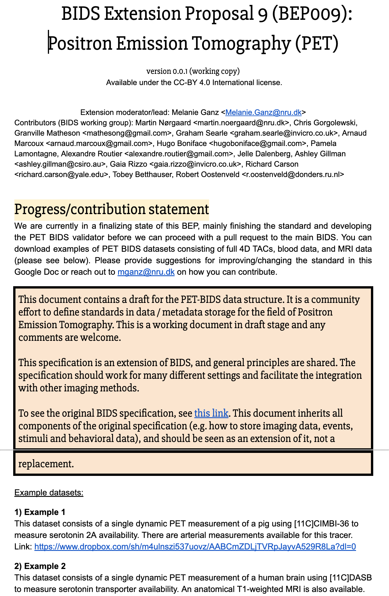

---
jupytext:
  formats: md:myst
  text_representation:
    extension: .md
    format_name: myst
    format_version: 0.13
    jupytext_version: 1.17.2
kernelspec:
  name: python3
  display_name: Python 3 (ipykernel)
  language: python
---

+++ {"editable": true, "slideshow": {"slide_type": "slide"}}

# Translating a BEP Document into Schema Code

One of the most important steps of a BEP is translating it from a plain text (google/microsoft document) as
a yaml schema. The yaml schema necessary for the following steps:

1) render the spec into its [ultimate markdown form](https://bids-specification.readthedocs.io/en/stable/)
2) apply and validate the new rules and requirements introduced by the BEP
3) merge their BEP into the BIDS Spec

For the purpose of this guide we'll be referencing a completed BEP starting from its initial Google doc form
and finishing with it's translation into schema.

## The Google Doc



### Updating modalities.yaml

For new modalities the first step should be to add that modality to the
[modalities.yaml](https://github.com/bids-standard/bids-specification/blob/880ab2db0570ff2038f403576f85564aa4454710/src/schema/objects/modalities.yaml)
file if it's not present.

`src/schema/objects/modalities.yaml` from:

```yaml
# src/schema/objects/modalities.yaml
---
# This file describes modalities supported by BIDS.
mri:
  display_name: Magnetic Resonance Imaging
  description: |
    Data acquired with an MRI scanner.
mrs:
  display_name: Magnetic Resonance Spectroscopy
  description: Data acquired with MRS.
```

To include your new modality, in this instance PET.

```yaml
# src/schema/objects/modalities.yaml
---
# This file describes modalities supported by BIDS.
mri:
  display_name: Magnetic Resonance Imaging
  description: |
    Data acquired with an MRI scanner.
pet:
  display_name: Positron Emission Tomography
  description: |
    Data acquired with PET.
mrs:
  display_name: Magnetic Resonance Spectroscopy
  description: Data acquired with MRS.
```

### Defining filename entities

Your next steps are to move from this template file name as described in your document to formally defining those entities within the schema. The definitions for these file entities are
located within `src/schema/rules/files`. Since this BEP is referring to raw data we go one level
further to `src/schema/rules/files/raw` and create a new `pet.yaml` file to record each entity/rule. There are additional folders for side card files (`sidecars/`), common elements (`common`), and derivative files (`derivatives/`), but we're only focusing on raw PET data for
this example.

```bash
tree src/schema/rules/files -L 1
src/schema/rules/files
├── common
├── deriv
└── raw
```


Given the template above we want to include mark all entities surrounded by `[]` as optional while everything else not contained in `[]` will be marked as required.

So, we create that `pet.yaml` file and begin to populate it.

```yaml
# src/schema/rules/files/pet.yaml
---
pet:
  suffixes:
    - pet
  extensions:
    - .nii.gz
    - .nii
    - .json
  entities:
    subject: required
    session: optional
    task: optional
    tracer: optional
    reconstruction: optional
    run: optional
```

### Sidecars and Metadata Rules


